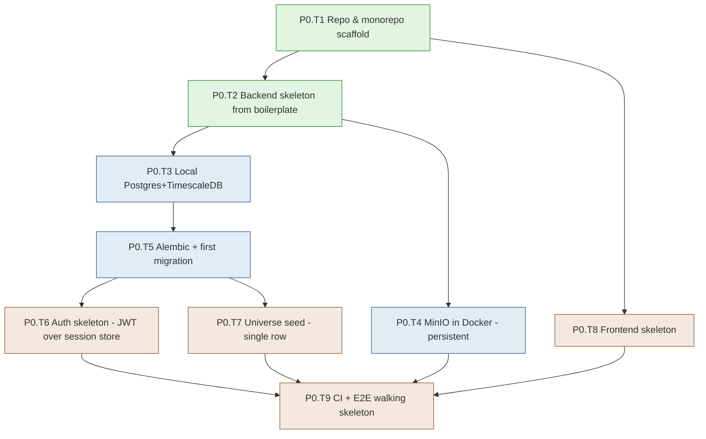

# Development Plan — Stage S0: Foundations

> **Project**: MBI Labs Oracle Engine — Pipeline A
> **Stage**: S0 — Foundations (the walking skeleton)
> **Companion docs**: `mbi-pipeline-a-v1-design.md` (design spec), `tech-stack-analysis.md` (stack validation)
> **Next stage**: S1 — Auth + Universes
> **Status**: Ready for execution. Generated via `dev-plan-generator`; gaps closed via `brainstorming`.

---

## Executive Summary

S0 builds the **walking skeleton**: a thin vertical slice that proves every layer of the stack is wired together and deployable before any real feature work begins. By the end of S0, an admin can log in (JWT), and a single seeded universe is read from Postgres, served by FastAPI, and rendered in the React UI — with migrations running clean, CI gating every PR, and the full local dev environment reproducible by one command.

- **Total tasks**: 9 (P0.T1 – P0.T9)
- **Total sub-tasks**: 41
- **Estimated effort**: 8–12 dev days (1 developer); 5–7 days with a backend+frontend pair
- **Scaffolding base**: [`fastapi_backend_boilerplate`](https://github.com/SIDDHESHCHAUDHARI2K24/fastapi_backend_boilerplate) — `app/` factory pattern, `app/features/core`, `app/features/auth`, alembic, uv, Makefile

### Top 3 Risks & Mitigations

| Risk | Mitigation |
|---|---|
| **TimescaleDB native install friction** (differs across macOS/Linux/WSL) | Document per-OS install in `backend/README.md`; provide a `make db-check` target that verifies the extension is loadable; fall back to a documented Docker option if native install blocks a developer |
| **Boilerplate uses session-auth; design locked JWT** | S0 scaffolds the boilerplate's session table as the *refresh* store and layers JWT access tokens on top — no rip-and-replace. Reconciliation documented in P0.T6. |
| **Playwright E2E in CI flakiness on a cold stack** | E2E job waits on `/ready` (not just `/health`) before running; DB seeded via a deterministic fixture; single critical-path test only in S0 (login → see universe) |

---

## Stage Dependency Map

S0 has no upstream stage dependencies (it's the foundation). Internal task dependencies:

**Critical path**: `T1 → T2 → T3 → T5 → T6 → T9` (the auth vertical slice gates the skeleton proof).
**Parallelizable**: T8 (frontend skeleton) runs alongside T2–T7; T4 (MinIO) runs alongside T3–T7.

---

## Stage Overview

### Goal
Stand up a reproducible, CI-gated, deployable skeleton spanning DB → API → frontend, with auth and one real DB-backed read proving the wiring end-to-end.

### Features Addressed
- Foundational slices of **Feature 1 (Auth)** and **Feature 2 (Universes)** — just enough to prove the vertical slice. Full feature build happens in S1.

### Entry Criteria
- Design doc and tech-stack-analysis approved (✅ done).
- Developer has: Python 3.11, Node 20+, pnpm, uv, Docker, and local Postgres 16 + TimescaleDB installable.

### Exit Criteria
- `make dev` brings up the full local stack (native Postgres+Timescale, Dockerized MinIO with persistent volume, backend, frontend).
- `GET /health` → 200; `GET /ready` → 200 when DB reachable.
- `alembic upgrade head` runs clean from an empty database; `alembic downgrade base` reverses cleanly.
- Admin user (from `.env`) can log in via the UI and receive a JWT.
- A single seeded universe ("S&P 500" stub) is fetched from the API and rendered on a frontend page.
- CI passes on a PR: ruff, ESLint, mypy/tsc, pytest, vitest, Playwright critical-path test, and a migration-runs-clean check.

---

## Task P0.T1: Monorepo Scaffold & Tooling

**Feature**: Foundation (cross-cutting)
**Effort**: M / 1 day
**Dependencies**: None
**Risk Level**: Low

#### Sub-task P0.T1.S1: Initialize monorepo directory structure
**Description**: Create the top-level monorepo layout per the approved design: `backend/`, `frontend/`, `docs/`, `e2e/`, plus root `Makefile`, `docker-compose.dev.yml`, `.env.example`, `.gitignore`, and `README.md`. Copy the approved `mbi-pipeline-a-v1-design.md` and `tech-stack-analysis.md` into `docs/`. This establishes the skeleton every other task fills in.
**Implementation Hints**: Mirror the directory tree from §13 of the design doc. Root `.gitignore` should cover `__pycache__`, `.venv`, `node_modules`, `.env`, `*.pt` (model artifacts), `.pytest_cache`, `dist`, `.ruff_cache`. Use a single `.env.example` at root that documents both backend and frontend env vars with comments.
**Dependencies**: None
**Effort**: S / 2 hrs
**Acceptance Criteria**:
- Directory tree matches design §13 (top-level dirs present, even if empty with `.gitkeep`)
- `docs/` contains both approved markdown specs
- `git status` is clean after an initial commit (nothing that should be ignored is tracked)

#### Sub-task P0.T1.S2: Author root Makefile with core targets
**Description**: Create the root `Makefile` with developer-facing convenience targets that delegate into `backend/` and `frontend/`. Targets: `dev` (bring up full stack), `db-up`/`db-down` (MinIO container), `db-check` (verify Timescale extension), `migrate`, `test`, `test-backend`, `test-frontend`, `test-e2e`, `lint`, `format`, `gen-api` (OpenAPI → TS types). Match the boilerplate's Makefile conventions.
**Implementation Hints**: Reference the boilerplate's Makefile structure. `make dev` should start MinIO (docker compose), then run backend (`uv run uvicorn app.app:create_app --factory --reload --loop asyncio`) and frontend (`pnpm dev`) — use a process runner or document running them in two terminals. Keep targets thin; they call into sub-project scripts.
**Dependencies**: P0.T1.S1
**Effort**: S / 2 hrs
**Acceptance Criteria**:
- `make help` lists all targets with one-line descriptions
- Each target name matches what later CI workflows invoke (no drift between Makefile and CI)

#### Sub-task P0.T1.S3: Write root README with setup runbook
**Description**: Author the root `README.md` documenting prerequisites (Python 3.11, Node 20+, uv, pnpm, Docker, native Postgres 16 + TimescaleDB), the one-time setup sequence, and the `make dev` happy path. Include the per-OS TimescaleDB install snippet (macOS via Homebrew, Ubuntu via apt, WSL notes).
**Implementation Hints**: Pull the Timescale install commands from the official docs per OS. Document the `.env` creation step (`cp .env.example .env`, then fill in `DATABASE_URL`, admin creds, MinIO keys). Cross-link to `docs/mbi-pipeline-a-v1-design.md`.
**Dependencies**: P0.T1.S1
**Effort**: S / 2 hrs
**Risk Flags**: TimescaleDB install varies enough across OSes that this doc needs real testing on at least macOS + Linux to be trustworthy.
**Acceptance Criteria**:
- A developer following the README from scratch reaches a running `make dev` without tribal knowledge
- Per-OS Timescale install commands are present and tested on ≥1 OS

---

## Task P0.T2: Backend Skeleton from Boilerplate

**Feature**: Foundation (Auth/Universes infra)
**Effort**: L / 1–2 days
**Dependencies**: P0.T1
**Risk Level**: Low

#### Sub-task P0.T2.S1: Scaffold backend from the FastAPI boilerplate
**Description**: Bring the `fastapi_backend_boilerplate` structure into `backend/`: the `app/app.py` application factory, `app/features/core/` (config via pydantic-settings, db helpers via asyncpg, shared deps), `app/features/auth/` skeleton, `alembic/` + `alembic.ini`, `pyproject.toml` (uv), `pytest.ini`, `.python-version`. Then **rename the feature root** to match our design's package name `backend` and adjust the factory import path used by `make dev`.
**Implementation Hints**: Clone the boilerplate, strip its `.git`, copy the tree into `backend/`. The factory entrypoint stays `app.app:create_app --factory --loop asyncio` (matches boilerplate). Our design's deeper `features/<name>/{models,schemas,repository,service,router,endpoints,tests}` layout is a superset of the boilerplate's `features/<name>/{endpoints,schemas,sql}` — extend, don't fight it. Keep the boilerplate's `core` config + db patterns verbatim where possible.
**Dependencies**: P0.T1.S1
**Effort**: M / 1 day
**Risk Flags**: The boilerplate's auth is session-based; our design layers JWT on top. Don't delete the session store — it becomes the refresh-token store (see P0.T6). Flag any naming collisions between boilerplate `app` package and design's `backend` package early.
**Acceptance Criteria**:
- `uv sync` installs cleanly in `backend/`
- `uv run uvicorn app.app:create_app --factory --reload --loop asyncio` boots without error
- Boilerplate's existing tests pass (`uv run python -m pytest`)

#### Sub-task P0.T2.S2: Configure pydantic-settings for MBI env vars
**Description**: Extend the boilerplate's `core` settings to cover MBI's env surface: `DATABASE_URL`, `JWT_SECRET`, `JWT_ACCESS_TTL_MINUTES`, `JWT_REFRESH_TTL_DAYS`, `ADMIN_EMAIL`, `ADMIN_PASSWORD`, `MINIO_ENDPOINT`, `MINIO_ACCESS_KEY`, `MINIO_SECRET_KEY`, `ARTIFACT_STORE_PATH`, `CORS_ALLOW_ORIGINS`, `LOG_LEVEL`. Use a typed `Settings(BaseSettings)` with sensible defaults for dev.
**Implementation Hints**: Keep the boilerplate's `Settings` class location (`app/features/core/`). Use `model_config = SettingsConfigDict(env_file=".env", extra="ignore")`. Validate `DATABASE_URL` starts with `postgresql+asyncpg://`. Don't put secrets in defaults.
**Dependencies**: P0.T2.S1
**Effort**: S / 2 hrs
**Acceptance Criteria**:
- Missing required env var (e.g., `JWT_SECRET`) fails fast at startup with a clear error
- `.env.example` documents every setting with a comment
- Settings are importable as a singleton dependency

#### Sub-task P0.T2.S3: Wire loguru structured logging + request-ID middleware
**Description**: Configure loguru (per design Rule 2) to emit JSON to stdout with the required field set (`ts`, `level`, `request_id`, `event`). Add a `RequestIdMiddleware` that assigns a `req_<random>` ID per request and binds it to the loguru context. Intercept uvicorn's standard logger so its logs route through loguru too.
**Implementation Hints**: Put logging config in `app/features/core/observability/logging.py` (create the dir). Use `logger.configure(extra={"service": "mbi-backend"})` and `logger.add(sys.stdout, serialize=True)`. The uvicorn intercept is a known pattern — a custom `logging.Handler` that forwards to loguru. Middleware binds via `logger.contextualize(request_id=...)`.
**Dependencies**: P0.T2.S1
**Effort**: M / 4 hrs
**Risk Flags**: uvicorn log interception is fiddly; test that both app logs and access logs appear as JSON.
**Acceptance Criteria**:
- App logs are single-line JSON with `request_id` populated per request
- uvicorn access logs also render as JSON (not the default text format)
- No secrets ever appear in logs (spot-check login flow)

#### Sub-task P0.T2.S4: Add health and readiness endpoints
**Description**: Implement `GET /health` (always 200 if process alive) and `GET /ready` (200 if DB reachable via `SELECT 1` with a 500ms timeout, else 503). These power the `make dev` smoke check and the CI E2E wait-gate. Place them in a `_health` feature module per the design's convention.
**Implementation Hints**: Create `app/features/_health/` with `router.py` + `endpoints/health.py`, `endpoints/ready.py`. `/ready` uses an injected `AsyncSession` and wraps the `SELECT 1` in `asyncio.wait_for(..., timeout=0.5)`. Register the router in the app factory.
**Dependencies**: P0.T2.S1, P0.T3.S1 (needs a DB to check readiness)
**Effort**: S / 2 hrs
**Acceptance Criteria**:
- `GET /health` returns 200 with `{"status":"ok"}` even when DB is down
- `GET /ready` returns 200 when DB up, 503 when DB unreachable
- Both endpoints documented in OpenAPI

---

## Task P0.T3: Local Postgres + TimescaleDB

**Feature**: Foundation (data layer)
**Effort**: M / 1 day
**Dependencies**: P0.T2
**Risk Level**: Medium

#### Sub-task P0.T3.S1: Provision local Postgres 16 + enable TimescaleDB
**Description**: Document and script the native local Postgres 16 setup with the TimescaleDB extension enabled. Create the `mbi` database and an app role. Provide a `make db-check` target that connects and asserts `SELECT extversion FROM pg_extension WHERE extname='timescaledb'` returns a version.
**Implementation Hints**: Native install (per locked decision): macOS `brew install postgresql@16 timescaledb` + `timescaledb-tune`; Ubuntu via the Timescale apt repo. The extension must be added to `shared_preload_libraries` in `postgresql.conf` and the server restarted. `make db-check` is a thin `psql` one-liner or a tiny `uv run python` script using asyncpg.
**Dependencies**: P0.T1.S2
**Effort**: M / 4 hrs
**Risk Flags**: `shared_preload_libraries` edit + restart is the step people miss — call it out loudly in the README. WSL users may need a different path.
**Acceptance Criteria**:
- `make db-check` confirms the timescaledb extension is present and reports its version
- The `mbi` database and app role exist with correct privileges
- Connection string in `.env` works from the backend

#### Sub-task P0.T3.S2: Configure async SQLAlchemy engine + session factory
**Description**: Set up the SQLAlchemy 2.0 async engine over asyncpg, an `async_sessionmaker`, and a `get_async_session` FastAPI dependency. Configure the pool (10 base + 10 overflow per tech-stack assumption #13) and set `statement_timeout=30s` on connections. This is the DB access foundation every feature uses.
**Implementation Hints**: Extend the boilerplate's `core` db helpers. `create_async_engine(settings.DATABASE_URL, pool_size=10, max_overflow=10)`. Set statement timeout via `connect_args={"server_settings": {"statement_timeout": "30000"}}` for asyncpg. The session dependency yields and closes per-request.
**Dependencies**: P0.T3.S1, P0.T2.S2
**Effort**: S / 3 hrs
**Acceptance Criteria**:
- `get_async_session` yields a working `AsyncSession` and closes it after the request
- A trivial `SELECT 1` through the session succeeds in a test
- Pool size and statement timeout are configured and verifiable

#### Sub-task P0.T3.S3: Set up per-test-database isolation with testcontainers
**Description**: Implement the backend test fixture strategy (tech-stack assumption #7): each test (or test module) gets an isolated Postgres+Timescale database via testcontainers, migrated to head before tests run. This is the foundation for all backend tests in every later stage.
**Implementation Hints**: Use `testcontainers[postgres]` with the `timescale/timescaledb-ha:pg16-latest` image (the *test* DB can be Dockerized even though dev Postgres is native — tests need disposable isolation). A session-scoped fixture spins the container, runs `alembic upgrade head`, yields the connection URL; a function-scoped fixture wraps each test in a transaction rolled back at teardown. Put fixtures in `backend/tests/conftest.py`.
**Dependencies**: P0.T3.S2, P0.T5.S1
**Effort**: L / 1 day
**Risk Flags**: Container spin-up per session is slow (~10s); acceptable. Make sure Timescale hypertable creation works inside the test container (it does with the `-ha` image).
**Acceptance Criteria**:
- A sample test that inserts and reads a row passes against an isolated container DB
- Test DB is destroyed at session teardown (no leftover containers)
- `make test-backend` runs the suite green

---

## Task P0.T4: MinIO in Docker (Persistent)

**Feature**: Foundation (artifact storage — future)
**Effort**: S / half day
**Dependencies**: P0.T1
**Risk Level**: Low

#### Sub-task P0.T4.S1: Add MinIO service to docker-compose.dev.yml with a named volume
**Description**: Define a MinIO service in `docker-compose.dev.yml` with a **named Docker volume** so data survives `docker compose down` and host restarts (per the locked requirement that storage be persistent). Expose the S3 API port and the console port. Wire credentials from `.env`.
**Implementation Hints**: Use `minio/minio:latest` with `command: server /data --console-address ":9001"`. Mount a **named volume** `mbi_minio_data:/data` (declared under top-level `volumes:` — named volumes persist across restarts, unlike anonymous/bind-to-tmp). Set `MINIO_ROOT_USER`/`MINIO_ROOT_PASSWORD` from env. Add a healthcheck hitting `/minio/health/ready`.
**Dependencies**: P0.T1.S1
**Effort**: S / 2 hrs
**Risk Flags**: A common mistake is using an anonymous volume or a bind mount to a temp dir — both lose data. The named-volume declaration is the thing that satisfies the persistence requirement.
**Acceptance Criteria**:
- `docker compose up minio` then `down` then `up` again retains a test object written between cycles
- MinIO console reachable at the configured port; credentials match `.env`
- Healthcheck reports healthy

#### Sub-task P0.T4.S2: Implement artifact_store abstraction (local FS for v1, MinIO-ready)
**Description**: Create `core/services/artifact_store.py` with a small interface (`put`, `get`, `exists`, `delete`, `list`) backed by the **local filesystem** for v1 (model artifacts land at `ARTIFACT_STORE_PATH`), structured so swapping to MinIO/S3 later is a one-class change. MinIO is provisioned now (P0.T4.S1) but artifacts use local FS until cloud deploy — this seam is the future hook.
**Implementation Hints**: Define an `ArtifactStore` Protocol; implement `LocalArtifactStore` for v1. The S3 implementation (using `aioboto3` against MinIO) is stubbed with a `NotImplementedError` + a docstring pointing to the future hook. Key format: `{universe_slug}/{model_role}/{training_run_id}.pt`.
**Dependencies**: P0.T2.S2
**Effort**: S / 3 hrs
**Acceptance Criteria**:
- `LocalArtifactStore.put/get` round-trips a bytes blob under `ARTIFACT_STORE_PATH`
- The interface is documented so S4 (ML models) can depend on it without rework
- Swapping implementations requires touching only one factory function

---

## Task P0.T5: Alembic + First Migration

**Feature**: Foundation (migrations)
**Effort**: M / 1 day
**Dependencies**: P0.T3
**Risk Level**: Medium

#### Sub-task P0.T5.S1: Configure Alembic env to discover all feature models + enable Timescale
**Description**: Wire `backend/alembic/env.py` to import the SQLAlchemy `Base` and every feature's models (so autogenerate sees all tables), run migrations with a sync engine (Alembic requirement), and target `Base.metadata`. The very first migration must `CREATE EXTENSION IF NOT EXISTS timescaledb;` before any hypertable work.
**Implementation Hints**: Per tech-stack compat note #1, Alembic uses a *sync* engine even though the app is async — convert the async URL to sync (`postgresql+psycopg://...`) inside `env.py`. Explicitly import each feature's `models` module (auth, universes — only these exist in S0) before referencing `target_metadata = Base.metadata`, mirroring the Feenix `env.py` pattern. Keep the boilerplate's `alembic.ini` at backend root.
**Dependencies**: P0.T3.S2
**Effort**: M / 4 hrs
**Risk Flags**: Autogen won't detect Timescale hypertables — those `create_hypertable()` calls are hand-added in later stages. For S0, no hypertables yet (auth + universes are plain tables), so just get the extension + plain-table autogen working.
**Acceptance Criteria**:
- `alembic revision --autogenerate` detects models from all imported feature modules
- The first migration enables the timescaledb extension
- `alembic upgrade head` then `alembic downgrade base` round-trips cleanly on an empty DB

#### Sub-task P0.T5.S2: Author the S0 initial migration (users, sessions, universes, tickers, universe_memberships)
**Description**: Create the first real migration defining the tables needed for the S0 vertical slice: `users`, `sessions` (Feature 1) and `universes`, `tickers`, `universe_memberships` (Feature 2). These match the design doc's table definitions exactly. No hypertables yet (those arrive with OHLCV in S2).
**Implementation Hints**: Define the ORM models first in `features/auth/models.py` and `features/universes/models.py` (per design §2 and §3 schemas), then autogenerate, then review the migration by hand. Include the `UNIQUE` constraints and indexes specified in the design (e.g., `UNIQUE(user_id, name)` on universes, `UNIQUE(universe_id, ticker_id, added_at)` on memberships). Use `UUID` PKs with `server_default=func.gen_random_uuid()`.
**Dependencies**: P0.T5.S1
**Effort**: M / 4 hrs
**Risk Flags**: Getting the indexes right now avoids a painful migration later. Double-check the time-aware membership unique constraint matches the design.
**Acceptance Criteria**:
- Migration creates all 5 tables with correct columns, types, FKs, uniques, and indexes
- `alembic upgrade head` applies it clean; `downgrade` drops cleanly
- Schema matches design §2–§3 exactly (column-by-column review)

---

## Task P0.T6: Auth Skeleton — JWT over the Boilerplate Session Store

**Feature**: Feature 1 (Auth) — skeleton only
**Effort**: L / 1–2 days
**Dependencies**: P0.T5
**Risk Level**: Medium

#### Sub-task P0.T6.S1: Seed the admin user via a typer CLI script
**Description**: Implement `backend/scripts/seed_admin.py` (typer) that reads `ADMIN_EMAIL`/`ADMIN_PASSWORD` from env, argon2-hashes the password, and inserts (or updates) the single admin user with `is_admin=true`. Idempotent — safe to run repeatedly.
**Implementation Hints**: Use `typer` (tech-stack §1). Hash with `argon2-cffi`'s `PasswordHasher`. Upsert via `INSERT ... ON CONFLICT (email) DO UPDATE`. This is the v1 substitute for a signup flow (single-user scope).
**Dependencies**: P0.T5.S2
**Effort**: S / 3 hrs
**Acceptance Criteria**:
- Running the script creates an admin row with an argon2 hash
- Re-running is idempotent (no duplicate, no error)
- Password is never logged or printed

#### Sub-task P0.T6.S2: Write auth service tests (TDD — write first)
**Description**: Following TDD, write the tests before the implementation: password verification (correct password verifies, wrong password fails), JWT issuance (token contains `user_id` + expiry claims), JWT verification (valid token resolves to a user, expired/tampered token raises), and session creation/lookup (refresh token hashed, lookup by hash works).
**Implementation Hints**: Tests live in `features/auth/tests/test_auth_service.py`. Use the per-test-DB fixture from P0.T3.S3. Mock time for expiry tests via `freezegun` or by injecting a clock. Assert tampered JWTs raise the expected exception.
**Dependencies**: P0.T3.S3, P0.T5.S2
**Effort**: M / 4 hrs
**Acceptance Criteria**:
- Tests exist and currently FAIL (no implementation yet) — RED state confirmed
- Test names clearly describe each scenario
- Coverage spans password, JWT issue/verify, session create/lookup

#### Sub-task P0.T6.S3: Implement the auth service (JWT issuance + session-backed refresh)
**Description**: Implement the auth service to make P0.T6.S2 pass. This reconciles the boilerplate's session-based auth with the design's JWT decision: issue a short-lived JWT **access** token (24h) and persist a hashed **refresh** token in the boilerplate's `sessions` table (30-day sliding). The session row IS the refresh store — we extend the boilerplate, not replace it.
**Implementation Hints**: Use `python-jose[cryptography]` for JWT (HS256, `JWT_SECRET` from settings). Refresh tokens are random (`secrets.token_urlsafe(32)`), stored as an argon2 hash in `sessions.refresh_token_hash`. Service methods: `authenticate(email, password)`, `issue_tokens(user) -> (access_jwt, refresh_token)`, `verify_access(jwt) -> user_id`, `rotate_refresh(refresh_token) -> new pair`, `revoke_session(...)`, `revoke_all(user_id)`.
**Dependencies**: P0.T6.S2
**Effort**: L / 1 day
**Risk Flags**: The session/JWT reconciliation is the one place S0 deviates from the boilerplate's shape — document it in `features/auth/features.md` so S1 doesn't get confused.
**Acceptance Criteria**:
- All P0.T6.S2 tests pass (GREEN)
- Access JWT carries `user_id` + `exp`; refresh token stored hashed in `sessions`
- `features/auth/features.md` documents the JWT-over-session model

#### Sub-task P0.T6.S4: Implement login/logout/refresh endpoints + auth dependency
**Description**: Expose `POST /api/v1/auth/login`, `POST /api/v1/auth/logout`, `POST /api/v1/auth/refresh`, and a `requires_auth` / `requires_role(["admin"])` FastAPI dependency. Login returns the access JWT in the body and sets the refresh token as an `HttpOnly Secure SameSite=Strict` cookie. Apply rate limiting (slowapi, 10/min per IP) to login.
**Implementation Hints**: Router in `features/auth/router.py` assembling `endpoints/{login,logout,refresh,me}.py`. The `requires_auth` dependency parses the `Authorization: Bearer` header, verifies via the service, loads the user. Use `slowapi`'s `@limiter.limit("10/minute")` on login. Refresh reads the cookie, rotates, re-sets the cookie.
**Dependencies**: P0.T6.S3
**Effort**: M / 4 hrs
**Acceptance Criteria**:
- `POST /login` with admin creds returns 200 + JWT + sets refresh cookie
- `POST /login` with wrong creds returns 401 (standard error envelope)
- A protected test endpoint returns 401 without a token, 200 with a valid one
- 11th login attempt in a minute from one IP returns 429

---

## Task P0.T7: Universe Seed — Single Row Vertical Slice

**Feature**: Feature 2 (Universes) — skeleton only
**Effort**: M / half–1 day
**Dependencies**: P0.T5
**Risk Level**: Low

#### Sub-task P0.T7.S1: Seed one stub universe via script
**Description**: Implement a minimal seed (extend `scripts/seed_universes.py` or a small dedicated script) that inserts a single system-managed universe — "S&P 500" stub with `is_system_managed=true` and a handful of tickers (e.g., AAPL, MSFT, NVDA) — enough to prove a real DB-backed read. Full constituent seeding is S1/S2.
**Implementation Hints**: Insert the universe + 3 tickers + 3 membership rows. Use `ON CONFLICT DO NOTHING` for idempotency. This is deliberately tiny — it exists only to give the skeleton something real to render.
**Dependencies**: P0.T5.S2
**Effort**: S / 2 hrs
**Acceptance Criteria**:
- Running the script inserts 1 universe, 3 tickers, 3 memberships
- Idempotent on re-run
- Data visible via `psql`

#### Sub-task P0.T7.S2: Implement GET /api/v1/universes (list) + GET /{id} (detail)
**Description**: Implement the read endpoints for universes with the repository → service → router → endpoints layering from the design. List returns universes with ticker counts; detail returns one universe with its active members. Both require auth. This is the API half of the vertical slice.
**Implementation Hints**: `features/universes/repository.py` holds the queries (active-member count via a join filtered on `removed_at IS NULL`). `schemas.py` defines `UniverseResponse`, `UniverseDetailResponse` (Pydantic v2, `from_attributes=True`). Router assembles `endpoints/list.py` + `endpoints/detail.py`. Guard with `requires_role(["admin"])`.
**Dependencies**: P0.T7.S1, P0.T6.S4
**Effort**: M / 4 hrs
**Acceptance Criteria**:
- `GET /api/v1/universes` returns the seeded universe with `ticker_count: 3` (requires auth)
- `GET /api/v1/universes/{id}` returns the universe + its 3 active members
- Unauthenticated request returns 401
- Unknown ID returns 404 with the standard error envelope

---

## Task P0.T8: Frontend Skeleton

**Feature**: Foundation (frontend)
**Effort**: L / 1–2 days
**Dependencies**: P0.T1 (runs parallel to backend tasks)
**Risk Level**: Low

#### Sub-task P0.T8.S1: Scaffold Vite + React + TS strict + Tailwind + shadcn
**Description**: Initialize the frontend in `frontend/` with Vite (React+TS template), enable TypeScript strict mode, install and configure Tailwind + shadcn/ui, React Router v6, TanStack Query v5, React Hook Form + Zod, and Zustand. Establish the feature-mirrored directory layout (`features/auth`, `features/universes`, `core/`, `shared/`).
**Implementation Hints**: `pnpm create vite@latest frontend -- --template react-ts`. Set `"strict": true` + `"noUncheckedIndexedAccess": true` in `tsconfig.json`. `shadcn init` copies primitives into `shared/components/`. Set up `core/query-client.ts`, `core/api-client.ts` (fetch wrapper attaching the JWT), `core/auth-context.tsx`. Configure `routes.tsx` with React Router.
**Dependencies**: P0.T1.S1
**Effort**: L / 1 day
**Acceptance Criteria**:
- `pnpm dev` serves the app; `pnpm build` produces a clean production build
- `tsc --noEmit` passes with strict mode on
- Tailwind classes render; one shadcn component (e.g., Button) renders

#### Sub-task P0.T8.S2: Set up OpenAPI → TypeScript type generation
**Description**: Wire `openapi-typescript` (tech-stack Gap 8) so frontend types are generated from the backend's `/openapi.json` into `frontend/src/core/types/api.ts`. Expose via `pnpm run gen:api` and the root `make gen-api`. This keeps client types in lockstep with backend schemas.
**Implementation Hints**: `pnpm add -D openapi-typescript`. Script: `openapi-typescript http://localhost:8000/openapi.json -o src/core/types/api.ts`. Requires the backend running. Document that it's run manually after backend schema changes (CI gate is a later concern).
**Dependencies**: P0.T8.S1, P0.T2.S4
**Effort**: S / 2 hrs
**Acceptance Criteria**:
- `make gen-api` produces a typed `api.ts` from the live backend
- Generated types compile under strict TS
- The universe response type is present and usable

#### Sub-task P0.T8.S3: Build the login page + auth flow
**Description**: Implement `/login` with React Hook Form + Zod validation, calling `POST /api/v1/auth/login` via TanStack Query, storing the access JWT in a Zustand auth slice (memory) and relying on the HttpOnly refresh cookie. On success, redirect to `/universes`. Add a route guard that bounces unauthenticated users to `/login`.
**Implementation Hints**: `features/auth/pages/LoginPage.tsx`, `features/auth/api/useLogin.ts` (TanStack mutation), `features/auth/store.ts` (Zustand). The api-client attaches `Authorization: Bearer <jwt>` from the store. Route guard is a wrapper component checking the store. Zod schema validates email + non-empty password.
**Dependencies**: P0.T8.S2, P0.T6.S4
**Effort**: M / 4 hrs
**Acceptance Criteria**:
- Submitting valid admin creds logs in and redirects to `/universes`
- Invalid creds show an inline error from the API envelope
- Visiting a guarded route while logged out redirects to `/login`

#### Sub-task P0.T8.S4: Build the universes list page (renders the seeded universe)
**Description**: Implement `/universes` that fetches `GET /api/v1/universes` via TanStack Query and renders the seeded "S&P 500" universe (name + ticker count) in a simple shadcn table. This is the frontend half of the vertical slice — proving DB → API → UI works end to end.
**Implementation Hints**: `features/universes/pages/UniverseListPage.tsx`, `features/universes/api/useUniverses.ts` (TanStack query, on-demand refetch with a manual refresh button per design §11). Use the generated `api.ts` types. Render with a shadcn `Table` or TanStack Table.
**Dependencies**: P0.T8.S3, P0.T7.S2
**Effort**: M / 4 hrs
**Acceptance Criteria**:
- Logged-in user sees the seeded universe with `ticker_count: 3`
- Loading and error states render (TanStack Query states)
- The data shown comes from the real API (verifiable by changing the seed)

---

## Task P0.T9: CI + E2E Walking-Skeleton Proof

**Feature**: Foundation (CI/CD + verification)
**Effort**: L / 1–2 days
**Dependencies**: P0.T6, P0.T7, P0.T8, P0.T4
**Risk Level**: Medium

#### Sub-task P0.T9.S1: Backend CI workflow (ruff + mypy + pytest + migration-clean)
**Description**: Create `.github/workflows/test-backend.yml` running on every PR: `ruff check` + `ruff format --check`, `mypy`, `pytest` (against a Timescale service container), and a **migration-runs-clean** check (`alembic upgrade head` then `alembic downgrade base` on a fresh DB). This is part of the locked "Full CI" gate.
**Implementation Hints**: Use a `services:` Postgres in the workflow with the `timescale/timescaledb-ha:pg16` image. `uv sync`, then run each gate as a step. The migration-clean step runs against the service DB. Cache uv's venv for speed.
**Dependencies**: P0.T5.S2, P0.T6.S4, P0.T7.S2
**Effort**: M / 4 hrs
**Risk Flags**: Timescale image in GH Actions services needs the right health check before migrations run; add a wait-for-postgres step.
**Acceptance Criteria**:
- PR triggers the workflow; all backend gates run
- Migration up+down clean check passes
- A deliberately failing lint or test red-X's the PR

#### Sub-task P0.T9.S2: Frontend CI workflow (ESLint + tsc + vitest)
**Description**: Create `.github/workflows/test-frontend.yml` running on every PR: ESLint (flat config), `tsc --noEmit` (strict), and `vitest run`. Part of the Full CI gate.
**Implementation Hints**: `pnpm install --frozen-lockfile`, then `pnpm lint`, `pnpm typecheck`, `pnpm test`. Cache pnpm store. Add at least one trivial vitest component test (e.g., LoginPage renders) so the test step is meaningful.
**Dependencies**: P0.T8.S4
**Effort**: S / 3 hrs
**Acceptance Criteria**:
- PR triggers the workflow; lint, typecheck, unit tests run
- A type error red-X's the PR
- At least one real component test passes

#### Sub-task P0.T9.S3: Playwright critical-path E2E (login → see universe)
**Description**: Create the single S0 E2E test in `e2e/`: spin the full stack, log in as admin, land on `/universes`, assert the seeded universe is visible. Wire `.github/workflows/e2e.yml` to bring up a Timescale service + MinIO + backend + built frontend, seed the DB, wait on `/ready`, then run Playwright. Part of the Full CI gate.
**Implementation Hints**: Use `docker-compose.test.yml` (or compose the services in the workflow). The test: `page.goto('/login')`, fill creds, submit, `await expect(page.getByText('S&P 500')).toBeVisible()`. Critically, wait on `GET /ready` returning 200 before running (avoids cold-stack flakiness). Seed via `seed_admin.py` + the universe seed script.
**Dependencies**: P0.T9.S1, P0.T9.S2, P0.T7.S1
**Effort**: L / 1 day
**Risk Flags**: E2E in CI is the flakiest part of S0. The `/ready` wait-gate and deterministic seeding are the two things that keep it stable. Keep it to ONE test in S0.
**Acceptance Criteria**:
- E2E test passes locally (`make test-e2e`) and in CI
- The test genuinely exercises DB → API → UI (fails if the seed is removed)
- Workflow waits on `/ready` before running the test

#### Sub-task P0.T9.S4: Lint/format workflow + pre-commit hooks
**Description**: Add a combined `.github/workflows/lint.yml` (or fold into the two test workflows) and local `pre-commit` hooks running ruff + ESLint + prettier so style issues are caught before CI. Document `pre-commit install` in the README.
**Implementation Hints**: Use the `pre-commit` framework with hooks for `ruff`, `ruff-format`, `eslint`, `prettier`. Mirror the exact commands CI runs so local and CI never disagree.
**Dependencies**: P0.T9.S1, P0.T9.S2
**Effort**: S / 2 hrs
**Acceptance Criteria**:
- `pre-commit run --all-files` passes on the clean repo
- Hooks match CI's lint/format commands exactly
- README documents `pre-commit install`

#### Sub-task P0.T9.S5: Author features.md docs for the scaffolded features
**Description**: Per the design's documentation requirement, write `features.md` for `core/`, `_health/`, `auth/`, and `universes/`, plus `feature.md` for the frontend `auth/` and `universes/` features. Each covers purpose, inputs/outputs, data flow, models/schemas used, and test scenarios. Establishes the documentation discipline every later stage follows.
**Implementation Hints**: Keep them short but real — this is the template later features copy. The auth `features.md` must document the JWT-over-session-store reconciliation (the one S0 deviation from the boilerplate).
**Dependencies**: P0.T6.S4, P0.T7.S2, P0.T8.S4
**Effort**: M / 4 hrs
**Acceptance Criteria**:
- Every S0 feature + core has a `features.md`/`feature.md`
- The auth doc explains the JWT/session model clearly
- Docs match the actual implemented code (no aspirational drift)

---

## Appendix

### Glossary

| Term | Meaning |
|---|---|
| **Walking skeleton** | A minimal end-to-end slice touching every architectural layer, proving they're wired before feature build |
| **Vertical slice** | A feature path that goes all the way from UI through API to DB and back |
| **JWT-over-session** | The S0 auth model: short-lived JWT access tokens + a Postgres-backed hashed refresh-token store (the boilerplate's `sessions` table) |
| **Hypertable** | A TimescaleDB time-partitioned table (none in S0; arrive with OHLCV in S2) |
| **Migration-clean check** | CI gate asserting `alembic upgrade head` then `downgrade base` round-trips without error |

### Full Risk Register

| ID | Risk | Likelihood | Impact | Mitigation | Owner Task |
|---|---|---|---|---|---|
| R1 | TimescaleDB native install varies by OS, blocks devs | Medium | Medium | Per-OS README runbook + `make db-check`; documented Docker fallback | P0.T3.S1 |
| R2 | Boilerplate session-auth vs locked JWT causes confusion | Medium | Low | Extend (don't replace) the session table as refresh store; document in features.md | P0.T6.S3 |
| R3 | Playwright E2E flaky on cold CI stack | High | Medium | `/ready` wait-gate; deterministic seed; single test in S0 | P0.T9.S3 |
| R4 | MinIO data lost on restart (wrong volume type) | Low | Medium | Named Docker volume (not anonymous/bind-temp); restart test in acceptance | P0.T4.S1 |
| R5 | Alembic async/sync engine mismatch | Medium | Low | Sync engine in env.py per documented pattern; covered in compat notes | P0.T5.S1 |
| R6 | OpenAPI type drift between BE and FE | Low | Low | `make gen-api` documented; CI gate deferred but flagged | P0.T8.S2 |

### Assumptions Log

All inherited from `tech-stack-analysis.md` §4. S0-specific confirmations:
- Postgres+TimescaleDB runs **native** locally (locked); the **test** DB uses a Timescale Docker container via testcontainers for isolation.
- MinIO runs in Docker with a **named persistent volume** (locked) but artifacts use **local FS** until cloud deploy.
- CI is the **Full** gate from day one (locked): lint + typecheck + backend unit + frontend unit + Playwright E2E + migration-clean.
- Skeleton exit criterion is **Option 4** (locked): health + admin JWT login + one seeded universe read rendered in the UI.
- Backend scaffolded from `fastapi_backend_boilerplate`; its session-auth becomes the refresh-token store under a JWT access layer.

### Cross-references
- Design spec: `mbi-pipeline-a-v1-design.md` (§2 Auth, §3 Universes, §13 Repo Architecture)
- Stack validation: `tech-stack-analysis.md` (§3 Gaps, §4 Assumptions, §5 Compatibility Notes)
- Next stage: `development-plan-S1.md` (Auth + Universes — full build) — forthcoming after S0 review

---

---

## Post-Implementation Reconciliation (2026-06-01)

*This section documents deviations between the S0 plan and what was actually implemented. It serves as the handoff document between S0 completion and S1 start.*

### Deviations from Plan

| Deviation | Plan Specified | Actually Implemented | Impact |
|---|---|---|---|
| **Logging framework** | loguru (locked design decision) | stdlib logging with custom `JsonFormatter` | No functional impact; JSON contract (ts, level, event, request_id, service) preserved. loguru removed from dependencies. |
| **Health endpoints** | `app/features/_health/` feature module with router + endpoints dir | Inline in `app/app.py` (no separate feature) | No functional impact. Health and ready endpoints work identically. |
| **Package naming** | `backend/src/backend/` per design doc §13 | `app/` (boilerplate factory pattern retained) | Minor. Factory remains `app.app:create_app`. Feature modules under `app/features/`. |
| **Artifact store location** | `core/services/artifact_store.py` under features | `app/core/services/artifact_store.py` (outside features) | Non-feature location. Protocol + LocalFS + S3Stub all implemented as planned. |
| **Legacy auth code** | Extend boilerplate session-auth as refresh store | Two stacks existed: working JWT+argon2 (live) + broken passlib/session code (dead). | **Cleaned up**: Dead code removed (utils.py, register.py, reset.py, passlib dependency). Auth/features.md rewritten for JWT. |
| **Auth features.md** | Document JWT-over-session reconciliation | Stale — described old passlib/session auth | **Fixed**: Rewritten to document actual JWT+argon2 implementation. |

### Schema Deviations from Design Doc §2–§3

| Table.Column | Design Doc | Actual Migration | Resolution |
|---|---|---|---|
| `users.password_hash` | Named `password_hash` | `hashed_password` | Accept as-is (docs updated) |
| `users.full_name` | `full_name TEXT` | Missing | **Added** via migration `d871d570373e_reconcile_schema_s1` |
| `users.email_verified_at` | Reserved for v2 | Missing | Deferred (not needed until multi-user v2) |
| `users.email_verification_token` | Reserved for v2 | Missing | Deferred |
| `sessions.created_at` | Present | Missing | **Added** via migration (Session now inherits Timestamped) |
| `sessions.updated_at` | Not in design | Missing | **Added** via migration |
| `sessions.last_used_at` | Present | Missing | **Added** via migration |
| `sessions.user_agent` | Present | Missing | **Added** via migration |
| `sessions.ip` | `ip INET` | Missing | **Added** as `VARCHAR(50)` (simpler, cross-platform) |
| `universes.user_id` | FK to users, `UNIQUE(user_id, name)` | No user_id column; simple `UNIQUE(name)` | Deferred (multi-user not needed in v1; S1 uses admin-only) |
| `universes.description` | `description TEXT NULL` | Missing | **Added** via migration |
| `tickers.asset_type` | `ENUM('equity','etf')` | `VARCHAR(20) DEFAULT 'equity'` | Accept as-is (VARCHAR is more flexible for future types) |
| `tickers.first_seen_at` | Present | Missing | Deferred (not needed until S2 data ingestion) |
| `tickers.last_seen_at` | Present | Missing | Deferred |
| `tickers.metadata JSONB` | `metadata JSONB DEFAULT '{}'` | Missing | Deferred |
| `universe_memberships.added_by` | FK to users.id | Missing | Deferred (not needed until multi-user) |

### CI Status

| Gate | Status | Notes |
|---|---|---|
| Backend CI (ruff, mypy, pytest, migration round-trip) | ✅ Green | test-backend.yml |
| Frontend CI (ESLint, tsc, vitest, build) | ✅ Green | test-frontend.yml |
| E2E CI (Playwright: login → see universe) | ✅ Green | e2e.yml |
| Pre-commit hooks | Not installed | `.pre-commit-config.yaml` exists but hooks not installed; deferred to S1 |

### What Was Implemented (Complete)

- ✅ Monorepo scaffold + root Makefile + docker-compose + `.env.example`
- ✅ Backend: FastAPI factory, SQLAlchemy 2.0 async, alembic, Postgres+TimescaleDB
- ✅ MinIO in Docker with named persistent volume
- ✅ Alembic initial migration (5 tables + 2 custom indexes)
- ✅ Auth: JWT login/logout/refresh/me + argon2 password hashing + rate limiting
- ✅ Admin seed script (idempotent)
- ✅ Universes: read list + detail endpoints (auth-gated), S&P 500 seed
- ✅ Frontend: Vite+React+TS strict+Tailwind+shadcn, login page, universe list page
- ✅ Health/readiness endpoints, request-ID middleware, structured JSON logging
- ✅ Artifact store Protocol + LocalFilesystem + S3 stub
- ✅ 30 unit/integration tests across auth, core, universes
- ✅ 3 CI workflows + Playwright critical-path E2E test
- ✅ Root README with setup runbook

### What Was Deferred (Not Implemented in S0)

- `app/features/_health/` feature module (endpoints are inline in app.py)
- `features.md` for `_health/` (no separate feature to document)
- Frontend `@` path alias in Vite/TS config (imports use relative paths)
- `gen:api` TypeScript generation script in frontend package.json

