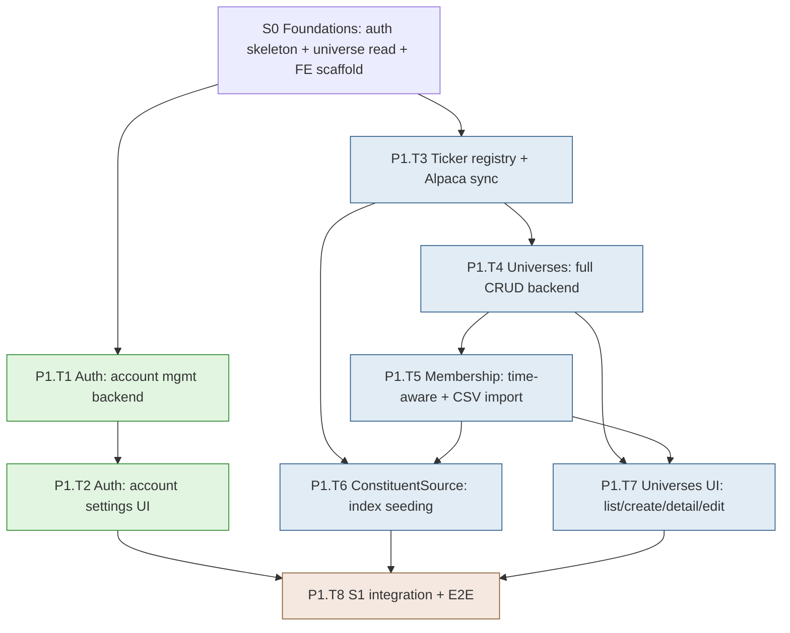
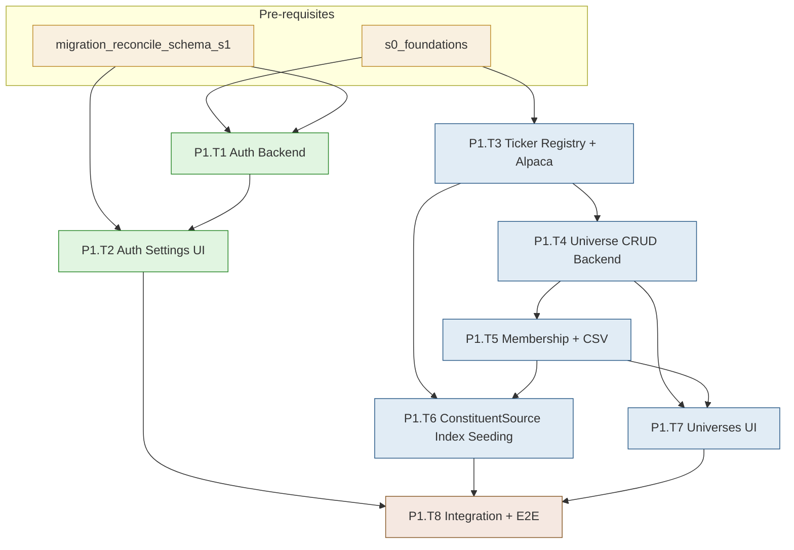

# Development Plan — Stage S1: Auth & Universes

> **Project**: MBI Labs Oracle Engine — Pipeline A
> **Stage**: S1 — Auth & Universe Management (full build)
> **Companion docs**: `mbi-pipeline-a-v1-design.md` (§2 Auth, §3 Universes), `tech-stack-analysis.md`
> **Previous stage**: S0 — Foundations (walking skeleton)
> **Next stage**: S2 — Data Ingestion (Block A1)
> **Status**: Ready for execution. Generated via `dev-plan-generator`; gaps closed via `brainstorming`.

---

## Executive Summary

S1 turns the S0 skeleton slices into complete features. It finishes **Auth** (full account management: change password, session list, log-out-everywhere, password-reset CLI) and builds **Universe Management** end-to-end: a canonical ticker registry lazily synced from Alpaca, custom universes via API + CSV import, the three named-index universes (S&P 500, Russell 1000, Russell 2000) seeded through a swappable `ConstituentSource` scraper with Alpaca validation, time-aware membership with point-in-time snapshots, and the full universe UI (list, create, detail, edit, membership management).

- **Total tasks**: 8 (P1.T1 – P1.T8)
- **Total sub-tasks**: 34
- **Estimated effort**: 11–15 dev days (1 developer); 7–9 days with a backend+frontend pair
- **Builds on**: S0's auth skeleton (JWT-over-session store), the seeded-universe read endpoint, and the frontend feature scaffold

### Top 3 Risks & Mitigations

| Risk | Mitigation |
|---|---|
| **Index constituent sources are unofficial/fragile** (Wikipedia tables, iShares CSV URLs change) | Wrap behind a `ConstituentSource` Protocol so each index has an isolated, independently-fixable adapter; snapshot the parsed result to a dated file so a broken source doesn't wipe an existing universe; validate every symbol against Alpaca before insert |
| **Alpaca asset validation latency on bulk add** (validating 2000 Russell symbols one-by-one is slow) | Fetch the full Alpaca asset list once per sync into an in-memory set; validate against the set, not per-symbol API calls; cache the asset snapshot with a short TTL |
| **Time-aware membership semantics are easy to get subtly wrong** (point-in-time queries, re-add after remove) | Lock the membership state-machine rules in one repository module with dedicated tests for add → remove → re-add and `at=<date>` snapshot correctness before building the UI on top |

---

## Stage Dependency Map

**Critical path**: `S0 → T3 → T4 → T5 → T6 → T8` (ticker registry gates universes, which gate membership, which gates index seeding, which gates integration).
**Parallelizable**: Auth track (T1 → T2) runs fully parallel to the Universe track (T3–T7). The Universes UI (T7) can start as soon as T4/T5 endpoints exist.

### Entry Criteria
- S0 complete with reconciliation (2026-06-01):
  - `make dev` works: backend (FastAPI + JWT auth), frontend (Vite + TS strict), MinIO.
  - Migrations clean: initial schema (5 tables) + reconciliation migration (new columns on users, sessions, universes).
  - Admin can log in (JWT + refresh cookie), S&P 500 universe renders in UI.
  - Backend CI green (ruff + mypy + pytest + migration round-trip).
  - Frontend CI green (ESLint + tsc --noEmit + vitest).
  - E2E CI green (Playwright: login → see S&P 500 universe).
  - Schema deviations reconciled: `users.full_name`, `sessions.last_used_at/user_agent/ip/created_at/updated_at`, `universes.description` added via migration `d871d570373e`.
  - Dead legacy code removed: passlib session auth, broken register/reset endpoints.
  - Feature docs updated: `auth/features.md`, `core/features.md`, `universes/features.md`.
- Alpaca paper-trading account exists with API keys in `.env` (`ALPACA_API_KEY`, `ALPACA_SECRET_KEY`) — needed for ticker validation/sync.

### Exit Criteria
- Admin can change password, see all active sessions, and log out everywhere from `/settings/account`.
- `scripts/reset_password.py` issues a working one-time reset.
- The three named-index universes are seeded with real, Alpaca-validated constituents via the `ConstituentSource` scraper.
- A user can create a custom universe, add/remove tickers (manual + bulk + CSV import), and view point-in-time membership.
- Full universe UI works: list (with ticker counts), create, detail (membership table), edit.
- All new endpoints covered by tests; Playwright E2E extended with a "create universe → add tickers → see them" path; CI green.

---

## Task P1.T1: Auth — Account Management Backend

**Feature**: Feature 1 (Auth)
**Effort**: L / 2 days
**Dependencies**: S0 (P0.T6 auth service + endpoints)
**Risk Level**: Low

#### Sub-task P1.T1.S1: Write account-management service tests (TDD — write first)
**Description**: Before implementation, write tests for: change-password (correct old password succeeds and re-hashes; wrong old password 401s; changing password revokes all *other* sessions but keeps the current one), list-active-sessions (returns non-expired sessions for the user with device/IP/last-used), and log-out-everywhere (deletes all sessions for the user). Use the per-test-DB fixture from S0.
**Implementation Hints**: Tests in `features/auth/tests/test_account_service.py`. Seed a user with multiple sessions via the S0 session-creation service. Assert session row counts before/after each operation. For change-password, assert the new hash verifies and the old one doesn't.
**Dependencies**: P0.T6.S3 (auth service), P0.T3.S3 (test DB)
**Effort**: M / 4 hrs
**Acceptance Criteria**:
- Tests exist and FAIL (RED) — no implementation yet
- Scenarios cover change-password (happy + wrong-old-password), session listing, revoke-all
- Change-password test asserts other sessions die but current survives

#### Sub-task P1.T1.S2: Implement account-management service methods
**Description**: Implement `change_password(user, old_pw, new_pw)`, `list_sessions(user) -> list[SessionInfo]`, `logout_everywhere(user, keep_current_session_id=None)` to pass P1.T1.S1. Change-password verifies the old password (argon2), hashes the new one, and revokes sibling sessions (keep current). Reuse the S0 session store.
**Implementation Hints**: Extend `features/auth/service.py`. `change_password` calls the existing argon2 hasher; on success deletes `sessions WHERE user_id=? AND id != current`. `list_sessions` returns rows with `last_used_at`, `user_agent`, `ip`, and a derived `is_current` flag. Enforce a minimum password policy (length ≥ 12) via a shared validator.
**Dependencies**: P1.T1.S1
**Effort**: M / 4 hrs
**Acceptance Criteria**:
- All P1.T1.S1 tests pass (GREEN)
- Password policy rejected with a clear 422 envelope
- `list_sessions` flags the current session

#### Sub-task P1.T1.S3: Implement account endpoints
**Description**: Expose `POST /api/v1/auth/change-password`, `GET /api/v1/auth/sessions`, `POST /api/v1/auth/logout-everywhere`, and `GET /api/v1/auth/me` (current user profile). All require auth. Change-password and logout-everywhere set/clear the refresh cookie appropriately (current session keeps a fresh cookie after password change).
**Implementation Hints**: Add `endpoints/{change_password,sessions,logout_everywhere,me}.py` under `features/auth/`. `change-password` rotates the current session's refresh token (re-set cookie) after revoking siblings. Pull `current_session_id` from the validated token context. Use the standard error envelope for failures.
**Dependencies**: P1.T1.S2
**Effort**: M / 4 hrs
**Acceptance Criteria**:
- `POST /change-password` with correct old pw → 200, other sessions invalidated, current still valid
- `GET /sessions` → list with `is_current` flags
- `POST /logout-everywhere` → all sessions gone, subsequent requests 401
- `GET /me` returns the admin profile

#### Sub-task P1.T1.S4: Implement password-reset CLI
**Description**: Build `backend/scripts/reset_password.py` (typer) per design §2: takes an email, generates a one-time reset token, stores its hash with a short expiry, and prints the token to stdout. A companion `POST /api/v1/auth/reset-password` consumes the token to set a new password (no email infra — admin runs the CLI, uses the printed token in the UI/endpoint).
**Implementation Hints**: Reuse the `email_verification_token` column pattern OR add a tiny `password_reset_tokens` consideration — but per design simplest is a short-lived token hashed into a reserved column. Token via `secrets.token_urlsafe(32)`. Expiry 1 hour. The consume endpoint validates hash + expiry, sets new password, revokes all sessions.
**Dependencies**: P1.T1.S2
**Effort**: M / 4 hrs
**Risk Flags**: Don't print the token to logs (only stdout for the operator). Ensure the token is single-use (cleared on consume).
**Acceptance Criteria**:
- CLI prints a usable one-time token; re-running invalidates the prior one
- Reset endpoint sets the new password and revokes all sessions
- Expired or reused token returns 400

---

## Task P1.T2: Auth — Account Settings UI

**Feature**: Feature 1 (Auth) — frontend
**Effort**: M / 1 day
**Dependencies**: P1.T1
**Risk Level**: Low

#### Sub-task P1.T2.S1: Build the change-password form
**Description**: Implement the change-password section of `/settings/account` using React Hook Form + Zod (old password, new password, confirm new password with match validation). On success, show a toast and keep the user logged in (current session survives). On wrong old password, surface the API error inline.
**Implementation Hints**: `features/auth/pages/AccountSettingsPage.tsx` + `features/auth/api/useChangePassword.ts` (TanStack mutation). Zod schema enforces the same length policy as the backend (≥12) and confirm-match. Regenerate API types (`make gen-api`) first so the request/response shapes are typed.
**Dependencies**: P1.T1.S3, P0.T8 (frontend scaffold)
**Effort**: M / 4 hrs
**Acceptance Criteria**:
- Valid change → success toast, still authenticated
- Wrong old password → inline error from API envelope
- Client-side validation matches server policy (no false-accept)

#### Sub-task P1.T2.S2: Build the active-sessions list + log-out-everywhere
**Description**: Add a sessions section to `/settings/account` showing each active session (device/user-agent, IP, last used, "this device" badge) fetched via TanStack Query, plus a "Log out everywhere" button that calls the endpoint and, since it kills the current session too, redirects to `/login`.
**Implementation Hints**: `features/auth/api/useSessions.ts` (query, 60s refetch) + `useLogoutEverywhere.ts` (mutation). Render with a shadcn table. After logout-everywhere succeeds, clear the Zustand auth slice and navigate to `/login`. Confirm with a shadcn AlertDialog before executing.
**Dependencies**: P1.T2.S1
**Effort**: M / 4 hrs
**Acceptance Criteria**:
- Sessions list shows all active sessions with the current one badged
- "Log out everywhere" → confirm dialog → all sessions cleared → redirect to login
- List refetches after the action (or component unmounts on redirect)

---

## Task P1.T3: Ticker Registry + Alpaca Sync

**Feature**: Feature 2 (Universes) — ticker registry
**Effort**: L / 2 days
**Dependencies**: S0 (universes/tickers tables exist from P0.T5)
**Risk Level**: Medium

#### Sub-task P1.T3.S1: Build the Alpaca asset-list client
**Description**: Implement a thin client in `features/universes/shared/alpaca_assets.py` wrapping Alpaca's `GET /v2/assets` (via `alpaca-py`) to fetch all tradable US equities/ETFs. Returns a normalized in-memory structure keyed by symbol (`symbol`, `exchange`, `asset_class`, `tradable`, `status`). Cache the snapshot in-memory with a short TTL to avoid refetching during a bulk operation.
**Implementation Hints**: Use `alpaca-py`'s `TradingClient.get_all_assets(GetAssetsRequest(status='active', asset_class='us_equity'))`. Normalize ETF detection (`asset.attributes` / class). Cache via a module-level dict + timestamp (TTL ~1h). Wrap in `tenacity` retry. This is the validation backbone for every universe add.
**Dependencies**: S0
**Effort**: M / 4 hrs
**Risk Flags**: Alpaca returns ~11k assets; keep the snapshot lean (only fields we need). Paper vs live base URL — use paper for v1.
**Acceptance Criteria**:
- Client returns a symbol→asset map of active tradable US equities/ETFs
- Second call within TTL uses the cache (no second API hit)
- Retry on transient Alpaca errors

#### Sub-task P1.T3.S2: Implement the ticker repository (lazy upsert + validation)
**Description**: Build `features/universes/repository.py` ticker functions per the locked **lazy** strategy: `validate_and_upsert_tickers(symbols) -> (inserted, skipped, invalid)` validates each symbol against the Alpaca snapshot, upserts valid ones into `tickers` (filling `exchange`, `asset_type`, `first_seen_at`), and returns which symbols were invalid (not in Alpaca). Tickers are inserted **only when referenced** by a universe add.
**Implementation Hints**: `INSERT ... ON CONFLICT (symbol) DO UPDATE SET last_seen_at=now()`. Map Alpaca `asset_class`/attributes to the `asset_type` enum (`equity`/`etf`). Invalid symbols (not in Alpaca's active set) are returned to the caller, not inserted. Write a TDD test first (valid symbol inserts, unknown symbol reported invalid, duplicate is idempotent).
**Dependencies**: P1.T3.S1, P0.T3.S3
**Effort**: L / 1 day
**Acceptance Criteria**:
- Known symbols upsert with correct exchange/asset_type
- Unknown symbols are reported invalid and NOT inserted
- Re-adding an existing symbol is idempotent (updates `last_seen_at`)

#### Sub-task P1.T3.S3: Add a manual full-sync script/endpoint (non-default)
**Description**: Provide `backend/scripts/sync_tickers.py` (typer) and an admin endpoint `POST /api/v1/tickers/sync` that performs a full Alpaca asset-list sync into `tickers` for when the operator explicitly wants the complete registry. This is the "available but not default" path (lazy-on-add remains the norm).
**Implementation Hints**: Reuse `alpaca_assets.py` + `validate_and_upsert_tickers`. Bulk upsert in chunks of ~1000. Log counts via loguru. Guard the endpoint with `requires_role(["admin"])`. Document in the universes `features.md` that this is optional.
**Dependencies**: P1.T3.S2
**Effort**: M / 4 hrs
**Acceptance Criteria**:
- Script/endpoint inserts/updates the full active asset list
- Idempotent on re-run
- Endpoint requires admin auth

---

## Task P1.T4: Universes — Full CRUD Backend

**Feature**: Feature 2 (Universes)
**Effort**: L / 2 days
**Dependencies**: P1.T3
**Risk Level**: Low

#### Sub-task P1.T4.S1: Write universe CRUD service tests (TDD — write first)
**Description**: Write tests for create (custom universe with `user_id`, uniqueness per `(user_id, name)`), update metadata (name/description/display_name), soft-delete (`deleted_at` set, excluded from default list, included with `?include_deleted=true`), and the guard that **system-managed universes cannot be deleted or renamed** by a user.
**Implementation Hints**: `features/universes/tests/test_universe_service.py`. Seed a system-managed universe and a custom one. Assert the unique constraint raises a clean domain error (not a raw IntegrityError). Assert soft-delete filtering.
**Dependencies**: P1.T3.S2, P0.T3.S3
**Effort**: M / 4 hrs
**Acceptance Criteria**:
- Tests FAIL initially (RED)
- Cover create/update/soft-delete/restore + system-managed protection
- Duplicate name raises a typed domain error

#### Sub-task P1.T4.S2: Implement universe CRUD service + repository
**Description**: Implement create/update/soft-delete/restore in `features/universes/service.py` + `repository.py` to pass P1.T4.S1. Enforce `(user_id, name)` uniqueness, block mutation of `is_system_managed` universes, generate a `display_name`, and a short public ID (`uni_<base32>`) alongside the UUID per tech-stack Gap 10.
**Implementation Hints**: Soft-delete sets `deleted_at=now()`; default queries filter `deleted_at IS NULL`. System-managed guard lives in the service layer (raise `SystemManagedUniverseError` → 403). Public ID via `secrets.token_hex(6)` base32. Reuse the S0 read endpoints' repository where possible.
**Dependencies**: P1.T4.S1
**Effort**: L / 1 day
**Acceptance Criteria**:
- All P1.T4.S1 tests pass (GREEN)
- Create returns a universe with both UUID and `uni_` public ID
- System-managed universe mutation → 403

#### Sub-task P1.T4.S3: Implement universe write endpoints
**Description**: Expose `POST /api/v1/universes` (create), `PATCH /api/v1/universes/{id}` (update metadata), `DELETE /api/v1/universes/{id}` (soft delete), and extend the S0 list endpoint with an `?include_deleted` toggle and a `last_retrain_at` field (nullable; populated in S4, null for now). All require admin auth.
**Implementation Hints**: Add `endpoints/{create,update,delete}.py`; extend `endpoints/list.py`. Pydantic v2 schemas: `UniverseCreate`, `UniverseUpdate`. The `last_retrain_at` is a forward-compatible nullable field (design notes it links to S4). Return the standard error envelope on the system-managed guard.
**Dependencies**: P1.T4.S2
**Effort**: M / 4 hrs
**Acceptance Criteria**:
- Create/update/delete work with admin auth; 401 without
- List excludes soft-deleted by default, includes with `?include_deleted=true`
- Attempting to delete a system-managed universe → 403

---

## Task P1.T5: Membership — Time-Aware + CSV Import

**Feature**: Feature 2 (Universes) — membership
**Effort**: XL / 3 days
**Dependencies**: P1.T4
**Risk Level**: Medium

#### Sub-task P1.T5.S1: Write membership state-machine tests (TDD — write first)
**Description**: Write the tests that pin down time-aware membership semantics before any implementation: add ticker (creates row with `added_at`, `removed_at NULL`), remove ticker (sets `removed_at`, doesn't delete the row), re-add after remove (new row, preserving history), active-members query (only `removed_at IS NULL`), and **point-in-time snapshot** (`at=<date>` returns members where `added_at <= date AND (removed_at IS NULL OR removed_at > date)`).
**Implementation Hints**: `features/universes/tests/test_membership.py`. This is the riskiest correctness surface in S1 — be exhaustive. Test the add→remove→re-add sequence explicitly and assert the snapshot at three different dates returns the right sets.
**Dependencies**: P1.T4.S2, P0.T3.S3
**Effort**: L / 1 day
**Acceptance Criteria**:
- Tests FAIL initially (RED)
- Cover add / remove / re-add / active-query / point-in-time at multiple dates
- The add→remove→re-add history is explicitly asserted

#### Sub-task P1.T5.S2: Implement membership repository + service
**Description**: Implement the membership operations to pass P1.T5.S1, integrating the lazy ticker validation from P1.T3.S2 (adding symbols validates against Alpaca + upserts into `tickers` first, then creates membership rows). Bulk add accepts a list; invalid symbols are reported back, valid ones added.
**Implementation Hints**: `add_members(universe_id, symbols) -> AddResult(added, already_present, invalid)`. Call `validate_and_upsert_tickers` first; only create memberships for valid, not-already-active tickers. `remove_member` sets `removed_at=now()`. Point-in-time query uses the indexed `(universe_id, removed_at)` per design. Block membership mutation on soft-deleted universes.
**Dependencies**: P1.T5.S1, P1.T3.S2
**Effort**: L / 1 day
**Acceptance Criteria**:
- All P1.T5.S1 tests pass (GREEN)
- Bulk add returns added/already-present/invalid breakdown
- Adding an invalid symbol doesn't create a membership row

#### Sub-task P1.T5.S3: Implement membership endpoints (manual add/remove + snapshot)
**Description**: Expose `POST /api/v1/universes/{id}/membership` (bulk add, JSON list of symbols), `DELETE /api/v1/universes/{id}/membership/{ticker_id}` (remove), and `GET /api/v1/universes/{id}/membership?at=<date>` (point-in-time snapshot; omitting `at` returns current active members). All require admin auth.
**Implementation Hints**: Add `endpoints/membership.py`. The add response surfaces the `AddResult` breakdown so the UI can show "3 added, 1 already present, 2 invalid: XYZ, ABC". Validate the `at` query param as a date. Return members joined to ticker metadata.
**Dependencies**: P1.T5.S2
**Effort**: M / 4 hrs
**Acceptance Criteria**:
- Bulk add returns the added/present/invalid breakdown
- Remove sets `removed_at` (row preserved); ticker disappears from active list
- `?at=<past-date>` returns the historically-correct member set

#### Sub-task P1.T5.S4: Implement CSV membership import endpoint
**Description**: Implement `POST /api/v1/universes/{id}/membership:import` accepting a `multipart/form-data` CSV upload (one symbol per row, optional header), parsing it, validating symbols against Alpaca, and bulk-adding via the membership service. Returns the same added/present/invalid breakdown plus parse errors (malformed rows).
**Implementation Hints**: FastAPI `UploadFile`. Parse with pandas or the stdlib `csv` module; tolerate a header row and surrounding whitespace; cap file size (e.g., 5 MB / ~50k rows). Reuse `add_members`. Report per-row parse failures separately from invalid-symbol failures.
**Dependencies**: P1.T5.S3
**Effort**: M / 4 hrs
**Risk Flags**: Guard against malformed/huge files (size cap + row cap). Don't let one bad row abort the whole import — collect and report.
**Acceptance Criteria**:
- Valid CSV bulk-adds symbols; response breaks down added/present/invalid/parse-errors
- Oversized file → 413; malformed rows reported, not fatal
- Re-importing the same CSV is idempotent (already-present, not duplicated)

---

## Task P1.T6: ConstituentSource — Named-Index Seeding

**Feature**: Feature 2 (Universes) — index seeding
**Effort**: L / 2 days
**Dependencies**: P1.T3 (Alpaca validation), P1.T5 (membership service)
**Risk Level**: High

#### Sub-task P1.T6.S1: Define the ConstituentSource interface + snapshot store
**Description**: Define a `ConstituentSource` Protocol in `features/universes/shared/constituents/base.py` with `fetch_constituents() -> list[str]` (returns symbols), so each index has an isolated, swappable adapter. Add a dated snapshot store: every successful fetch writes the parsed symbol list to a timestamped file so a later broken source can't wipe an existing universe.
**Implementation Hints**: Protocol method returns symbols; concrete adapters parse their own source. Snapshots saved via the S0 `artifact_store` (or a sibling) at `constituents/{index_slug}/{YYYY-MM-DD}.json`. Document that this is the swap point for a future licensed index API (tech-stack future hook).
**Dependencies**: P0.T4.S2 (artifact store), P1.T5.S2
**Effort**: M / 4 hrs
**Acceptance Criteria**:
- `ConstituentSource` Protocol defined with one clear method
- Each fetch writes a dated snapshot
- Interface documented as the future-licensed-API swap point

#### Sub-task P1.T6.S2: Implement S&P 500 source (Wikipedia) + Russell sources (iShares)
**Description**: Implement three adapters: `SP500Source` (parses the Wikipedia constituents table via `pandas.read_html`), `Russell1000Source` and `Russell2000Source` (parse iShares ETF holdings CSV exports for IWB/IWM). Each cleans symbols (strip dots/whitespace, handle class shares like `BRK.B`) and returns a symbol list.
**Implementation Hints**: S&P 500: `pd.read_html("https://en.wikipedia.org/wiki/List_of_S%26P_500_companies")` → first table → `Symbol` column. Russells: iShares publishes a downloadable holdings CSV per ETF; fetch via `httpx`, skip the metadata preamble rows, take the `Ticker` column, filter to equities. Normalize `BRK.B`-style symbols to match Alpaca's format. Each adapter is independently fixable.
**Dependencies**: P1.T6.S1
**Effort**: L / 1 day
**Risk Flags**: **Highest-risk task in S1.** Wikipedia table structure and iShares CSV layouts change without notice. Isolate each adapter; write a parse test against a saved fixture of each source so breakage is caught in CI, not in production. Symbol-format mismatches (dots vs dashes) are a classic silent failure — validate against Alpaca catches most.
**Acceptance Criteria**:
- Each adapter returns a plausible count (~500 / ~1000 / ~2000 symbols)
- Symbol normalization handles class shares correctly
- Parse tests run against saved fixtures (not live sources) in CI

#### Sub-task P1.T6.S3: Implement the seed script wiring sources → validation → membership
**Description**: Build `backend/scripts/seed_universes.py` that, for each of the three indices: ensures the system-managed universe row exists, runs its `ConstituentSource`, validates symbols against Alpaca (P1.T3), and bulk-adds via the membership service (P1.T5). Idempotent — re-running reconciles (adds new constituents, marks departed ones removed).
**Implementation Hints**: Reuse `add_members`. For reconciliation: compare fetched set vs current active set; add the new, `remove_member` the departed (preserving history via the time-aware model). Log a summary per index via loguru. This is also the quarterly-refresh entrypoint documented in the runbook.
**Dependencies**: P1.T6.S2, P1.T5.S2, P1.T3.S2
**Effort**: M / 4 hrs
**Risk Flags**: Reconciliation must use the time-aware remove (not hard delete) so historical membership stays intact for survivorship-bias-resistant backtests later.
**Acceptance Criteria**:
- Running the script seeds all three indices with validated constituents
- Re-running reconciles (new added, departed marked removed) without duplicates
- Each index universe shows a realistic active member count

---

## Task P1.T7: Universes UI

**Feature**: Feature 2 (Universes) — frontend
**Effort**: L / 2 days
**Dependencies**: P1.T4, P1.T5
**Risk Level**: Low

#### Sub-task P1.T7.S1: Build the universe list page (full)
**Description**: Upgrade the S0 stub list page to the full design surface: all universes with ticker counts, system-managed vs custom badge, `last_retrain_at` badge (null → "never"), an "include deleted" toggle, a manual refresh button, and a "New universe" CTA. Link each row to its detail page.
**Implementation Hints**: `features/universes/pages/UniverseListPage.tsx` + `api/useUniverses.ts` (on-demand refetch per design §11). Use TanStack Table for sortable columns. Regenerate API types first. System-managed rows show a lock icon (no delete affordance).
**Dependencies**: P1.T4.S3, P0.T8
**Effort**: M / 4 hrs
**Acceptance Criteria**:
- All universes listed with counts + badges
- "Include deleted" toggle works; refresh button refetches
- System-managed universes show no delete affordance

#### Sub-task P1.T7.S2: Build the create + edit universe forms
**Description**: Implement `/universes/new` (create: name, description, display_name) and `/universes/{id}/edit` (edit metadata) using React Hook Form + Zod, sharing one mode-toggled form component. On create success, redirect to the new universe's detail page.
**Implementation Hints**: `features/universes/pages/UniverseFormPage.tsx` (mode prop) + `api/{useCreateUniverse,useUpdateUniverse}.ts`. Zod validates name (non-empty, unique handled server-side → surface the 409/422 inline). Reuse shadcn form primitives.
**Dependencies**: P1.T7.S1
**Effort**: M / 4 hrs
**Acceptance Criteria**:
- Create → redirect to detail; duplicate name surfaces server error inline
- Edit pre-fills current values and saves changes
- System-managed universes can't reach the edit form (guarded)

#### Sub-task P1.T7.S3: Build the universe detail page with membership management
**Description**: Implement `/universes/{id}` showing metadata, a membership table (symbol, exchange, added date), add-tickers controls (paste symbols + the add breakdown result), per-ticker remove, a CSV import dropzone, and a point-in-time date picker that re-queries membership `?at=<date>`. Include a placeholder "model health" link (wired in S4).
**Implementation Hints**: `features/universes/pages/UniverseDetailPage.tsx` + `api/{useMembership,useAddMembers,useRemoveMember,useImportCsv}.ts`. CSV dropzone via `react-dropzone` (tech-stack Gap 6). The add/import result modal shows added/already-present/invalid breakdown. Date picker via `react-day-picker`. Removing a ticker confirms via AlertDialog.
**Dependencies**: P1.T7.S2, P1.T5.S3, P1.T5.S4
**Effort**: L / 1 day
**Acceptance Criteria**:
- Add tickers (paste) shows the added/present/invalid breakdown
- CSV import works via dropzone with the same breakdown + parse errors
- Point-in-time picker re-queries and shows historical membership
- Remove ticker confirms then updates the active list

---

## Task P1.T8: S1 Integration + E2E

**Feature**: Cross-feature verification
**Effort**: M / 1 day
**Dependencies**: P1.T2, P1.T6, P1.T7
**Risk Level**: Medium

#### Sub-task P1.T8.S1: Cross-feature integration tests
**Description**: Write backend integration tests in `backend/tests/integration/` exercising full flows: create custom universe → add tickers (valid + invalid mix) → verify membership → CSV import → point-in-time snapshot → soft-delete → restore. Plus an auth flow: login → change password → confirm other sessions revoked → log out everywhere.
**Implementation Hints**: Use the per-test-DB fixture but at the API layer (FastAPI `TestClient`/`httpx.AsyncClient`). Seed the admin + a small Alpaca asset fixture (mock the Alpaca client so tests don't hit the network). Assert the membership breakdown and snapshot correctness end-to-end.
**Dependencies**: P1.T5, P1.T6, P1.T1
**Effort**: M / 4 hrs
**Risk Flags**: Mock the Alpaca asset client in tests (don't depend on the live API in CI). Provide a deterministic fixture asset set.
**Acceptance Criteria**:
- Full universe lifecycle integration test passes
- Auth account-management integration test passes
- Alpaca client is mocked; no live network calls in CI

#### Sub-task P1.T8.S2: Extend Playwright E2E (create universe → add tickers → see them)
**Description**: Add a second E2E test to `e2e/`: log in, create a custom universe, add a couple of valid tickers via the paste control, assert they appear in the membership table, then open the account settings page and change the password. Keep it deterministic and waiting on `/ready`.
**Implementation Hints**: Extend the S0 Playwright suite. Mock or stub Alpaca validation at the backend test-config level so known symbols (AAPL, MSFT) always validate in the E2E environment. Reuse the `/ready` wait-gate pattern from S0.
**Dependencies**: P1.T7.S3, P1.T2.S1, P0.T9.S3
**Effort**: M / 4 hrs
**Risk Flags**: Alpaca validation must be deterministic in E2E — use a seeded/mocked asset set in the test compose env.
**Acceptance Criteria**:
- E2E passes locally and in CI
- Test genuinely creates a universe and sees added tickers (fails if membership breaks)
- `/ready` wait-gate prevents cold-stack flakiness

#### Sub-task P1.T8.S3: Write/update features.md for auth + universes
**Description**: Update `features/auth/features.md` (account management, reset CLI) and write the full `features/universes/features.md` covering the ticker registry, lazy Alpaca validation, the `ConstituentSource` abstraction + each index adapter, time-aware membership semantics, and CSV import. Update the frontend `feature.md` files to match. Document the quarterly index-refresh runbook in `docs/runbooks/`.
**Implementation Hints**: Match the depth of the S0 features.md template. The universes doc must clearly explain the time-aware membership model (add/remove/re-add/point-in-time) since it's the subtlest part. Add `docs/runbooks/quarterly-index-refresh.md` documenting how to re-run `seed_universes.py`.
**Dependencies**: P1.T6, P1.T5, P1.T7
**Effort**: M / 4 hrs
**Acceptance Criteria**:
- Both features.md updated and match the implemented code
- Time-aware membership semantics clearly documented
- Quarterly-refresh runbook exists

---

## Appendix

### Glossary

| Term | Meaning |
|---|---|
| **Ticker registry** | The canonical `tickers` table; one row per real symbol, populated lazily on universe-add (validated against Alpaca) |
| **ConstituentSource** | A swappable adapter that produces an index's member symbol list (Wikipedia for S&P 500, iShares CSVs for Russells) |
| **Time-aware membership** | Membership rows carry `added_at` + `removed_at`; removal preserves history, enabling point-in-time snapshots |
| **Point-in-time snapshot** | `GET .../membership?at=<date>` — the member set as it was on a given date (survivorship-bias-resistant) |
| **System-managed universe** | The three seeded indices; users can't rename or delete them |
| **Lazy ticker sync** | Tickers enter the registry only when a universe references them (vs. syncing all ~11k Alpaca assets upfront) |

### Full Risk Register

| ID | Risk | Likelihood | Impact | Mitigation | Owner Task |
|---|---|---|---|---|---|
| R1 | Wikipedia/iShares source format changes break seeding | High | Medium | Isolated adapters behind `ConstituentSource`; parse tests against saved fixtures; dated snapshots prevent wipes | P1.T6.S2 |
| R2 | Bulk Alpaca validation slow on 2000-symbol adds | Medium | Medium | Single cached asset-list snapshot; validate against in-memory set, not per-symbol calls | P1.T3.S1 |
| R3 | Time-aware membership edge cases (re-add, snapshot) subtly wrong | Medium | High | TDD the state machine exhaustively before UI; explicit add→remove→re-add + multi-date snapshot tests | P1.T5.S1 |
| R4 | Symbol-format mismatch (BRK.B vs BRK-B) silently drops constituents | Medium | Medium | Normalize in adapters; Alpaca validation reports unmatched symbols rather than silently skipping | P1.T6.S2 |
| R5 | CSV import abused with huge/malformed files | Low | Low | Size + row caps (413); per-row error collection, non-fatal | P1.T5.S4 |
| R6 | Live Alpaca dependency makes CI flaky | Medium | Medium | Mock the Alpaca client in all tests; deterministic fixture asset set | P1.T8.S1 |

### Assumptions Log

Inherited from `tech-stack-analysis.md` §4, plus S1-specific:
- Constituent sourcing is **hybrid** (locked): Alpaca-validated registry + custom universes (API/CSV) + named indices via swappable scraper.
- Ticker registry is populated **lazily** on universe-add (locked); a manual full-sync exists but isn't default.
- CSV import ships in S1 with both endpoint and drag-drop UI (locked).
- Full account-management surface ships in S1 (locked): change password + sessions + log-out-everywhere.
- Alpaca **paper** account is used for asset validation; keys live in `.env`.
- Index membership has no free official API; the scraper is the accepted, documented, swappable workaround.

### Cross-references
- Design spec: `mbi-pipeline-a-v1-design.md` (§2 Auth, §3 Universes)
- Stack validation: `tech-stack-analysis.md` (§3 Gap 4 constituent CSVs, Gap 10 short IDs, §4 Assumptions)
- Previous stage: `development-plan-S0.md` (auth skeleton, universe read endpoint, FE scaffold this builds on)
- Next stage: `development-plan-S2.md` (Data Ingestion — Block A1) — forthcoming

### S1 Task Dependency Map

This map is authoritative for coding agents. A task depends on all upstream tasks connected to it by directed edges.

| Task | ID | Dependencies | Can Start When | Blocks |
|---|---|---|---|---|
| Auth account management backend | T1 | S0, migration `d871d570373e` | Phase 1 complete | T2, P1.T1.S2-S4 |
| Auth settings UI | T2 | T1 | T1 complete | T8 |
| Ticker registry + Alpaca sync | T3 | S0 | Phase 1 complete | T4, T6 |
| Universe CRUD backend | T4 | T3 | T3 complete | T5, T7 |
| Membership (time-aware + CSV) | T5 | T4 | T4 complete | T6, T7 |
| ConstituentSource index seeding | T6 | T3, T5 | T3+T5 complete | T8 |
| Universes UI | T7 | T4, T5 | T4+T5 endpoints exist | T8 |
| Integration + E2E | T8 | T2, T6, T7 | All feature tracks complete | (none) |

**Parallel execution strategy**:
- **Track A (Auth)**: T1 → T2 — runs fully parallel to universes track
- **Track B (Universes Backend)**: T3 → T4 → T5 — sequential by necessity (each builds on prior)
- **Track C (Index Seeding)**: T6 — starts after T3+T5
- **Track D (Universes UI)**: T7 — starts after T4+T5 endpoints exist
- **Final**: T8 — gates on T2+T6+T7

Sub-tasks within each task are always sequential (TDD: tests first, then implementation, then endpoints).

**Critical path**: S0 → T3 → T4 → T5 → T6 → T8 (ticker registry gates everything).

---

## End of Stage S1 Plan
