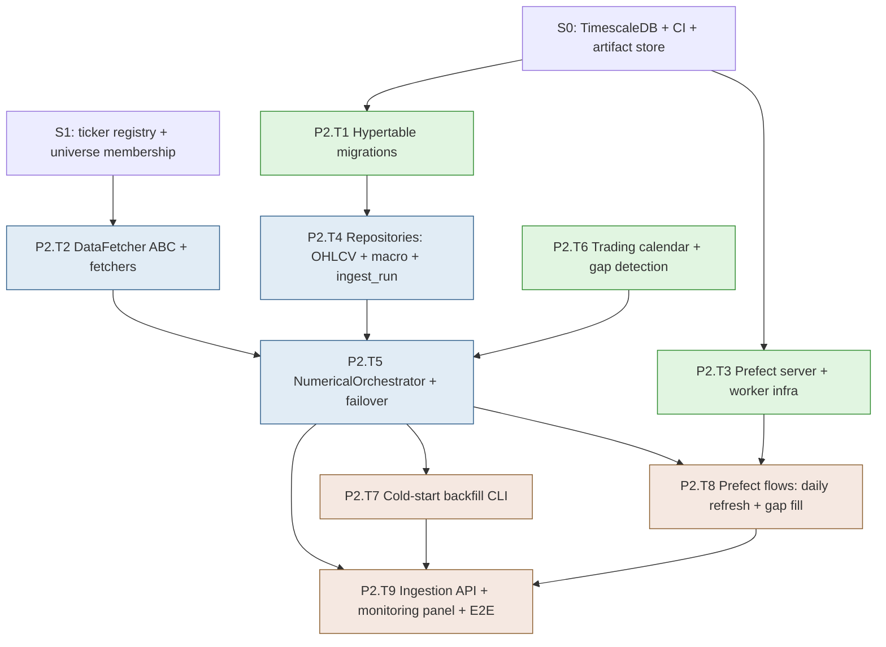

# Development Plan — Stage S2: Data Ingestion (Block A1)

> **Project**: MBI Labs Oracle Engine — Pipeline A
> **Stage**: S2 — Data Ingestion Layer (Block A1)
> **Companion docs**: `mbi-pipeline-a-v1-design.md` (§4 Data Ingestion), `tech-stack-analysis.md`
> **Previous stage**: S1 — Auth & Universes
> **Next stage**: S3 — Feature Engineering (Blocks A2 + A3)
> **Status**: Ready for execution. Generated via `dev-plan-generator`; gaps closed via `brainstorming`.

---

## Executive Summary

S2 builds the numerical data backbone — Block A1. It implements the `DataFetcher` abstraction with four concrete sources (yfinance primary, Alpaca secondary, Stooq last-resort, FRED for macro), the `NumericalOrchestrator` with failover + per-ticker isolation, TimescaleDB hypertables for OHLCV and macro observations, trading-calendar-aware gap detection, the cold-start 2-year backfill CLI, and — importantly — **the birth of orchestration**: a full Prefect server + worker in docker-compose with the daily data-refresh flow registered and scheduled. By the end of S2, one command backfills 2 years of OHLCV + macro for every universe, and a scheduled Prefect flow keeps it current after each market close.

- **Total tasks**: 9 (P2.T1 – P2.T9)
- **Total sub-tasks**: 33
- **Estimated effort**: 12–16 dev days (1 developer); 8–10 days with a backend+infra pair
- **Builds on**: S1's ticker registry + universe membership (the source of "which tickers to fetch"); S0's TimescaleDB + artifact store + CI

### Top 3 Risks & Mitigations

| Risk | Mitigation |
|---|---|
| **yfinance unreliability** (breaks for days, rate limits, silent empty returns) | Failover chain (yfinance → Alpaca → Stooq) with `tenacity` retry; per-ticker isolation so one failure doesn't abort the batch; `IngestRun.status='partial'` lets the pipeline proceed on stale data while alerting; empty-return detection treated as failure, not success |
| **Prefect-in-Postgres schema collision** (Prefect + Alembic fighting over the same DB) | Prefect uses a separate `prefect` schema via `PREFECT_API_DATABASE_CONNECTION_URL`; app migrations stay in `public`; documented in compat notes; verified by a "both migrate clean" CI check |
| **Full Russell-3000 backfill is slow + memory-heavy** (~1.5M bars, ~2hr on yfinance) | Batched fetches (50 tickers/batch); resumable backfill (skip ticker-dates already present via `ON CONFLICT`); progress logged per batch; documented runtime expectation in the cold-start runbook |

---

## Stage Dependency Map

**Critical path**: `S1 → T2 → T5 → T7 → T9` (fetchers → orchestrator → backfill → verification). `T1`, `T3`, `T6` are prerequisites that can be built in parallel up front.
**Parallelizable**: T1 (migrations), T3 (Prefect infra), and T6 (calendar) have no interdependencies and can be done concurrently before T5 integrates everything.

### Entry Criteria
- S1 complete: ticker registry populated lazily, universes seeded (3 indices + ability to create custom), membership queryable.
- `.env` has `FRED_API_KEY`, `ALPACA_API_KEY`, `ALPACA_SECRET_KEY`.
- TimescaleDB extension confirmed working (S0 `make db-check`).

### Exit Criteria
- `scripts/initial_backfill.py` pulls 2 years of daily OHLCV for every active ticker across all universes + all 7 macro series, resumably, into TimescaleDB hypertables.
- Failover works: a simulated yfinance failure falls through to Alpaca, then Stooq, recorded in `ohlcv_bars.source`.
- Trading-calendar-aware gap detection correctly identifies missing bars (ignoring holidays/weekends).
- Prefect server + worker run via docker-compose; `daily_data_refresh` flow is deployed, scheduled (weekdays ~4:30pm ET), and runnable on-demand.
- `POST /api/v1/data_ingestion/trigger` kicks an on-demand refresh; monitoring panel shows last-ingest status.
- CI green with mocked APIs; one documented manual live smoke test passes.

---

## Task P2.T1: TimescaleDB Hypertable Migrations

**Feature**: Feature 3 (Data Ingestion) — schema
**Effort**: M / 1 day
**Dependencies**: S0 (Alembic + Timescale), S1 (tickers table)
**Risk Level**: Medium

#### Sub-task P2.T1.S1: Define ORM models for ohlcv_bars, macro_observations, ingest_runs
**Description**: Create `features/data_ingestion/models.py` with the three ORM models exactly per design §4 (OHLCVBar, MacroObservation, IngestRun), including the composite PKs, FKs to `tickers` and `ingest_runs`, the `source` field, and the enum types. These are plain SQLAlchemy models; the hypertable conversion happens in the migration.
**Implementation Hints**: Composite PK `(ticker_id, bar_date)` on OHLCV; `(series_name, observed_date)` on macro. Use `NUMERIC(18,6)` for prices (Decimal round-trip per compat note #12 — never cast to float in the service layer). Register these models in `alembic/env.py`'s import list (S0 pattern).
**Dependencies**: P0.T5.S1, S1
**Effort**: S / 3 hrs
**Acceptance Criteria**:
- Models match design §4 column-for-column
- Models imported in alembic env for autogen discovery
- `NUMERIC` precision preserved (no float casts)

#### Sub-task P2.T1.S2: Author the hypertable migration
**Description**: Write the Alembic migration that creates the three tables, then converts `ohlcv_bars` (on `bar_date`) and `macro_observations` (on `observed_date`) into TimescaleDB hypertables via `SELECT create_hypertable(...)`. Add the design-specified indexes (`(ticker_id, bar_date DESC)`, `(series_name, observed_date)`, `(triggered_at DESC)` on ingest_runs). `ingest_runs` stays a plain table.
**Implementation Hints**: Per compat note #2, autogenerate the plain tables first, then hand-add the `op.execute("SELECT create_hypertable('ohlcv_bars', 'bar_date', if_not_exists => TRUE)")` calls *after* table creation in the same migration. Hypertable conversion must happen before any data exists. Indexes on a hypertable are created normally but apply per-chunk.
**Dependencies**: P2.T1.S1
**Effort**: M / 4 hrs
**Risk Flags**: `create_hypertable` must run after `create_table` but the table must be empty. Composite PK including the partition column is required by Timescale — verify `bar_date` and `observed_date` are part of their PKs (they are, per design).
**Acceptance Criteria**:
- `alembic upgrade head` creates the tables and converts two to hypertables
- `SELECT * FROM timescaledb_information.hypertables` shows both
- `downgrade` drops cleanly (drops hypertables like normal tables)

#### Sub-task P2.T1.S3: Add the monthly partition-manager scheduler hook
**Description**: Per design §11, register a monthly in-process scheduler task (the S0 `core/services/scheduler.py`) that pre-creates the next month's chunks isn't strictly needed for Timescale (it auto-creates chunks), but add the documented retention/chunk-policy configuration: set a sensible `chunk_time_interval` (e.g., 1 month) on each hypertable and document the future retention policy hook.
**Implementation Hints**: Timescale auto-creates chunks on insert, so no manual partition creation is needed (unlike vanilla Postgres declarative partitioning). The real action here is `SELECT set_chunk_time_interval('ohlcv_bars', INTERVAL '1 month')` in the migration and a documented (not-yet-active) `add_retention_policy` for the future. Clarify in `features.md` that Timescale differs from the manual partitioning Feenix used.
**Dependencies**: P2.T1.S2
**Effort**: S / 2 hrs
**Acceptance Criteria**:
- Chunk interval configured on both hypertables
- Retention policy documented as a future hook (not active in v1)
- `features.md` notes the Timescale-vs-manual-partitioning distinction

---

## Task P2.T2: DataFetcher ABC + Concrete Fetchers

**Feature**: Feature 3 (Data Ingestion) — fetchers
**Effort**: XL / 3 days
**Dependencies**: S1 (Alpaca client from P1.T3 can be reused/extended)
**Risk Level**: Medium

#### Sub-task P2.T2.S1: Define the DataFetcher ABC + shared retry/exception helpers
**Description**: Implement `features/data_ingestion/shared/fetcher_base.py` with the `DataFetcher(ABC)` per spec a1.2 (`__init__(**kwargs)`, `@abstractmethod fetch() -> pd.DataFrame | dict[str, pd.DataFrame]`), plus shared `tenacity` retry decorators (`wait_exponential(min=2, max=30), stop_after_attempt(3)`) and the `DataPipelineAlert` exception in `shared/exceptions.py`.
**Implementation Hints**: The ABC enforces strict return typing. The retry helper is a reusable decorator applied to each concrete fetcher's network call. `DataPipelineAlert` carries the failed-ticker list + source for monitoring. Keep timezone-stripping as a shared post-fetch utility (`strip_tz(df)`).
**Dependencies**: S1
**Effort**: M / 4 hrs
**Acceptance Criteria**:
- `DataFetcher` ABC defined with strict typing
- Retry decorator + `DataPipelineAlert` available as shared utilities
- `strip_tz` utility enforces tz-naive indexes

#### Sub-task P2.T2.S2: Implement YahooFinanceFetcher (primary OHLCV)
**Description**: Implement `features/data_ingestion/numerical/yahoo.py` per spec a1.3: fetch daily OHLCV for a list of symbols (`period='2y'` for backfill, configurable date range for incremental), strip timezones, enforce the OHLCV schema (no NaNs, correct dtypes), and treat empty returns as failures (not silent success). Wrap in the shared retry.
**Implementation Hints**: Use `yfinance.download(symbols, period=..., interval='1d', group_by='ticker', threads=True)`. Strip tz via the shared utility. **Critical**: yfinance returns an empty frame on failure rather than raising — detect `df.empty` and raise so the retry/failover triggers. Batch symbols (≤50) to stay polite. Return `dict[symbol, DataFrame]`.
**Dependencies**: P2.T2.S1
**Effort**: L / 1 day
**Risk Flags**: The empty-return-as-success trap is the #1 yfinance gotcha. Also handle partial batch returns (some symbols present, some missing). Adjusted close handling: capture `Adj Close` into `adjusted_close`.
**Acceptance Criteria**:
- Fetches valid OHLCV for known symbols with tz-naive index
- Empty/missing symbol return raises (triggers failover), not silent pass
- Schema enforced: no NaNs in OHLCV, correct dtypes, `adjusted_close` captured

#### Sub-task P2.T2.S3: Implement AlpacaFetcher (secondary OHLCV) + StooqFetcher (last resort)
**Description**: Implement `numerical/alpaca.py` (using `alpaca-py`'s market-data client for daily bars) and `numerical/stooq.py` (direct CSV download via `httpx` from Stooq's endpoint). Both inherit `DataFetcher`, return the same normalized schema, strip timezones, and enforce dtypes — so the orchestrator can use any of them interchangeably.
**Implementation Hints**: Alpaca: `StockHistoricalDataClient.get_stock_bars(StockBarsRequest(...))`, timeframe=Day, adjustment='all'. Stooq: GET `https://stooq.com/q/d/l/?s={symbol}.us&i=d`, parse CSV with pandas, rename columns to the standard schema. Both must produce identical column names/dtypes to YahooFinanceFetcher so failover is transparent.
**Dependencies**: P2.T2.S1
**Effort**: L / 1 day
**Risk Flags**: Stooq uses `.us` suffix and different symbol formatting — normalize. Alpaca's free tier has a 15-min delay on the most recent bar (fine for after-close daily). Column-name parity across all three fetchers is essential.
**Acceptance Criteria**:
- Both fetchers return the exact same schema as YahooFinanceFetcher
- Alpaca fetch works against the paper-account market-data API
- Stooq CSV parse handles its symbol-suffix + column quirks

#### Sub-task P2.T2.S4: Implement FREDFetcher (macro)
**Description**: Implement `numerical/fred.py` per spec a1.4: fetch the 7 macro series by their FRED IDs, rename to the standardized column names, and return a single date-indexed DataFrame. Apply the shared retry. Forward-filling to the trading calendar happens in the orchestrator (not here — this just fetches raw series).
**Implementation Hints**: Use `fredapi.Fred(api_key=...)`. Loop the 7 series IDs (`DFF`, `CPIAUCSL`, etc.), rename per the design's mapping table, outer-join into one frame on date. Don't forward-fill here. Flag each series' latest observation date so the orchestrator can compute `stale_macro`.
**Dependencies**: P2.T2.S1
**Effort**: M / 4 hrs
**Acceptance Criteria**:
- All 7 series fetched and renamed to standardized columns
- Returns one date-indexed DataFrame
- Latest-observation dates available for staleness detection

#### Sub-task P2.T2.S5: Write fetcher tests with recorded fixtures (TDD + mock-in-CI)
**Description**: Per the locked dev/test posture (real APIs in dev, mocked in CI), record response fixtures for each fetcher and write tests that run against them: schema correctness, tz-stripping, empty-return-raises (yfinance), column parity across fetchers, FRED series renaming. Tests must NOT hit live APIs in CI.
**Implementation Hints**: Capture real responses once (in dev) into `features/data_ingestion/tests/fixtures/`. Use `respx` (httpx mocking) for Stooq/Alpaca-HTTP and monkeypatch for yfinance/fredapi library calls. Add a `pytest.mark.live` marker for the manual live-smoke tests that CI skips.
**Dependencies**: P2.T2.S2, P2.T2.S3, P2.T2.S4
**Effort**: M / 4 hrs
**Acceptance Criteria**:
- Each fetcher has fixture-based tests covering schema + edge cases
- Tests pass in CI with zero live network calls
- `@pytest.mark.live` tests exist for manual dev validation (CI-skipped)

---

## Task P2.T3: Prefect Server + Worker Infrastructure

**Feature**: Feature 9 (Orchestration) — infra (born here)
**Effort**: L / 2 days
**Dependencies**: S0 (docker-compose, Postgres)
**Risk Level**: High

#### Sub-task P2.T3.S1: Add Prefect server + worker to docker-compose with separate schema
**Description**: Add `prefect-server` and `prefect-worker` services to `docker-compose.dev.yml`, configured to use the existing Postgres via a **separate `prefect` schema** (not `public`), so Prefect's tables never collide with Alembic-managed app tables. Persist Prefect state across restarts.
**Implementation Hints**: Use `prefecthq/prefect:3-latest`. Set `PREFECT_API_DATABASE_CONNECTION_URL=postgresql+asyncpg://.../mbi` with `PREFECT_API_DATABASE_CONNECTION_URL` pointed at a schema-qualified search path, OR a dedicated `prefect` database (simplest clean separation — recommend a separate DB named `prefect` on the same Postgres instance). Worker connects to the server's API URL. Add healthchecks.
**Dependencies**: P0.T1.S1
**Effort**: M / 4 hrs
**Risk Flags**: **Highest-risk task in S2.** The cleanest separation is a *separate database* (`prefect`) on the same Postgres server rather than a shared-DB-separate-schema (which Prefect 3 supports less cleanly). Recommend the separate-DB approach; document the decision. Verify both Alembic (app DB) and Prefect (prefect DB) migrate independently.
**Acceptance Criteria**:
- `docker compose up` starts Prefect server + worker healthy
- Prefect uses its own database/schema; app Alembic untouched by Prefect
- Prefect state persists across `down`/`up`

#### Sub-task P2.T3.S2: Implement the flow-deployment script + base flow scaffolding
**Description**: Build `backend/scripts/deploy_prefect_flows.py` that registers all data flows as Prefect deployments with their schedules. Create `orchestration/` package scaffolding per design §10: `flows/`, `tasks/`, `deployments.py`. Define the reusable task wrappers in `tasks/data_tasks.py` that call into feature services.
**Implementation Hints**: Use Prefect 3's `flow.serve()` / `Deployment` API. Schedules as cron strings (weekdays 4:30pm ET for daily refresh — set timezone explicitly). `tasks/data_tasks.py` holds `@task`-decorated thin wrappers (retries=3, retry_delay) that call `NumericalOrchestrator`. The deploy script is idempotent (re-running updates deployments).
**Dependencies**: P2.T3.S1
**Effort**: M / 4 hrs
**Acceptance Criteria**:
- Deploy script registers deployments + schedules on the Prefect server
- `orchestration/` package structure matches design §10
- Re-running the deploy script updates (not duplicates) deployments

#### Sub-task P2.T3.S3: Wire the monitoring read-model for Prefect flow state
**Description**: Add a thin read path so the app can surface Prefect flow-run status without rebuilding Prefect's UI (design §10 says we link out, but the monitoring panel needs last-run summaries). Implement a `prefect_client.py` in `core/services/` that queries Prefect's API for recent flow runs.
**Implementation Hints**: Use Prefect's Python client (`get_client()`) to query flow runs by deployment + state. Cache briefly. This feeds the monitoring panel in P2.T9. Don't query Prefect's DB directly — use its API (decouples us from its schema).
**Dependencies**: P2.T3.S2
**Effort**: S / 3 hrs
**Acceptance Criteria**:
- `prefect_client.get_recent_runs(deployment)` returns run status + timing
- Queries via Prefect API, not direct DB access
- Result shape ready for the monitoring panel

---

## Task P2.T4: Repositories — OHLCV, Macro, IngestRun

**Feature**: Feature 3 (Data Ingestion) — persistence
**Effort**: M / 1 day
**Dependencies**: P2.T1
**Risk Level**: Low

#### Sub-task P2.T4.S1: Implement the OHLCV + macro repositories with upsert
**Description**: Build `features/data_ingestion/repository.py` with bulk upsert for OHLCV bars and macro observations (`INSERT ... ON CONFLICT (ticker_id, bar_date) DO UPDATE` per compat note #10), plus read helpers: latest bar date per ticker, bars in a date range, presence checks for gap detection. These power both backfill (resumable) and incremental.
**Implementation Hints**: Bulk upsert via SQLAlchemy's `insert(...).on_conflict_do_update(...)`. The "latest bar date per ticker" query (`SELECT ticker_id, MAX(bar_date) GROUP BY ticker_id`) drives incremental + gap detection. Keep all queries here (cache-friendly per design §11).
**Dependencies**: P2.T1.S2
**Effort**: M / 4 hrs
**Acceptance Criteria**:
- Bulk upsert inserts new bars and updates overlapping ones idempotently
- Latest-bar-date-per-ticker query is correct and indexed
- Date-range read returns contiguous bars for a ticker

#### Sub-task P2.T4.S2: Implement the IngestRun repository + lifecycle
**Description**: Build the `ingest_runs` persistence: create a run (status `running`), update it on completion (`succeeded`/`partial`/`failed`) with row counts, failed-ticker list, `stale_macro` flag, and error summary. Provide a "latest run" query for the monitoring panel.
**Implementation Hints**: Create-then-update pattern: open the run before fetching, finalize after. `partial` status when some tickers failed but others succeeded. The failed-ticker array and stale-macro flag feed alerts. Index on `(triggered_at DESC)` for the latest-run lookup.
**Dependencies**: P2.T4.S1
**Effort**: S / 3 hrs
**Acceptance Criteria**:
- Run lifecycle (running → terminal state) persists correctly
- Failed tickers + stale-macro recorded
- Latest-run query powers the monitoring panel

---

## Task P2.T5: NumericalOrchestrator + Failover

**Feature**: Feature 3 (Data Ingestion) — orchestration core
**Effort**: L / 2 days
**Dependencies**: P2.T2, P2.T4, P2.T6
**Risk Level**: Medium

#### Sub-task P2.T5.S1: Write orchestrator tests (TDD — write first)
**Description**: Write tests covering: failover (yfinance fails → Alpaca tried → Stooq tried, recorded source reflects which won), per-ticker isolation (one ticker's total failure doesn't abort the batch; it lands in `failed_tickers`), the >3-failures `DataPipelineAlert` trigger, macro forward-fill + `stale_macro` flagging, and the leading-NaN drop after merge. Use mocked fetchers.
**Implementation Hints**: `features/data_ingestion/tests/test_orchestrator.py`. Inject mock fetchers that fail on command to exercise the failover chain. Assert `ohlcv_bars.source` reflects the successful fetcher. Assert the alert fires at >3 failures. This is the behavioral contract of Block A1 — be thorough.
**Dependencies**: P2.T2, P2.T4, P0.T3.S3
**Effort**: M / 4 hrs
**Acceptance Criteria**:
- Tests FAIL initially (RED)
- Failover, isolation, alert-threshold, macro-staleness, NaN-drop all covered
- Source attribution asserted per fetcher

#### Sub-task P2.T5.S2: Implement the orchestrator (failover + isolation + cleaning)
**Description**: Implement `features/data_ingestion/service.py::NumericalOrchestrator` to pass P2.T5.S1: resolve active tickers from universes, fetch OHLCV with the yfinance→Alpaca→Stooq failover per ticker, fetch macro via FRED, apply cleaning rules (tz-strip, dtype enforce, no-NaN assert on OHLCV, macro forward-fill to the trading calendar, leading-NaN drop), persist via repositories, and finalize the IngestRun.
**Implementation Hints**: Per spec a1.5. Failover is per-ticker (try primary, on retry-exhaustion try secondary, then tertiary). Macro forward-fill uses the trading calendar from P2.T6 (not naive ffill). Set `stale_macro` if any series' latest obs >30 days old. Wrap each ticker in try/except so isolation holds. Accept a `mode` param (backfill vs incremental vs gap-fill).
**Dependencies**: P2.T5.S1
**Effort**: L / 1 day
**Risk Flags**: The forward-fill must align to real trading days (P2.T6), not calendar days, or macro values land on non-trading dates. Keep Decimal precision through persistence.
**Acceptance Criteria**:
- All P2.T5.S1 tests pass (GREEN)
- Failover + per-ticker isolation work end-to-end
- Cleaning rules applied; `IngestRun` finalized with accurate counts/flags

---

## Task P2.T6: Trading Calendar + Gap Detection

**Feature**: Feature 3 (Data Ingestion) — calendar
**Effort**: M / 1 day
**Dependencies**: S0
**Risk Level**: Low

#### Sub-task P2.T6.S1: Integrate pandas-market-calendars (NYSE)
**Description**: Add `pandas-market-calendars` and build `features/data_ingestion/shared/trading_calendar.py` exposing: `trading_days(start, end) -> list[date]` (NYSE sessions, holiday/half-day aware), `is_trading_day(date) -> bool`, and `expected_bars(ticker_added_at, through) -> set[date]`. This is the single source of truth for "what dates should have bars."
**Implementation Hints**: `mcal.get_calendar('NYSE').schedule(start, end)` → session dates. Cache the calendar per date-range. `expected_bars` clamps to when the ticker entered a universe (no expecting bars before it existed). Used by both the orchestrator (macro ffill alignment) and gap detection.
**Dependencies**: S0
**Effort**: M / 4 hrs
**Acceptance Criteria**:
- `trading_days` excludes weekends + NYSE holidays + respects half-days
- `is_trading_day` correct for known holidays (e.g., July 4, Thanksgiving)
- Calendar cached to avoid recomputation per call

#### Sub-task P2.T6.S2: Implement gap detection
**Description**: Build `detect_gaps(ticker_id) -> list[date]` comparing `expected_bars` (from the calendar, since the ticker's universe-add date) against actually-present bar dates (from the OHLCV repository). Returns the missing trading days. This drives the daily flow's self-healing gap-fill.
**Implementation Hints**: `expected = trading_calendar.expected_bars(added_at, today)`; `present = repository.present_bar_dates(ticker_id)`; `gaps = sorted(expected - present)`. Ignore the most-recent day if it's today and market hasn't closed. Batch-friendly: compute for many tickers via a single grouped query.
**Dependencies**: P2.T6.S1, P2.T4.S1
**Effort**: S / 3 hrs
**Acceptance Criteria**:
- Gap detection ignores weekends/holidays (no false gaps)
- Correctly identifies genuinely missing trading days
- Doesn't flag today's bar before market close
- Holiday near a real gap doesn't mask the real gap

---

## Task P2.T7: Cold-Start Backfill CLI

**Feature**: Feature 3 (Data Ingestion) — backfill
**Effort**: M / 1 day
**Dependencies**: P2.T5
**Risk Level**: Medium

#### Sub-task P2.T7.S1: Implement the resumable backfill script
**Description**: Build `backend/scripts/initial_backfill.py` (typer) that runs the orchestrator in `backfill` mode for every active ticker across all universes + all 7 macro series, pulling 2 years of history. **Resumable**: skip ticker-dates already present so an interrupted run can re-run without redoing work. Batched (50 tickers) with per-batch progress logging.
**Implementation Hints**: Query distinct active tickers across all universes. For each batch, call the orchestrator; the `ON CONFLICT` upsert makes it naturally resumable (re-fetching existing dates is harmless). Log progress (`batch 3/60, 150 tickers done, 2 failed`). Accept `--universe` to scope to one, `--batch-size` to tune.
**Dependencies**: P2.T5.S2
**Effort**: M / 4 hrs
**Risk Flags**: Full Russell-3000 backfill is ~1.5M rows and ~1.5–2hr on yfinance. Document expected runtime + memory in the runbook. Resumability is essential — a crash at ticker 2500 shouldn't restart from zero.
**Acceptance Criteria**:
- Backfills 2y OHLCV + 7 macro series for all active tickers
- Interrupting and re-running skips already-present data (resumable)
- Per-batch progress logged; `--universe` scoping works

#### Sub-task P2.T7.S2: Write the cold-start runbook
**Description**: Author `docs/runbooks/cold-start-ingestion.md` documenting the first-time backfill: prerequisites (API keys, universes seeded), the command, expected runtime/memory for each universe size, how to monitor progress, what to do on partial failure, and the live-API caveat (yfinance may be flaky — re-run is safe).
**Implementation Hints**: Include concrete numbers (S&P 500 ≈ 250k bars ≈ 15 min; Russell 3000 ≈ 1.5M bars ≈ 1.5–2hr). Document the `pytest.mark.live` smoke test as a pre-backfill sanity check. Cross-link from the root README.
**Dependencies**: P2.T7.S1
**Effort**: S / 2 hrs
**Acceptance Criteria**:
- Runbook covers prerequisites, command, runtime expectations, failure recovery
- A new operator can run the backfill from the runbook alone
- Live-API flakiness + safe-re-run documented

---

## Task P2.T8: Prefect Flows — Daily Refresh + Gap Fill

**Feature**: Feature 9 (Orchestration) — data flows
**Effort**: M / 1 day
**Dependencies**: P2.T5, P2.T3
**Risk Level**: Medium

#### Sub-task P2.T8.S1: Implement the daily_data_refresh flow
**Description**: Build `orchestration/flows/daily_data_refresh.py` per design §10: for each active universe, fetch the latest trading day's bars (incremental mode) + refresh macro, with task-level retries. Registered as a Prefect deployment scheduled weekdays ~4:30pm ET (after close). Composes the orchestrator via the `tasks/data_tasks.py` wrappers — no business logic in the flow.
**Implementation Hints**: The flow iterates universes, calls `infer`-style tasks that wrap `NumericalOrchestrator(mode='incremental')`. Incremental fetches only dates after each ticker's latest present bar. Schedule timezone explicitly `America/New_York`. On-failure hook writes a `system_alerts` row (S6 fully wires alerts; stub the write now).
**Dependencies**: P2.T5.S2, P2.T3.S2
**Effort**: M / 4 hrs
**Acceptance Criteria**:
- Flow runs incrementally, fetching only new bars
- Deployed + scheduled (weekdays after close, ET) and runnable on-demand
- Task retries + on-failure alert stub work

#### Sub-task P2.T8.S2: Implement gap-fill within the daily flow
**Description**: Extend the daily flow to run gap detection (P2.T6.S2) after the incremental fetch and trigger a targeted re-fetch for any genuinely missing trading days per ticker. This is the self-healing path that recovers from prior failed runs.
**Implementation Hints**: After incremental insert, call `detect_gaps` per active ticker (batched), collect the union of missing dates, and run a scoped orchestrator fetch for just those ticker-dates. Cap the gap-fill lookback (e.g., 30 trading days) so a long-dormant ticker doesn't trigger a huge backfill inside the daily flow — route that to the manual backfill instead.
**Dependencies**: P2.T8.S1, P2.T6.S2
**Effort**: S / 3 hrs
**Acceptance Criteria**:
- Daily flow detects and fills recent gaps automatically
- Gap-fill lookback is capped (large gaps deferred to manual backfill)
- A deliberately deleted bar is recovered on the next daily run

---

## Task P2.T9: Ingestion API + Monitoring Panel + E2E

**Feature**: Feature 3 + Feature 8 (Monitoring) + verification
**Effort**: M / 1 day
**Dependencies**: P2.T5, P2.T7, P2.T8
**Risk Level**: Low

#### Sub-task P2.T9.S1: Implement ingestion trigger + status endpoints
**Description**: Expose `POST /api/v1/data_ingestion/trigger` (on-demand refresh, optionally scoped to a universe; kicks the orchestrator or the Prefect deployment) and `GET /api/v1/data_ingestion/status` (latest IngestRun summary + per-universe freshness). Admin-only. Plus a `GET /api/v1/data_ingestion/bars?ticker=...&from=...&to=...` read for inspection.
**Implementation Hints**: `endpoints/{trigger,status,query}.py`. Trigger can either run synchronously (small scope) or fire a Prefect deployment run (full scope) — prefer firing the Prefect run for large scopes and returning the run ID. Status reads the latest IngestRun + latest-bar-date per universe.
**Dependencies**: P2.T5.S2, P2.T3.S3
**Effort**: M / 4 hrs
**Acceptance Criteria**:
- Trigger kicks a refresh (sync for small scope, Prefect run for large)
- Status returns last-ingest summary + per-universe freshness
- Bars query returns OHLCV for a ticker/date-range; admin-only

#### Sub-task P2.T9.S2: Build the ingestion monitoring panel (frontend)
**Description**: Add a read-only ingestion status panel to the monitoring area per design §4: "Last successful ingest: <time>, N failed tickers, macro stale: yes/no," plus recent Prefect flow-run status (from P2.T3.S3) and a manual "Trigger refresh" button (admin). This is the first piece of the S6 Model Health Dashboard.
**Implementation Hints**: `features/monitoring/components/IngestionStatusPanel.tsx` + `api/useIngestStatus.ts` (60s refetch). Show the latest IngestRun fields + a link out to the Prefect UI for details. The trigger button calls P2.T9.S1.
**Dependencies**: P2.T9.S1, P0.T8
**Effort**: S / 3 hrs
**Acceptance Criteria**:
- Panel shows last-ingest time, failed-ticker count, macro-staleness
- Recent Prefect runs surfaced with a link to the Prefect UI
- Trigger button kicks a refresh and the panel updates

#### Sub-task P2.T9.S3: Integration tests + live smoke test + features.md
**Description**: Write integration tests (mocked APIs) for the full ingestion path: trigger → fetch → failover → persist → IngestRun finalized → gap detection. Add a `@pytest.mark.live` smoke test (CI-skipped) that hits real APIs for 2–3 tickers. Write `features/data_ingestion/features.md` documenting Block A1, the failover chain, calendar handling, and the Timescale specifics.
**Implementation Hints**: Integration test uses mocked fetchers at the orchestrator boundary + a real test DB. The live smoke test fetches AAPL/MSFT + one FRED series and asserts plausible data — run manually before a real backfill. The features.md is the Block A1 reference for later stages.
**Dependencies**: P2.T8, P2.T9.S1
**Effort**: M / 4 hrs
**Acceptance Criteria**:
- Integration test covers the full ingestion path with mocked APIs (no live calls in CI)
- Live smoke test exists and passes manually against real APIs
- `features.md` documents Block A1 end-to-end

---

## Appendix

### Glossary

| Term | Meaning |
|---|---|
| **DataFetcher** | The ABC all concrete OHLCV/macro fetchers inherit; enforces uniform return schema for transparent failover |
| **Failover chain** | yfinance → Alpaca → Stooq, tried per-ticker on retry exhaustion; the winning source is recorded on each bar |
| **Per-ticker isolation** | One ticker's total failure lands in `failed_tickers` without aborting the batch |
| **IngestRun** | An audit row per ingestion (status, counts, failed tickers, macro-staleness) — drives monitoring + alerts |
| **Trading calendar** | NYSE sessions via `pandas-market-calendars`; the source of truth for expected bars + gap detection |
| **Gap detection** | Calendar-aware comparison of expected vs present bar dates; drives the daily flow's self-healing |
| **Backfill vs incremental** | Backfill = one-time 2y history pull (resumable); incremental = daily after-close new-bar fetch |

### Full Risk Register

| ID | Risk | Likelihood | Impact | Mitigation | Owner Task |
|---|---|---|---|---|---|
| R1 | Prefect/app DB schema collision | Medium | High | Separate `prefect` database on the same instance; both migrate independently; CI verifies | P2.T3.S1 |
| R2 | yfinance empty-return-as-success silent failure | High | High | Detect `df.empty` and raise → triggers failover; covered by tests | P2.T2.S2 |
| R3 | Full backfill slow/memory-heavy | Medium | Medium | Batched + resumable + progress-logged; documented runtime in runbook | P2.T7.S1 |
| R4 | Macro forward-fill lands on non-trading days | Medium | Medium | ffill aligned to NYSE trading calendar, not calendar days | P2.T5.S2 |
| R5 | Fetcher schema drift (columns differ across sources) | Medium | Medium | Strict shared schema enforcement; column-parity tests across all fetchers | P2.T2.S3 |
| R6 | Live API flakiness makes CI unreliable | Medium | Medium | Mocked fixtures default in CI; `@pytest.mark.live` for manual-only validation | P2.T2.S5 |
| R7 | Holiday masks a real gap in detection | Low | Medium | Calendar-aware expected-bars set difference; explicit holiday-adjacent-gap test | P2.T6.S2 |

### Assumptions Log

Inherited from `tech-stack-analysis.md` §4, plus S2-specific:
- Prefect stands up **fully** in S2 (locked): server + worker in docker-compose, deploy script, scheduled data flows.
- External APIs are **live in dev, mocked in CI** (locked); a `@pytest.mark.live` smoke test validates real integration manually.
- Trading calendar is **NYSE via `pandas-market-calendars`** (locked) for expected-bars + gap detection.
- Prefect uses a **separate `prefect` database** on the same Postgres instance (recommended during gap-closing) for clean separation from Alembic.
- yfinance empty returns are treated as **failures**, triggering failover (the key reliability decision).
- Backfill is **resumable** via `ON CONFLICT` upserts; full Russell-3000 runtime ~1.5–2hr is accepted and documented.

### Cross-references
- Design spec: `mbi-pipeline-a-v1-design.md` (§4 Data Ingestion, §10 Orchestration, §11 Cross-cutting)
- Stack validation: `tech-stack-analysis.md` (§3 Gap 1 TA-Lib n/a here, Gap 3 Prefect, Gap 7 Timescale, §5 compat #2/#5/#10)
- Previous stage: `development-plan-S1.md` (ticker registry + membership this consumes)
- Next stage: `development-plan-S3.md` (Feature Engineering — Blocks A2 + A3) — forthcoming

---

## End of Stage S2 Plan
