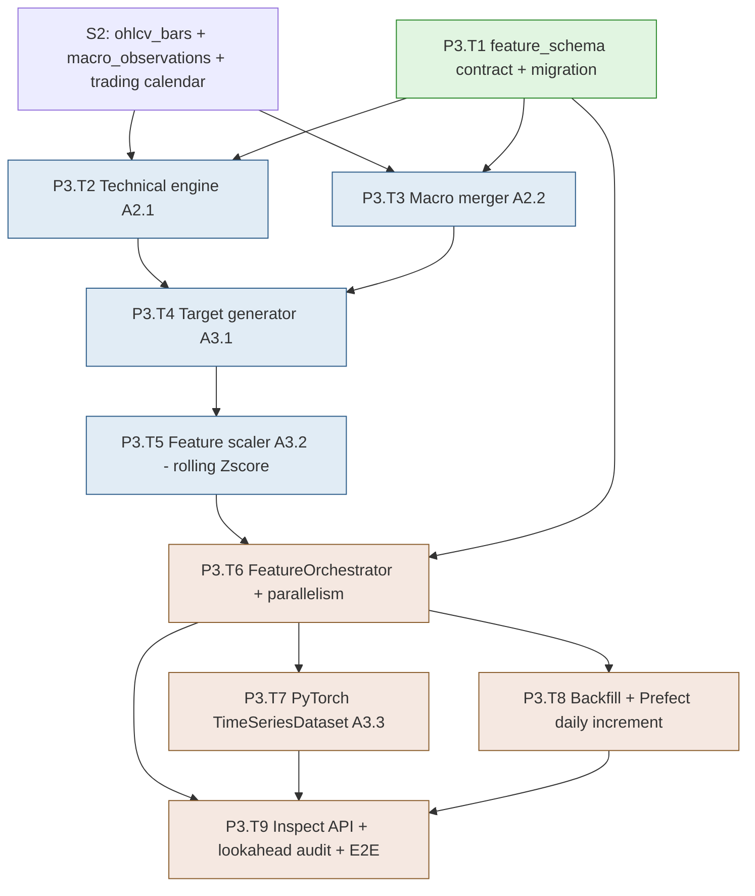

# Development Plan — Stage S3: Feature Engineering (Blocks A2 + A3)

> **Project**: MBI Labs Oracle Engine — Pipeline A
> **Stage**: S3 — Feature Matrix Constructor + Tensor Preparation (Blocks A2 + A3)
> **Companion docs**: `mbi-pipeline-a-v1-design.md` (§5 Feature Engineering), `tech-stack-analysis.md`
> **Previous stage**: S2 — Data Ingestion (Block A1)
> **Next stage**: S4 — ML Models (Blocks A4 + A5 + A6)
> **Status**: Ready for execution. Generated via `dev-plan-generator`; gaps closed via `brainstorming`.

---

## Executive Summary

S3 transforms raw OHLCV + macro (from S2) into the **31-dimensional feature tensor** that the models consume — Blocks A2 and A3. It implements the locked feature schema (5 raw + 19 technical + 7 macro), the TA-Lib technical engine, the macro left-join aligner, continuous-return target generation (T+1/T+5/T+10/T+15), lookahead-safe rolling 252-day Z-score normalization, and the PyTorch `TimeSeriesDataset` producing `[252, 31]` / `[4]` tensors. The computation is strictly per-ticker (preserving isolation and lookahead protection), parallelized across CPU cores for wall-clock, and uses a hybrid increment strategy (full recompute on backfill/schema-change, trailing-window-seeded incremental on daily). Normalized features land in the `feature_matrix` hypertable; rolling mean/std snapshots land in `normalization_stats` for reproducibility.

- **Total tasks**: 9 (P3.T1 – P3.T9)
- **Total sub-tasks**: 30
- **Estimated effort**: 11–15 dev days (1 developer); 7–9 days with a backend+ML pair
- **Builds on**: S2's `ohlcv_bars` + `macro_observations` hypertables, the trading calendar, and the Prefect daily flow (which S3 extends)

### Top 3 Risks & Mitigations

| Risk | Mitigation |
|---|---|
| **Lookahead bias creeping in** (the cardinal sin of quant ML — using future data to predict the past) | Strictly trailing-window calculations; targets isolated from the scaler; a dedicated "lookahead audit" test suite that shifts inputs and asserts no future leakage; per-ticker isolation enforced structurally (one ticker's stats never touch another's) |
| **Incremental trailing-window seed computed wrong** (today's SMA-200 needs the prior 200 bars; getting the seed window wrong silently corrupts indicators) | Dedicated test that compares incremental-with-seed output against full-recompute output for the same dates — they must be bit-identical; the seed window is computed from the trading calendar, not naive row counts |
| **TA-Lib unavailable in some environments** (C library install friction, esp. Colab/CI) | `pandas-ta` fallback wired with a logged warning; the `EquityFeatureEngineer` try-imports TA-Lib first; feature-parity tests assert TA-Lib and pandas-ta produce equivalent values within tolerance |

---

## Stage Dependency Map

**Critical path**: `S2 → T1 → T2 → T4 → T5 → T6 → T7 → T9` (schema → technical → targets → scaler → orchestrator → dataset → verification).
**Parallelizable**: T2 (technical) and T3 (macro merge) can be built concurrently once T1's schema contract exists.

### Entry Criteria
- S2 complete: `ohlcv_bars` + `macro_observations` populated for the universes; trading calendar available; daily Prefect flow running.
- TA-Lib installed (or `pandas-ta` fallback confirmed working) per S2/S0 setup.

### Exit Criteria
- `feature_schema.py` defines the exact 31-column contract; all code references it (no magic column lists).
- The full feature pipeline produces a normalized `feature_matrix` row for every (ticker, trading day) with all 31 features + 4 targets, burn-in dropped, infinities swept.
- `normalization_stats` records rolling mean/std per (ticker, date, feature) for reproducibility.
- Per-ticker computation is parallelized across cores; full-universe backfill completes in documented time.
- The hybrid increment produces output bit-identical to a full recompute for the same dates (verified by test).
- `TimeSeriesDataset` yields correctly-shaped `[252, 31]` / `[4]` tensors with no lookahead.
- The lookahead-audit test suite passes; `/features/inspect` shows raw + normalized values for a ticker/date.
- Prefect daily flow extended to compute features after ingestion; CI green.

---

## Task P3.T1: Feature Schema Contract + Migration

**Feature**: Feature 4 (Feature Engineering) — schema
**Effort**: M / 1 day
**Dependencies**: S2 (tickers, ohlcv_bars)
**Risk Level**: Medium

#### Sub-task P3.T1.S1: Define the locked 31-column feature_schema contract
**Description**: Create `features/feature_engineering/shared/feature_schema.py` as the single source of truth: an ordered, named definition of the 5 raw + 19 technical + 7 macro features + 4 targets, each with its dtype, computation source (raw/talib/pandas/macro), and any window parameter. Every downstream module imports from here — no module hardcodes a column list.
**Implementation Hints**: Use a structured definition (e.g., a list of `FeatureSpec` dataclasses or an enum + metadata dict) capturing `name`, `category`, `dtype`, `source_lib`, `window`. Include a `FEATURE_SCHEMA_VERSION = "v1.0"` constant. Provide helper accessors: `input_feature_names()` (31), `target_names()` (4), `raw_names()`, `technical_names()`, `macro_names()`. This contract is what makes "31-dimensional" enforceable.
**Dependencies**: S2
**Effort**: M / 4 hrs
**Acceptance Criteria**:
- The exact 31 input features + 4 targets defined in order, matching design §5
- `FEATURE_SCHEMA_VERSION` constant present
- Helper accessors return the correct names/counts; a test asserts `len(input_feature_names()) == 31`

#### Sub-task P3.T1.S2: Author the feature_matrix + normalization_stats migration
**Description**: Write the Alembic migration creating `feature_matrix` (all 31 feature columns + 4 nullable targets + `feature_schema_version` + composite PK including `bar_date`) and `normalization_stats`, converting both to TimescaleDB hypertables on `bar_date`. Add the design-specified indexes.
**Implementation Hints**: Per S2's hypertable pattern: create plain tables via autogen, then hand-add `create_hypertable(...)`. The PK `(ticker_id, bar_date, feature_schema_version)` lets multiple schema versions coexist during a migration. `NUMERIC(18,8)` for ratios/returns, `NUMERIC(18,6)` for prices/levels per design. Index `(ticker_id, bar_date DESC)`.
**Dependencies**: P3.T1.S1
**Effort**: M / 4 hrs
**Risk Flags**: The schema_version in the PK is what enables a clean schema migration later (compute v2 alongside v1, then cut over). Don't omit it.
**Acceptance Criteria**:
- Migration creates both tables as hypertables with correct columns/precision
- PK includes `feature_schema_version`; indexes present
- `upgrade`/`downgrade` round-trip clean

---

## Task P3.T2: Technical Feature Engine (Block A2.1)

**Feature**: Feature 4 — technical features
**Effort**: L / 2 days
**Dependencies**: P3.T1, S2
**Risk Level**: Medium

#### Sub-task P3.T2.S1: Define the BaseFeatureEngineer ABC
**Description**: Implement `features/feature_engineering/shared/base.py::BaseFeatureEngineer(ABC)` per spec a2.2: `__init__(**kwargs)` accepting window config, and `@abstractmethod generate_features(df: pd.DataFrame) -> pd.DataFrame` returning the frame with appended feature columns. This keeps the engine swappable for future asset classes.
**Implementation Hints**: The ABC enforces the append-don't-overwrite contract (raw OHLCV columns untouched). Window sizes (14 for RSI/ATR, 20/50/200 for SMAs, 252 later for scaling) come from config defaulting to the schema's window params.
**Dependencies**: P3.T1.S1
**Effort**: S / 2 hrs
**Acceptance Criteria**:
- ABC defined with the strict `generate_features` signature
- Window config flows from `feature_schema`
- Append-only contract documented

#### Sub-task P3.T2.S2: Write technical-feature tests (TDD — write first)
**Description**: Before implementation, write tests asserting each of the 19 technical features computes correctly on a known fixture: returns at 4 horizons, RSI-14, MACD triple, Bollinger triple + width, ATR-14, volatility-20d, volume z-score, SMA-50/200, price-to-SMA ratios. Include a lookahead check (feature at time t uses only data ≤ t) and the TA-Lib/pandas-ta parity check.
**Implementation Hints**: `features/feature_engineering/technical/tests/test_equity_engineer.py`. Use a deterministic OHLCV fixture (e.g., a saved 300-row AAPL slice). Assert known values for a few indicators (cross-check against a hand-computed or TA-Lib reference). The lookahead check: compute features on `df[:t]` vs `df[:t+10]` and assert the row at `t` is identical.
**Dependencies**: P3.T2.S1, P0.T3.S3
**Effort**: M / 4 hrs
**Acceptance Criteria**:
- Tests FAIL initially (RED)
- All 19 features covered with value assertions
- Lookahead check + TA-Lib/pandas-ta parity check present

#### Sub-task P3.T2.S3: Implement EquityFeatureEngineer (TA-Lib + pandas-ta fallback)
**Description**: Implement `features/feature_engineering/technical/equity_engineer.py` to pass P3.T2.S2: compute all 19 technical features vectorized (TA-Lib primary, pandas-ta fallback with a logged warning), appending columns without overwriting raw OHLCV. No Python row loops.
**Implementation Hints**: Per spec a2.4 exact formulas: `talib.RSI(close,14)`, `talib.MACD(close)` → 3 outputs, `talib.BBANDS(close)` → 3, `bb_width = (upper-lower)/middle`, `talib.ATR(high,low,close,14)`, `volatility_20d = returns_1d.rolling(20).std()*sqrt(252)`, `volume_z_score = (volume - volume.rolling(20).mean())/volume.rolling(20).std()`, SMAs via `talib.SMA`, ratios via pandas. Try-import TA-Lib; on ImportError, fall back to `pandas-ta` and log a warning.
**Dependencies**: P3.T2.S2
**Effort**: L / 1 day
**Risk Flags**: pandas-ta is ~20× slower and occasionally differs slightly from TA-Lib — the parity test must use a tolerance, not exact equality. Document which library was used (a column or run-metadata flag).
**Acceptance Criteria**:
- All P3.T2.S2 tests pass (GREEN) with TA-Lib
- pandas-ta fallback produces parity within tolerance; warning logged
- Raw OHLCV columns never overwritten; fully vectorized

---

## Task P3.T3: Macro Merger (Block A2.2)

**Feature**: Feature 4 — macro alignment
**Effort**: M / 1 day
**Dependencies**: P3.T1, S2
**Risk Level**: Low

#### Sub-task P3.T3.S1: Implement MacroMerger (left-join on trading calendar)
**Description**: Implement `features/feature_engineering/alignment/macro_merger.py::MacroMerger` per spec a2.5: left-join the 7 forward-filled macro series onto each ticker's technical-feature frame using the equity (trading-day) index, so the feature matrix strictly follows the market calendar. Macro values already forward-filled in S2's ingest; this just aligns them.
**Implementation Hints**: `equity_df.join(macro_df, how='left')` on the date index. Because S2 forward-fills macro to the trading calendar, every trading day has a macro value. Assert no macro NaNs remain post-join (except the leading burn-in region, dropped later). The left join guarantees no weekend/holiday macro rows leak in.
**Dependencies**: P3.T1.S1, S2 (macro_observations)
**Effort**: M / 4 hrs
**Acceptance Criteria**:
- Left-join aligns 7 macro columns onto each ticker's trading-day index
- No macro values land on non-trading days
- Post-join macro NaNs only in the leading burn-in region

#### Sub-task P3.T3.S2: Write macro-merge tests
**Description**: Test that the merge preserves the equity row count, attaches all 7 macro columns, forward-fills correctly across a macro-release gap (e.g., monthly CPI propagates daily), and never introduces a non-trading-day row. Include a case where macro starts later than equity history (leading macro NaN handling).
**Implementation Hints**: Fixture with daily equity dates + sparse monthly macro. Assert the CPI value is constant between releases and updates on the release date. Assert row count equals the equity frame's.
**Dependencies**: P3.T3.S1
**Effort**: S / 3 hrs
**Acceptance Criteria**:
- Merge preserves equity row count and attaches all 7 macro columns
- Forward-fill propagation verified across a release gap
- Leading-macro-NaN case handled (dropped in orchestrator burn-in)

---

## Task P3.T4: Target Generator (Block A3.1)

**Feature**: Feature 4 — target generation
**Effort**: M / 1 day
**Dependencies**: P3.T2, P3.T3
**Risk Level**: Medium

#### Sub-task P3.T4.S1: Implement TargetGenerator (continuous forward returns)
**Description**: Implement `features/feature_engineering/tensor_prep/target_generator.py::TargetGenerator` per the locked continuous-regression decision: compute `target_t{1,5,10,15} = (close.shift(-N) - close) / close` for each horizon, using the exact subtraction form (NOT `pct_change(periods=-N)`, per spec a3.2 to avoid inverse-denominator errors). Drop the trailing rows where the future hasn't resolved.
**Implementation Hints**: Per spec a3.2 exact syntax. The last 15 rows get NaN targets for T+15 and must be dropped (or left NaN and excluded at training time — design stores them nullable; the dataset excludes unresolved rows). Targets are NEVER normalized (enforced in the scaler, T5).
**Dependencies**: P3.T2.S3, P3.T3.S1
**Effort**: M / 4 hrs
**Risk Flags**: The `shift(-N)` sign is the classic bug — negative shift looks forward. Test that `target_t1` at row `t` equals the actual return from `close[t]` to `close[t+1]`.
**Acceptance Criteria**:
- 4 continuous-return targets computed with the exact subtraction formula
- Trailing unresolved rows handled (nullable, excluded downstream)
- A test verifies target values against hand-computed forward returns

#### Sub-task P3.T4.S2: Write target-correctness + leakage tests
**Description**: Test that targets correctly look forward (not backward), that the denominator is the current close (not the future close), and — critically — that targets are excluded from any feature transformation. Verify the trailing-NaN drop count equals the largest horizon (15).
**Implementation Hints**: Assert `target_t5[t] == (close[t+5] - close[t]) / close[t]`. Assert the last 15 rows have NaN `target_t15`. This is a leakage-prevention checkpoint.
**Dependencies**: P3.T4.S1
**Effort**: S / 3 hrs
**Acceptance Criteria**:
- Forward-looking direction + correct denominator verified
- Trailing-NaN count matches the max horizon
- Targets confirmed isolated from feature columns

---

## Task P3.T5: Feature Scaler (Block A3.2 — Rolling Z-score)

**Feature**: Feature 4 — normalization
**Effort**: L / 2 days
**Dependencies**: P3.T4
**Risk Level**: High

#### Sub-task P3.T5.S1: Write lookahead-safety tests for the scaler (TDD — write first)
**Description**: Before implementation, write the tests that pin down lookahead-safe normalization: the Z-score at time `t` uses ONLY the trailing 252 days `[t-252, t]` (never future data), targets are never touched, each ticker normalizes in isolation, and the stored mean/std at `t` match a manual trailing-window computation. This is the highest-risk correctness surface in S3.
**Implementation Hints**: `tensor_prep/tests/test_feature_scaler.py`. The decisive test: compute the scaled value at `t` using `df[:t+1]` vs `df[:t+100]` and assert identical (no future leakage). Assert target columns pass through unchanged. Assert `normalization_stats` rows match `mean(x[t-252:t])` / `std(x[t-252:t])`.
**Dependencies**: P3.T4.S1, P0.T3.S3
**Effort**: M / 4 hrs
**Acceptance Criteria**:
- Tests FAIL initially (RED)
- Trailing-window-only, target-isolation, per-ticker-isolation, stats-correctness all covered
- The future-leakage test is explicit and decisive

#### Sub-task P3.T5.S2: Implement FeatureScaler (rolling 252-day Z-score + stats capture)
**Description**: Implement `tensor_prep/feature_scaler.py::FeatureScaler` to pass P3.T5.S1: apply `z_t = (x_t - mean(x_{t-252:t})) / std(x_{t-252:t})` per input feature per ticker using a strict trailing rolling window, leaving the 4 targets untouched, and emit the per-(ticker, date, feature) mean/std into `normalization_stats`. Handle zero-std (constant feature) gracefully.
**Implementation Hints**: `df[feat].rolling(window=252, min_periods=252).mean()` and `.std()`. Only the 31 input features (from `feature_schema.input_feature_names()`); targets explicitly excluded. Zero-std → output 0 (or NaN→drop) to avoid div-by-zero. Capture mean/std for the stats table in the same pass. Macro features z-scored with the same 252-day logic per design.
**Dependencies**: P3.T5.S1
**Effort**: L / 1 day
**Risk Flags**: `min_periods=252` means the first 252 rows are NaN — this compounds with the SMA-200 burn-in; the orchestrator's dropna handles it. Zero-std features (rare but real, e.g., a halted stock) must not produce inf.
**Acceptance Criteria**:
- All P3.T5.S1 tests pass (GREEN)
- Only the 31 inputs normalized; targets untouched; per-ticker isolation holds
- `normalization_stats` populated; zero-std handled without inf

---

## Task P3.T6: FeatureOrchestrator + Parallelism

**Feature**: Feature 4 — orchestration
**Effort**: L / 2 days
**Dependencies**: P3.T5, P3.T1
**Risk Level**: Medium

#### Sub-task P3.T6.S1: Implement the per-ticker pipeline + sanitization
**Description**: Implement the per-ticker feature pipeline in `features/feature_engineering/service.py::FeatureOrchestrator`: for one ticker, run technical engine → macro merge → target generation → scaler, then sanitize per spec a2.6 (replace ±inf with NaN, drop the burn-in NaN region via `dropna`, assert exactly 31 features + 4 targets, enforce dtypes), and persist to `feature_matrix` + `normalization_stats`.
**Implementation Hints**: The per-ticker function is pure (DataFrame in → DataFrame out) for testability. Sanitization order per spec: infinity sweep first (`replace([inf,-inf], nan)`), then `dropna` (clears both the SMA-200 burn-in and the 252-day scaler burn-in), then schema assert. Bulk-upsert results via the repository.
**Dependencies**: P3.T5.S2, P3.T2.S3, P3.T3.S1, P3.T4.S1
**Effort**: L / 1 day
**Risk Flags**: The combined burn-in (max of 200-day SMA and 252-day scaler window) drops ~252 leading rows — verify the drop is correct, not over-aggressive. Infinity sweep must precede dropna.
**Acceptance Criteria**:
- Per-ticker pipeline produces a clean 31-feature + 4-target frame
- Infinity sweep + burn-in drop + schema assert applied in the right order
- Results persisted to both tables with the schema version stamped

#### Sub-task P3.T6.S2: Add per-ticker parallelism across CPU cores
**Description**: Wrap the per-ticker pipeline in core-level parallelism (joblib) so a full-universe recompute runs across all available cores while each ticker stays fully isolated. The orchestrator resolves active tickers, dispatches per-ticker jobs, and aggregates results/failures.
**Implementation Hints**: `joblib.Parallel(n_jobs=-1)(delayed(process_ticker)(t) for t in tickers)`. Each `process_ticker` loads that ticker's OHLCV + the shared macro frame, runs the pure pipeline, persists. Per-ticker try/except so one failure doesn't kill the batch (mirrors S2's isolation). Make `n_jobs` configurable. Pass the shared macro frame read-only to workers.
**Dependencies**: P3.T6.S1
**Effort**: M / 4 hrs
**Risk Flags**: joblib workers each need a DB session — don't share a session across processes; open one per worker. Memory: the shared macro frame is small, but don't accidentally copy the full OHLCV history into every worker.
**Acceptance Criteria**:
- Full-universe recompute parallelizes across cores; `n_jobs` configurable
- Per-ticker isolation preserved (one failure → logged, batch continues)
- Wall-clock materially better than single-threaded (documented benchmark)

---

## Task P3.T7: PyTorch TimeSeriesDataset (Block A3.3)

**Feature**: Feature 4 — tensor windowing
**Effort**: M / 1 day
**Dependencies**: P3.T6
**Risk Level**: Medium

#### Sub-task P3.T7.S1: Implement TimeSeriesDataset (sliding-window tensors)
**Description**: Implement `features/feature_engineering/tensor_prep/dataset.py::TimeSeriesDataset(torch.utils.data.Dataset)` per spec a3.3: read normalized rows from `feature_matrix` for a ticker (or universe), produce `__getitem__` yielding `X` of shape `[252, 31]` (lookback window of normalized features) and `y` of shape `[4]` (the 4 continuous targets at the window's end). Rows with unresolved (NaN) targets are excluded.
**Implementation Hints**: Hardcode `lookback=252` per spec. A window ending at row `t` uses features `[t-251, t]` and targets at `t`. Exclude windows where any target is NaN (unresolved future). For a global (universe-spanning) dataset, concatenate per-ticker windows but never let a window straddle two tickers. Build an index map of valid window-end positions.
**Dependencies**: P3.T6.S1
**Effort**: M / 4 hrs
**Risk Flags**: The cross-ticker straddle bug — a window must never span two tickers' data. Build the valid-window index per ticker, then concatenate. Verify tensor dtypes are float32 for PyTorch.
**Acceptance Criteria**:
- `__getitem__` yields `X[252,31]` + `y[4]` float32 tensors
- Windows never straddle ticker boundaries
- Unresolved-target windows excluded; index map correct

#### Sub-task P3.T7.S2: Write dataset shape + integrity tests
**Description**: Test the tensor shapes, the no-straddle guarantee (a window at a ticker boundary doesn't pull the previous ticker's rows), the unresolved-target exclusion, and that the features in `X` are the normalized values (not raw). Verify `DataLoader` batching produces `[B, 252, 31]` / `[B, 4]`.
**Implementation Hints**: Seed `feature_matrix` with two short tickers; assert the window count equals `sum(valid_rows_per_ticker)`. Assert a boundary window's first row belongs to the same ticker as its last. Wrap in a `DataLoader(batch_size=8)` and check batch shapes.
**Dependencies**: P3.T7.S1
**Effort**: S / 3 hrs
**Acceptance Criteria**:
- Shape tests pass for single items and batched `DataLoader`
- No-straddle and unresolved-exclusion verified
- `X` confirmed to carry normalized (not raw) features

---

## Task P3.T8: Backfill + Prefect Daily Increment

**Feature**: Feature 4 + Feature 9 (Orchestration)
**Effort**: L / 2 days
**Dependencies**: P3.T6, S2 (Prefect daily flow)
**Risk Level**: High

#### Sub-task P3.T8.S1: Implement the feature backfill (full recompute)
**Description**: Build the full-recompute path (a script + a callable service) that runs the parallel FeatureOrchestrator over all active tickers' full history — used after cold-start ingest and on any `feature_schema.py` change. Idempotent via the schema-versioned upsert.
**Implementation Hints**: Reuse P3.T6.S2 parallelism. Scope by universe optionally. Because the PK includes `feature_schema_version`, a schema bump computes a new version alongside the old (clean cutover). Log per-batch progress. This is the "full recompute" half of the hybrid strategy.
**Dependencies**: P3.T6.S2
**Effort**: M / 4 hrs
**Acceptance Criteria**:
- Full recompute populates `feature_matrix` for all active tickers
- Re-running is idempotent; schema-version bump computes alongside the old version
- Progress logged; runtime documented

#### Sub-task P3.T8.S2: Implement the trailing-window-seeded incremental
**Description**: Implement the incremental path: for new `bar_date`s only, load the trailing window needed to correctly seed rolling indicators (max of SMA-200 + 252-day scaler ≈ 252 trading days) but write ONLY the new rows. This is the careful half of the hybrid strategy and the highest-correctness-risk piece in S3.
**Implementation Hints**: For each ticker, find the latest `feature_matrix` date, load OHLCV from `(latest - 252 trading days)` through today (using the trading calendar for the window, not naive row count), run the full per-ticker pipeline on that slice, then upsert only rows after the latest existing date. The seed window guarantees today's SMA-200/Z-score are correct.
**Dependencies**: P3.T8.S1, P2.T6 (calendar)
**Effort**: M / 4 hrs
**Risk Flags**: **The seed-window correctness is the crux.** If the seed window is too short, today's SMA-200 is wrong but looks plausible (silent corruption). The next sub-task's bit-identical test is the guard.
**Acceptance Criteria**:
- Incremental computes only new rows but seeds rolling windows correctly
- Trailing window derived from the trading calendar, not naive counts
- Only post-latest rows are written (no redundant rewrites)

#### Sub-task P3.T8.S3: Verify incremental == full-recompute (bit-identical test) + wire Prefect
**Description**: Write the decisive test: for a set of dates, the incremental-with-seed output must be bit-identical (within float tolerance) to a full recompute of the same dates. Then extend the S2 `daily_data_refresh` Prefect flow to run feature computation (incremental) after ingestion completes.
**Implementation Hints**: Compute features two ways for the same 10 dates (full vs incremental-seeded); assert equality within tolerance on all 31 features. In the Prefect flow, add a feature-compute task downstream of the ingest task (same flow, sequential dependency). On schema-change, the operator runs the full backfill manually.
**Dependencies**: P3.T8.S2, P2.T8.S1
**Effort**: M / 4 hrs
**Risk Flags**: If this test can't reach bit-identity, the seed window is wrong — do not ship until it passes. This is the gate that prevents silent indicator corruption.
**Acceptance Criteria**:
- Incremental output is bit-identical to full recompute for the same dates
- Prefect daily flow computes features (incremental) after ingestion
- Flow failure on features doesn't corrupt prior good rows

---

## Task P3.T9: Inspect API + Lookahead Audit + E2E

**Feature**: Feature 4 + verification
**Effort**: M / 1 day
**Dependencies**: P3.T6, P3.T7, P3.T8
**Risk Level**: Medium

#### Sub-task P3.T9.S1: Implement the feature trigger + inspect endpoints
**Description**: Expose `POST /api/v1/feature_engineering/trigger` (on-demand recompute, optionally scoped to a universe or ticker; full or incremental mode) and `GET /api/v1/feature_engineering/inspect?ticker=...&date=...` returning all 31 raw + normalized feature values + the 4 targets + the normalization stats for one (ticker, date). Admin-only.
**Implementation Hints**: `endpoints/{trigger,inspect}.py`. The inspect endpoint joins `feature_matrix` + `normalization_stats` for the requested cell — this is the power-user debugging view from design §5. Trigger fires the orchestrator (small scope) or a Prefect run (full scope).
**Dependencies**: P3.T6.S2, P3.T8.S1
**Effort**: M / 4 hrs
**Acceptance Criteria**:
- Trigger kicks a recompute (full or incremental, scoped)
- Inspect returns 31 raw + normalized values + 4 targets + stats for a cell
- Admin-only; unknown ticker/date → 404

#### Sub-task P3.T9.S2: Build the lookahead audit test suite
**Description**: Assemble a dedicated `tests/lookahead_audit/` suite that systematically proves no future leakage anywhere in the pipeline: appending future bars never changes past features (technical + scaled), targets never influence features, and the dataset's windows never include future-relative-to-target data. This is the stage's correctness capstone.
**Implementation Hints**: The core technique: compute the full pipeline on `history[:t]`, then on `history[:t+K]`, and assert every feature row at dates `≤ t` is identical between the two runs. Run it across technical features, scaled features, and assembled dataset windows. A single failing cell here means lookahead bias — treat as a release blocker.
**Dependencies**: P3.T2.S3, P3.T5.S2, P3.T7.S1
**Effort**: M / 4 hrs
**Risk Flags**: This suite is the single most important quality gate in Pipeline A's data path. Lookahead bias makes backtests look brilliant and live performance collapse. Invest here.
**Acceptance Criteria**:
- Audit proves past features are invariant to appended future data
- Covers technical features, scaled features, and dataset windows
- Documented as a release-blocking gate

#### Sub-task P3.T9.S3: Inspect UI page + integration tests + features.md
**Description**: Build the `/features/inspect` frontend page (ticker + date pickers → table of raw vs normalized values + targets), write an integration test for the full feature path (ingest fixture → compute → inspect), and author `features/feature_engineering/features.md` documenting Blocks A2+A3, the 31-dim contract, lookahead protections, and the hybrid increment.
**Implementation Hints**: `features/feature_engineering` frontend feature: a simple data-grid page (it's a debugging tool, not a polished surface). Integration test seeds a small OHLCV+macro fixture, runs the orchestrator, asserts a known feature value via the inspect endpoint. The features.md must clearly document the trailing-window-seed logic for the next engineer.
**Dependencies**: P3.T9.S1, P3.T9.S2
**Effort**: M / 4 hrs
**Acceptance Criteria**:
- Inspect page renders raw + normalized values for a chosen ticker/date
- Integration test covers ingest → compute → inspect end-to-end
- `features.md` documents the 31-dim contract, lookahead protections, hybrid increment

---

## Appendix

### Glossary

| Term | Meaning |
|---|---|
| **31-dim contract** | The locked feature set: 5 raw + 19 technical + 7 macro, defined once in `feature_schema.py` |
| **Burn-in period** | The ~252 leading rows dropped because SMA-200 and the 252-day Z-score window need history to seed |
| **Lookahead bias** | Using future information to compute a past feature — the cardinal quant-ML sin; structurally prevented here |
| **Rolling Z-score** | `(x_t - mean(x[t-252:t])) / std(x[t-252:t])` — normalization using only trailing data |
| **Trailing-window seed** | On incremental runs, loading ~252 prior bars to correctly compute today's rolling indicators while writing only new rows |
| **TimeSeriesDataset** | The PyTorch dataset yielding `[252,31]` feature windows + `[4]` target vectors |
| **Schema version** | `feature_schema_version` in the PK; lets a new feature schema compute alongside the old for clean cutover |

### Full Risk Register

| ID | Risk | Likelihood | Impact | Mitigation | Owner Task |
|---|---|---|---|---|---|
| R1 | Lookahead bias leaks into features | Medium | Critical | Trailing-window-only math; target isolation; dedicated lookahead-audit suite as a release gate | P3.T9.S2 |
| R2 | Incremental seed window wrong → silent indicator corruption | Medium | High | Bit-identical incremental-vs-full test; seed window from trading calendar | P3.T8.S3 |
| R3 | TA-Lib unavailable in an environment | Medium | Medium | pandas-ta fallback with logged warning; parity test within tolerance | P3.T2.S3 |
| R4 | Cross-ticker window straddle in the dataset | Medium | High | Per-ticker valid-window index; no-straddle test | P3.T7.S1 |
| R5 | Negative-shift target sign bug | Low | High | Exact subtraction formula per spec; forward-direction test against hand-computed returns | P3.T4.S1 |
| R6 | joblib workers sharing a DB session | Medium | Medium | One session per worker process; read-only shared macro frame | P3.T6.S2 |
| R7 | Zero-std feature → inf after Z-score | Low | Medium | Explicit zero-std handling in the scaler | P3.T5.S2 |

### Assumptions Log

Inherited from `tech-stack-analysis.md` §4, plus S3-specific:
- Persistence is **normalized features in `feature_matrix` + rolling mean/std in `normalization_stats`** (locked) — most reproducible.
- Feature computation is **per-ticker, parallelized across CPU cores** via joblib (locked) — isolation preserved, wall-clock recovered.
- Increment strategy is **hybrid** (locked): full recompute on backfill + schema change; trailing-window-seeded incremental on daily.
- TA-Lib primary, `pandas-ta` fallback (from tech-stack Gap 1); parity within tolerance.
- The 31-dim feature schema is locked in `feature_schema.py`; changes require a documented deviation + schema-version bump.
- Lookahead-audit suite is a **release-blocking** quality gate.

### Cross-references
- Design spec: `mbi-pipeline-a-v1-design.md` (§5 Feature Engineering, §14 deviation #1/#6 on continuous targets)
- Stack validation: `tech-stack-analysis.md` (§3 Gap 1 TA-Lib, §5 compat #14 memory)
- Previous stage: `development-plan-S2.md` (OHLCV + macro + trading calendar this consumes)
- Next stage: `development-plan-S4.md` (ML Models — Blocks A4 + A5 + A6) — forthcoming

---

## End of Stage S3 Plan
