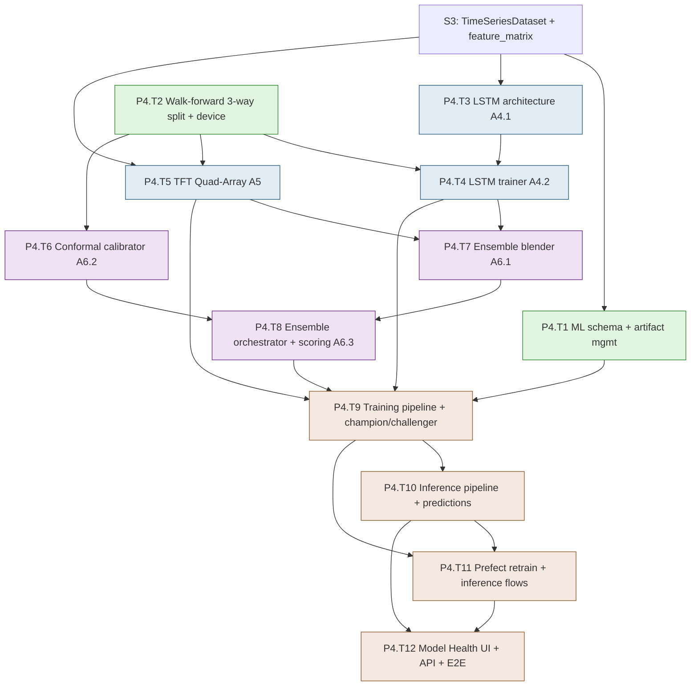

# Development Plan — Stage S4: ML Models (Blocks A4 + A5 + A6)

> **Project**: MBI Labs Oracle Engine — Pipeline A
> **Stage**: S4 — LSTM + TFT Quad-Array + Ensemble + Conformal (Blocks A4, A5, A6)
> **Companion docs**: `mbi-pipeline-a-v1-design.md` (§6 ML Models), `tech-stack-analysis.md`
> **Previous stage**: S3 — Feature Engineering (Blocks A2 + A3)
> **Next stage**: S5 — Backtesting (A7) + Conviction Tickets (A8)
> **Status**: Ready for execution. Generated via `dev-plan-generator`; gaps closed via `brainstorming`.

---

## Executive Summary

S4 is the heart of Pipeline A — the predictive engine. It implements the ticker-agnostic global LSTM (Bi-LSTM 3×128 + 8-head attention + Huber-loss regression head), the asset-aware TFT Quad-Array (4 Temporal Fusion Transformers, one per horizon, with ticker as a static covariate and QuantileLoss), the uncertainty-aware ensemble blender, and the locally-weighted split conformal calibrator that produces calibrated prediction intervals. It wires the 3-way walk-forward split (train/calibration/validation), GPU device routing, champion/challenger model promotion, versioned artifact storage, the weekly retrain Prefect flow, the daily inference flow, and the Model Health Dashboard. By the end of S4, a weekly retrain produces 7 artifacts per universe, and a daily inference run emits per-ticker 4-horizon predictions with conformal intervals and conviction scores into the `predictions` hypertable.

- **Total tasks**: 12 (P4.T1 – P4.T12)
- **Total sub-tasks**: 44
- **Estimated effort**: 20–28 dev days (1 developer); 13–17 days with an ML+backend pair
- **Builds on**: S3's `TimeSeriesDataset` + `feature_matrix`; S2's Prefect infra; S0's artifact store + GPU device helper

### Top 3 Risks & Mitigations

| Risk | Mitigation |
|---|---|
| **Training time/compute for 15 models weekly** (1 LSTM + 4 TFTs × 3 universes) | Training is a **portable callable** (local-GPU default, Colab escape hatch); GPU device routing; per-model checkpointing so a crash resumes; documented runtime budget per universe; TFTs train in parallel on GPU |
| **A bad model silently going live** (overfit or degenerate retrain replacing a good model) | **Champion/challenger promotion** — a challenger only goes active if it beats the current champion on held-out validation by a configurable margin; otherwise champion stays and challenger is archived for inspection; conformal coverage is a second gate |
| **Conformal calibration correctness** (custom implementation; wrong intervals undermine the whole filter downstream) | The 3-way split strictly isolates the calibration set from training; a coverage test asserts realized coverage ≈ nominal on held-out data; the residual-predictor MLP is unit-tested independently; intervals validated against a synthetic ground-truth distribution |

---

## Stage Dependency Map

**Critical path**: `S3 → T2 → T4 → T7 → T8 → T9 → T10 → T11 → T12`.
**Parallelizable**: LSTM track (T3→T4) and TFT track (T5) run concurrently; conformal (T6) develops alongside both; the artifact/schema work (T1) is independent up front.

### Entry Criteria
- S3 complete: `feature_matrix` populated, `TimeSeriesDataset` yields `[252,31]`/`[4]` tensors, lookahead audit green.
- GPU available (local CUDA/MPS) or Colab access; `core/services/torch_device.py` from tech-stack Gap 5 exists or is created here.
- PyTorch + pytorch-forecasting + pytorch-lightning installed and version-pinned (compat note #7).

### Exit Criteria
- A weekly retrain for a universe produces 7 versioned artifacts (LSTM, 4 TFTs, conformal, residual-predictor) via the portable training callable, on local GPU or Colab.
- The 3-way walk-forward split is enforced; no calibration/validation leakage into training.
- The ensemble blender produces uncertainty-weighted blended predictions; the conformal calibrator produces intervals with realized coverage ≈ nominal on held-out data.
- Champion/challenger promotion works: a worse challenger does NOT replace the champion.
- A daily inference run emits per-ticker 4-horizon predictions + intervals + conviction scores into `predictions`.
- Weekly retrain + daily inference Prefect flows run on schedule and on-demand.
- Model Health Dashboard shows training history, validation loss curves, conformal coverage, and artifact list with rollback; CI green.

---

## Task P4.T1: ML Schema + Artifact Management

**Feature**: Feature 5 (ML Models) — persistence
**Effort**: M / 1 day
**Dependencies**: S3, S0 (artifact store)
**Risk Level**: Low

#### Sub-task P4.T1.S1: Define ORM models for training_runs, model_artifacts, inference_runs, predictions
**Description**: Create `features/ml_models/models.py` with the four ORM models per design §6, including the `model_role` enum (lstm/tft_t1/tft_t5/tft_t10/tft_t15/conformal/residual_predictor), the per-horizon prediction columns + interval + conviction, the raw-component debug arrays, and the window-bound columns on training_runs. `predictions` is a TimescaleDB hypertable on `inference_date`.
**Implementation Hints**: Per design §6 schemas exactly. `predictions` carries 4 horizons × (point, lo, hi, conviction) + `lstm_outputs`/`tft_q10/q50/q90` arrays (length 4) for debugging. The `is_active` partial-unique on `model_artifacts` is the champion constraint. Register models in alembic env.
**Dependencies**: S3
**Effort**: M / 4 hrs
**Acceptance Criteria**:
- Four models match design §6 column-for-column
- `model_role` enum has all 7 roles; partial-unique `(universe_id, model_role) WHERE is_active` defined
- `predictions` registered as a hypertable

#### Sub-task P4.T1.S2: Author the ML schema migration
**Description**: Write the Alembic migration creating the four tables, converting `predictions` to a hypertable on `inference_date`, and adding the design indexes (`(universe_id, started_at DESC)`, `(universe_id, model_role, created_at DESC)`, the active partial-unique, `(universe_id, inference_date DESC)`, `(ticker_id, inference_date DESC)`).
**Implementation Hints**: Follow S2/S3 hypertable pattern. The partial-unique index is `CREATE UNIQUE INDEX ... ON model_artifacts (universe_id, model_role) WHERE is_active = true` — this enforces exactly one champion per role per universe at the DB level.
**Dependencies**: P4.T1.S1
**Effort**: S / 3 hrs
**Acceptance Criteria**:
- Migration creates all four tables; `predictions` is a hypertable
- Champion partial-unique index enforced (a second active artifact for the same role fails)
- `upgrade`/`downgrade` round-trip clean

#### Sub-task P4.T1.S3: Implement the artifact lifecycle service
**Description**: Build artifact save/load/activate/archive on top of S0's `artifact_store`: `save_artifact(universe, role, training_run, bytes) -> ModelArtifact` (writes file + row, inactive), `activate(artifact)` (atomic champion swap — deactivate old, activate new in one transaction), `load_active(universe, role) -> bytes`, `archive_old(cutoff)`. Path format `{universe_slug}/{model_role}/{training_run_id}.pt`.
**Implementation Hints**: The activate swap must be atomic (`SELECT ... FOR UPDATE` on the current champion, deactivate, activate new, commit) so inference never sees zero or two champions. Loading uses the active artifact's path through `artifact_store`. Keep artifact bytes opaque to the store (the model layer handles serialization).
**Dependencies**: P4.T1.S2, P0.T4.S2
**Effort**: M / 4 hrs
**Acceptance Criteria**:
- Save writes both file (via artifact_store) and DB row (inactive)
- Activate atomically swaps champion (never 0 or 2 active for a role)
- Load returns the active artifact's bytes; archive marks old ones

---

## Task P4.T2: Walk-Forward Split + GPU Device Routing

**Feature**: Feature 5 — training infrastructure
**Effort**: M / 1 day
**Dependencies**: S3
**Risk Level**: Medium

#### Sub-task P4.T2.S1: Implement the 3-way walk-forward split
**Description**: Implement `features/ml_models/shared/walk_forward.py` producing the locked chronological 70/15/15 train/calibration/validation split over a rolling 2-year window, with **no random shuffling** and no leakage across boundaries. Returns date-bounded index sets the dataset/loaders consume.
**Implementation Hints**: Strictly chronological: sort by date, slice 0–70% train, 70–85% calibration, 85–100% validation. For the global LSTM the split is over the pooled timeline; for the TFT it respects the per-ticker temporal structure. Weekly retrain slides the window forward 7 trading days. Return concrete date ranges (stored on `training_runs`).
**Dependencies**: S3
**Effort**: M / 4 hrs
**Risk Flags**: The split must never let a calibration or validation date precede a training date in a way that leaks. Test boundary correctness explicitly.
**Acceptance Criteria**:
- 70/15/15 chronological split; no shuffling
- Calibration and validation strictly follow training in time
- Date bounds returned and recorded on the training run

#### Sub-task P4.T2.S2: Implement GPU device routing + reproducibility seed
**Description**: Implement `core/services/torch_device.py` (tech-stack Gap 5): `get_device()` returns cuda > mps > cpu. Add a reproducibility helper seeding torch/numpy/python RNGs and setting deterministic flags where feasible. Every model `.to(device)` and tensor move routes through this.
**Implementation Hints**: `torch.cuda.is_available()` → cuda; `torch.backends.mps.is_available()` → mps (with the compat-note #3 caveat that TFT may fall back to CPU on MPS); else cpu. Seed helper: `torch.manual_seed`, `np.random.seed`, `random.seed`, `torch.use_deterministic_algorithms(True)` where it doesn't break TFT. Log the chosen device.
**Dependencies**: S3
**Effort**: S / 3 hrs
**Acceptance Criteria**:
- Device routing prefers cuda, then mps, then cpu; logged
- Seed helper makes a small training run reproducible on CPU
- MPS-TFT caveat documented

---

## Task P4.T3: LSTM Architecture (Block A4.1)

**Feature**: Feature 5 — LSTM model
**Effort**: M / 1 day
**Dependencies**: S3
**Risk Level**: Low

#### Sub-task P4.T3.S1: Define the BaseMathEngine ABC
**Description**: Implement `features/ml_models/shared/base.py::BaseMathEngine(ABC)` per spec a5.2: `__init__(**kwargs)`, `@abstractmethod train_model(dataloader)`, `@abstractmethod predict(tensor) -> np.ndarray`. This lets the LSTM and TFT be hot-swapped/ensembled uniformly regardless of internal loop style (custom vs Lightning).
**Implementation Hints**: The ABC is the contract the ensemble orchestrator depends on, decoupling it from whether the LSTM uses a custom loop and the TFT uses Lightning. Keep it minimal — train + predict + a serialize/deserialize pair for artifacts.
**Dependencies**: S3
**Effort**: S / 2 hrs
**Acceptance Criteria**:
- ABC defined with train/predict/serialize contract
- Documented as the swap point unifying custom-loop and Lightning models

#### Sub-task P4.T3.S2: Implement LSTMMathEngine architecture
**Description**: Implement `features/ml_models/lstm/architecture.py::LSTMMathEngine(nn.Module)` exactly per design §6: `nn.LSTM(input_size=31, hidden_size=128, num_layers=3, batch_first=True, bidirectional=True)` → 256-dim, `nn.MultiheadAttention(embed_dim=256, num_heads=8, batch_first=True)`, head `Linear(256,64) → ReLU → Dropout(0.3) → Linear(64,4)` with **NO Sigmoid** (locked deviation #1). Output `[Batch, 4]` unbounded continuous returns.
**Implementation Hints**: Bidirectional doubles hidden to 256 feeding attention. Apply attention over the sequence, then pool (last timestep or mean) before the head. The missing Sigmoid is the deliberate continuous-regression change — assert output is unbounded. Ticker-agnostic: no ticker embedding input (locked topology).
**Dependencies**: P4.T3.S1
**Effort**: M / 4 hrs
**Risk Flags**: Attention output pooling choice matters — document whether last-timestep or mean-pool feeds the head. Confirm output shape `[B,4]`.
**Acceptance Criteria**:
- Architecture matches design §6 exactly (no Sigmoid)
- Forward pass on `[B,252,31]` yields `[B,4]`
- No ticker embedding (ticker-agnostic confirmed)

---

## Task P4.T4: LSTM Trainer (Block A4.2)

**Feature**: Feature 5 — LSTM training
**Effort**: L / 2 days
**Dependencies**: P4.T3, P4.T2
**Risk Level**: Medium

#### Sub-task P4.T4.S1: Write LSTM trainer tests (TDD — write first)
**Description**: Write tests for: walk-forward split is used (no shuffling), HuberLoss is the objective, early stopping halts after 10 no-improve epochs and restores best weights, ReduceLROnPlateau fires on plateau, and the trained engine's `predict` returns `[N,4]`. Use a tiny synthetic dataset so training runs in seconds on CPU.
**Implementation Hints**: `features/ml_models/lstm/tests/test_lstm_trainer.py`. Synthetic data with a learnable signal so loss visibly decreases. Mock/shrink epochs. Assert best-weight restoration by checking the restored val loss equals the best observed. Seed for determinism (P4.T2.S2).
**Dependencies**: P4.T3.S2, P4.T2.S1, P0.T3.S3
**Effort**: M / 4 hrs
**Acceptance Criteria**:
- Tests FAIL initially (RED)
- Cover split usage, HuberLoss, early-stop + best-weight restore, LR schedule, predict shape

#### Sub-task P4.T4.S2: Implement LSTMTrainer (custom PyTorch loop)
**Description**: Implement `features/ml_models/lstm/trainer.py::LSTMTrainer` (custom loop per locked decision) to pass P4.T4.S1: AdamW(lr=1e-3, weight_decay=1e-4), HuberLoss, ReduceLROnPlateau(patience=5, factor=0.5), early stopping after 10 no-improve epochs with best-weight restoration, max 100 epochs, batch size 256, device-routed. Trains on the 70% slice, validates on the 15% validation slice.
**Implementation Hints**: Per spec a4.3 hyperparameters. Standard loop: forward → HuberLoss → backward → step; per-epoch validation; scheduler.step(val_loss); track best val loss + best state_dict; restore on stop. Route tensors/model through `get_device()`. Implements `BaseMathEngine`. Record per-epoch losses for the model-health curves.
**Dependencies**: P4.T4.S1
**Effort**: L / 1 day
**Risk Flags**: The calibration slice is NOT used in LSTM training (it's for conformal). Only train (70%) + validation (15%) here. Keep the per-epoch loss history for the dashboard.
**Acceptance Criteria**:
- All P4.T4.S1 tests pass (GREEN)
- Hyperparameters match spec a4.3; trains on 70%, validates on 15%
- Per-epoch loss history captured for model-health curves

#### Sub-task P4.T4.S3: Implement LSTM inference helper
**Description**: Implement `features/ml_models/lstm/inference.py`: load an LSTM artifact, run a batched forward pass over `[N,252,31]` tensors, return `[N,4]` continuous return point estimates. Used by the ensemble at daily inference.
**Implementation Hints**: Set `model.eval()` + `torch.no_grad()`. Batch to fit GPU memory. Returns a numpy array per the `BaseMathEngine.predict` contract. Deserialize via the artifact lifecycle service.
**Dependencies**: P4.T4.S2
**Effort**: S / 3 hrs
**Acceptance Criteria**:
- Loads an artifact and produces `[N,4]` predictions in eval mode
- Batched to respect GPU memory
- Matches the `predict` contract

---

## Task P4.T5: TFT Quad-Array (Block A5)

**Feature**: Feature 5 — TFT model
**Effort**: XL / 3 days
**Dependencies**: P4.T2, S3
**Risk Level**: High

#### Sub-task P4.T5.S1: Build the pytorch-forecasting TimeSeriesDataSet adapter
**Description**: Implement an adapter that maps the `feature_matrix` into pytorch-forecasting's `TimeSeriesDataSet` per spec a5.3: ticker_id as static categorical, macro features as time-varying knowns, technical features as time-varying unknowns, and one target per horizon. This is the data bridge the TFT needs (distinct from the LSTM's `TimeSeriesDataset`).
**Implementation Hints**: pytorch-forecasting wants a long-format DataFrame with `time_idx`, `group_ids=[ticker]`, and typed covariate lists. Map macro → `time_varying_known_reals`, technicals → `time_varying_unknown_reals`, ticker → `static_categoricals`. Build one dataset per horizon target (target_t1, etc.) since it's a Quad-Array. Respect the walk-forward split boundaries.
**Dependencies**: S3, P4.T2.S1
**Effort**: L / 1 day
**Risk Flags**: pytorch-forecasting's data API is finicky — `time_idx` must be a contiguous integer per group; gaps (from the trading calendar) need careful handling. Allocate spike time here.
**Acceptance Criteria**:
- `TimeSeriesDataSet` builds with correct covariate typing (ticker static, macro known, tech unknown)
- One dataset per horizon; split boundaries respected
- Contiguous `time_idx` per ticker handled

#### Sub-task P4.T5.S2: Implement TemporalFusionQuadArray architecture
**Description**: Implement `features/ml_models/tft/architecture.py::TemporalFusionQuadArray` (implements `BaseMathEngine`): instantiate 4 `TemporalFusionTransformer` models (one per horizon T+1/T+5/T+10/T+15) from pytorch-forecasting, each with `QuantileLoss(quantiles=[0.1, 0.5, 0.9])`. Output per horizon: `{q10, q50, q90}`.
**Implementation Hints**: `TemporalFusionTransformer.from_dataset(dataset, loss=QuantileLoss([0.1,0.5,0.9]), ...)`. Four separate models — the "Quad-Array." Each is asset-aware via the static ticker covariate. Keep hidden sizes modest for v1 (document defaults); they're tunable.
**Dependencies**: P4.T5.S1
**Effort**: L / 1 day
**Acceptance Criteria**:
- 4 TFT models instantiated, one per horizon, with QuantileLoss
- Ticker is a static covariate (asset-aware)
- Each outputs q10/q50/q90 per the design

#### Sub-task P4.T5.S3: Implement TFT trainer (PyTorch Lightning) + inference
**Description**: Implement `features/ml_models/tft/trainer.py` using 4 PyTorch Lightning `Trainer` instances (one per horizon) with early stopping + LR monitoring, device-routed, and `tft/inference.py` returning full quantile distributions (not point estimates). Train each TFT on its assigned horizon target.
**Implementation Hints**: Lightning `Trainer(max_epochs=..., callbacks=[EarlyStopping(monitor='val_loss', patience=10), LearningRateMonitor()], accelerator='gpu'|'cpu')`. The four can train sequentially (simpler) or in parallel if GPU memory allows (document the choice). Inference: `model.predict(dataloader, mode='quantiles')` → q10/q50/q90 per horizon. Implements `BaseMathEngine`.
**Dependencies**: P4.T5.S2
**Effort**: L / 1 day
**Risk Flags**: TFT training is the heaviest compute in S4. On MPS it may fall back to CPU (compat #3/#15) — document Colab as the escape hatch. Capture per-horizon val loss for the dashboard.
**Acceptance Criteria**:
- 4 TFTs train via Lightning with early stopping; device-routed
- Inference returns q10/q50/q90 per horizon per ticker
- Per-horizon val loss captured; Colab fallback documented

---

## Task P4.T6: Conformal Calibrator (Block A6.2)

**Feature**: Feature 5 — conformal calibration
**Effort**: L / 2 days
**Dependencies**: P4.T2
**Risk Level**: High

#### Sub-task P4.T6.S1: Write conformal calibration tests (TDD — write first)
**Description**: Write tests pinning down locally-weighted split conformal: on a synthetic dataset with known noise, the calibrated intervals achieve ≈ nominal coverage (e.g., 90% of held-out points fall inside 90% intervals), intervals widen with local volatility, and the calibration set is strictly separate from training. Include a coverage-on-held-out assertion with tolerance.
**Implementation Hints**: `features/ml_models/conformal/tests/test_calibrator.py`. Generate synthetic `y = f(x) + noise(x)` where noise scales with a feature, so locally-weighted intervals should widen there. Assert empirical coverage on a fresh test split is within ~±3% of nominal. This is the correctness keystone.
**Dependencies**: P4.T2.S1, P0.T3.S3
**Effort**: M / 4 hrs
**Acceptance Criteria**:
- Tests FAIL initially (RED)
- Cover nominal-coverage achievement, local-volatility widening, calibration/train separation
- Coverage assertion uses a held-out test split with tolerance

#### Sub-task P4.T6.S2: Implement the residual predictor + ConformalCalibrator
**Description**: Implement `features/ml_models/conformal/calibrator.py::ConformalCalibrator` (~120 lines per design): a small MLP `residual_predictor` predicting expected absolute residual from features, then split-conformal scoring `s_i = |y_true - y_pred| / (r_hat + eps)`, storing the (1−α) quantile per horizon (α=0.10 default). At inference: `interval = [y_pred - q·r_hat, y_pred + q·r_hat]`.
**Implementation Hints**: Fit on the 15% calibration slice ONLY (never training data — that's the whole point). The residual predictor is a tiny `nn.Sequential` (or sklearn) trained on (features → |residual|). Store q per horizon in the artifact. Handle the zero-r_hat edge with epsilon. Locally-weighted = the division by r_hat makes width adapt to local volatility.
**Dependencies**: P4.T6.S1
**Effort**: L / 1 day
**Risk Flags**: The calibration-set isolation is non-negotiable — fitting conformal on training data gives falsely tight intervals (the classic conformal mistake). Assert in code that the calibration indices don't overlap training indices.
**Acceptance Criteria**:
- All P4.T6.S1 tests pass (GREEN); realized coverage ≈ nominal
- Calibrator fits ONLY on the calibration slice (overlap assertion)
- Intervals widen in high-local-volatility regions

#### Sub-task P4.T6.S3: Implement the coverage tracker
**Description**: Implement `features/ml_models/conformal/coverage_tracker.py`: given resolved predictions (actual outcomes known), compute realized coverage per universe per horizon over a rolling window and compare to nominal — feeding the `coverage_metrics` table (defined in S6's monitoring, stubbed here) and flagging breaches (<80% sustained for 90% intervals).
**Implementation Hints**: Realized coverage = fraction of resolved actuals that fell within their stored conformal interval. Rolling window (e.g., 30/90 days). This runs post-resolution (S5 resolves outcomes; S6 dashboards it) — implement the computation here so it's ready. Breach threshold configurable.
**Dependencies**: P4.T6.S2
**Effort**: S / 3 hrs
**Acceptance Criteria**:
- Computes realized coverage per universe/horizon over a rolling window
- Flags sustained breaches below threshold
- Output shape ready for `coverage_metrics` (S6)

---

## Task P4.T7: Ensemble Blender (Block A6.1)

**Feature**: Feature 5 — ensemble
**Effort**: M / 1 day
**Dependencies**: P4.T4, P4.T5
**Risk Level**: Medium

#### Sub-task P4.T7.S1: Implement the uncertainty-aware RegimeBlender
**Description**: Implement `features/ml_models/ensemble/blender.py::RegimeBlender` per locked deviation #3: blend the LSTM point estimate with the TFT median using uncertainty-aware weights driven by the TFT quantile spread — wider spread (more TFT uncertainty) leans toward the LSTM. Weights clipped to [0.40, 0.80]. Symmetric across all 4 horizons.
**Implementation Hints**: Per design formula: `tft_spread = q90 - q10`; `spread_z = normalize_against_history(spread)`; `lstm_w = clip(0.60 + 0.10·spread_z, 0.40, 0.80)`; `blended = lstm_pred·lstm_w + tft_q50·(1-lstm_w)`. `base_lstm_w` config-tunable. The `normalize_against_history` baseline comes from recent spreads (rolling).
**Dependencies**: P4.T4.S3, P4.T5.S3
**Effort**: M / 4 hrs
**Acceptance Criteria**:
- Blends LSTM point + TFT median with spread-driven weights, clipped [0.40,0.80]
- Symmetric across 4 horizons
- `base_lstm_w` configurable; reduces to ~60/40 at average spread

#### Sub-task P4.T7.S2: Write blender behavior tests
**Description**: Test that high TFT spread shifts weight toward the LSTM (up to 0.80), low spread toward the TFT (down to 0.40), weights stay clipped, and at average spread the blend is ≈60/40. Verify horizon symmetry.
**Implementation Hints**: Feed synthetic (lstm_pred, q10/q50/q90) with controlled spreads; assert the resulting weight moves monotonically with spread and respects clips. Assert all 4 horizons use the identical rule.
**Dependencies**: P4.T7.S1
**Effort**: S / 3 hrs
**Acceptance Criteria**:
- Weight responds monotonically to TFT spread within clips
- Average-spread case ≈ 60/40
- Horizon symmetry verified

---

## Task P4.T8: Ensemble Orchestrator + Conviction Scoring (Block A6.3)

**Feature**: Feature 5 — ensemble orchestration
**Effort**: M / 1 day
**Dependencies**: P4.T7, P4.T6
**Risk Level**: Low

#### Sub-task P4.T8.S1: Implement conviction scoring (Derivation A)
**Description**: Implement `features/ml_models/ensemble/scoring.py` (or in conviction_tickets in S5 — keep the formula here for inference) per locked Derivation A: `sigma = (q90-q10)/2.563; z = y_pred/(sigma+eps); score = clip(z·25 + 50, 0, 100)` per horizon. Produces the 0–100 conviction used downstream.
**Implementation Hints**: Per design §6 formula exactly. The 2.563 converts a 10–90 quantile spread to ~1σ. Center 50 = neutral. Document the intuition examples from the design. Vectorize across tickers/horizons.
**Dependencies**: P4.T7.S1
**Effort**: S / 3 hrs
**Acceptance Criteria**:
- Conviction formula matches design §6 exactly
- Produces the documented example values (e.g., +2%/1.5σ → ~83.3)
- Vectorized per ticker per horizon

#### Sub-task P4.T8.S2: Implement EnsembleOrchestrator
**Description**: Implement `features/ml_models/ensemble/orchestrator.py::EnsembleOrchestrator` coordinating blender + conformal + scoring: takes LSTM outputs + TFT quantiles for a batch, produces per-horizon (blended point, conformal lower, conformal upper, conviction score) plus the raw component outputs for debugging. This is the unit the inference pipeline calls.
**Implementation Hints**: Sequence: blend (T7) → conformal interval (T6) → conviction (T8.S1). Output matches the `predictions` table shape (4×(point,lo,hi,conviction) + raw lstm/q10/q50/q90 arrays). Loads the active conformal + residual-predictor artifacts.
**Dependencies**: P4.T8.S1, P4.T6.S2
**Effort**: M / 4 hrs
**Acceptance Criteria**:
- Produces the full per-horizon prediction package
- Includes raw component outputs for debugging
- Output maps directly to the `predictions` schema

---

## Task P4.T9: Training Pipeline + Champion/Challenger

**Feature**: Feature 5 — training orchestration
**Effort**: L / 2 days
**Dependencies**: P4.T4, P4.T5, P4.T8, P4.T1
**Risk Level**: High

#### Sub-task P4.T9.S1: Implement the portable training callable
**Description**: Implement `features/ml_models/service.py::train_universe(universe_id, as_of_date, hyperparams) -> TrainingResult` as a **portable, framework-agnostic callable** (no Prefect/FastAPI dependency) that: builds the walk-forward split, trains the LSTM (custom loop) + 4 TFTs (Lightning), fits the conformal calibrator on the calibration slice, evaluates on validation, and returns artifacts + metrics. Runs identically on the local GPU (invoked by Prefect) or in a Colab notebook.
**Implementation Hints**: This is the locked "portable callable" decision. It takes connection/config via parameters, not globals, so Colab can call it against the same Postgres + artifact store. Returns the 7 artifacts (LSTM, 4 TFTs, conformal, residual-predictor) + validation metrics, all as a `TrainingResult`. Checkpoint per-model so a crash resumes. Leave a documented seam for the detached-subprocess execution mode.
**Dependencies**: P4.T4.S2, P4.T5.S3, P4.T6.S2, P4.T8.S2
**Effort**: L / 1 day
**Risk Flags**: Keep it free of framework globals so Colab works. Per-model checkpointing matters — losing 4 trained TFTs because the LSTM crashed afterward is painful. Document the Colab runbook.
**Acceptance Criteria**:
- `train_universe` runs end-to-end producing 7 artifacts + validation metrics
- No Prefect/FastAPI imports (portable to Colab)
- Per-model checkpointing; documented Colab runbook

#### Sub-task P4.T9.S2: Implement champion/challenger promotion
**Description**: Implement the promotion gate per locked decision: after training, the new artifacts are a **challenger**; promote (activate) them only if they beat the current champion on the held-out validation slice by a configurable margin (e.g., lower validation MAE per horizon, aggregated), AND conformal coverage is within tolerance. Otherwise keep the champion and archive the challenger for inspection.
**Implementation Hints**: Compare challenger vs champion validation metrics (stored on `training_runs`). The margin is config (`promotion_margin`, default e.g. 2% relative improvement). On promote → atomic `activate` (P4.T1.S3) for all 7 roles together. On reject → store artifacts inactive with a `rejected_challenger` flag + reason. First-ever training auto-promotes (no champion to beat).
**Dependencies**: P4.T9.S1, P4.T1.S3
**Effort**: M / 4 hrs
**Risk Flags**: Promotion must be all-or-nothing across the 7 artifacts (don't half-promote). The comparison must use the SAME validation window definition for fairness — compare on the challenger's validation slice re-scored through the champion, or store comparable metrics. Document the comparison method precisely.
**Acceptance Criteria**:
- A worse challenger does NOT replace the champion (stays archived with reason)
- A better challenger atomically promotes all 7 artifacts
- First training (no champion) auto-promotes; decisions recorded on `training_runs`

#### Sub-task P4.T9.S3: Training pipeline tests + run lifecycle
**Description**: Write tests for the training pipeline: a full small-universe train produces 7 artifacts + a `training_runs` row with window bounds + metrics; champion/challenger correctly promotes a better model and rejects a worse one; run status transitions (running→succeeded/failed) persist. Use tiny synthetic data + few epochs.
**Implementation Hints**: Mock or shrink the heavy training to keep tests fast. Focus on the orchestration correctness (artifact count, promotion logic, run lifecycle), not model quality. Force a "worse challenger" by training the challenger on degraded data and assert the champion survives.
**Dependencies**: P4.T9.S2
**Effort**: M / 4 hrs
**Acceptance Criteria**:
- Full training produces 7 artifacts + a complete `training_runs` row
- Promotion accepts better / rejects worse (both asserted)
- Run lifecycle persists; failures recorded

---

## Task P4.T10: Inference Pipeline + Predictions

**Feature**: Feature 5 — inference
**Effort**: L / 2 days
**Dependencies**: P4.T9
**Risk Level**: Medium

#### Sub-task P4.T10.S1: Implement the inference pipeline
**Description**: Implement `run_inference(universe_id, inference_date) -> InferenceRun`: load the active 7 artifacts, build the latest 252-day window per active ticker from `feature_matrix`, run LSTM + 4 TFT inference, pass through the ensemble orchestrator, and write per-ticker 4-horizon predictions (point, interval, conviction, raw components) to the `predictions` hypertable. Records which artifacts were used.
**Implementation Hints**: For each active ticker, fetch the trailing 252 normalized feature rows → tensor → LSTM + TFT inference → ensemble → prediction row. Batch for GPU efficiency. `inference_runs.artifact_ids` records the exact champion set used (reproducibility). Skip tickers lacking 252 days of history (log them).
**Dependencies**: P4.T9.S1, P4.T8.S2
**Effort**: L / 1 day
**Risk Flags**: Tickers with <252 days of features can't be scored — handle gracefully (skip + log, don't crash). Ensure the inference window uses the SAME normalization the model trained on (the stored normalization is in feature_matrix already).
**Acceptance Criteria**:
- Produces per-ticker 4-horizon predictions into `predictions`
- Records the champion artifact set used on `inference_runs`
- Short-history tickers skipped with logging, not errors

#### Sub-task P4.T10.S2: Inference pipeline tests
**Description**: Test the inference path end-to-end on a tiny trained model: predictions land with correct shape (4 horizons × point/lo/hi/conviction + raw arrays), the `UNIQUE(ticker, universe, inference_date)` upsert is idempotent (re-running same date doesn't duplicate), and short-history tickers are skipped.
**Implementation Hints**: Train a tiny model via the P4.T9 pipeline on synthetic data, then run inference and assert prediction rows. Re-run and assert no duplicates (upsert). Include a <252-day ticker and assert it's skipped.
**Dependencies**: P4.T10.S1
**Effort**: M / 4 hrs
**Acceptance Criteria**:
- Predictions written with correct shape; conviction in [0,100]
- Re-running the same inference date is idempotent
- Short-history ticker skipped

---

## Task P4.T11: Prefect Retrain + Inference Flows

**Feature**: Feature 9 (Orchestration) — ML flows
**Effort**: M / 1 day
**Dependencies**: P4.T9, P4.T10, S2 (Prefect)
**Risk Level**: Medium

#### Sub-task P4.T11.S1: Implement the weekly_retrain flow
**Description**: Build `orchestration/flows/weekly_retrain.py` per design §10: for each active universe, call the portable `train_universe` callable (local GPU), then run champion/challenger promotion. Scheduled Sundays ~6am ET. Composes the training service — no ML logic in the flow.
**Implementation Hints**: The flow iterates universes, invokes `train_universe` as a Prefect task (long-running — set generous timeout), then the promotion task. On-failure hook writes a `system_alerts` row (stub). The flow runs training on the local GPU box; the Colab path is a manual out-of-band alternative that registers artifacts through the same service.
**Dependencies**: P4.T9.S2, P2.T3.S2
**Effort**: M / 4 hrs
**Risk Flags**: Training is long — ensure the Prefect task timeout accommodates the full 15-model retrain. A failed universe shouldn't abort the others (per-universe isolation).
**Acceptance Criteria**:
- Weekly retrain deployed + scheduled (Sundays ET) + on-demand runnable
- Per-universe isolation (one failure doesn't abort others)
- Promotion runs after each universe's training

#### Sub-task P4.T11.S2: Implement the daily_inference flow
**Description**: Build `orchestration/flows/daily_inference.py` per design §10: after the daily data + feature refresh, run `run_inference` per active universe, writing predictions. Scheduled weekdays ~5:30pm ET (after S2/S3 refresh flows). On-demand runnable.
**Implementation Hints**: Depends temporally on the S2 data refresh + S3 feature compute completing first (chain or schedule offset). Per-universe inference tasks with retries. This flow feeds S5's filter/conviction-ticket emission (wired in S5).
**Dependencies**: P4.T10.S1, P2.T3.S2
**Effort**: S / 3 hrs
**Acceptance Criteria**:
- Daily inference deployed + scheduled (weekdays after refresh) + on-demand
- Per-universe inference with retries
- Predictions land for each active universe

---

## Task P4.T12: Model Health UI + API + E2E

**Feature**: Feature 5 + Feature 8 (Monitoring) + verification
**Effort**: L / 2 days
**Dependencies**: P4.T9, P4.T10, P4.T11
**Risk Level**: Low

#### Sub-task P4.T12.S1: Implement model-health + training + artifact endpoints
**Description**: Expose `GET /api/v1/model-health/{universe_id}` (current model card: latest training run, validation metrics, conformal coverage), `GET .../training-history` (chronological runs), `GET .../artifacts` (artifact list with active flags), `POST .../artifacts/{id}/rollback` (re-activate an older artifact set), and `POST .../retrain` / `POST .../infer` triggers. Admin-only.
**Implementation Hints**: `features/ml_models/endpoints/`. Rollback re-activates a prior training run's artifacts atomically (reuse the activate swap). The model card aggregates `training_runs` + `coverage_metrics`. Triggers fire Prefect deployments.
**Dependencies**: P4.T9.S2, P4.T10.S1, P4.T11
**Effort**: M / 4 hrs
**Acceptance Criteria**:
- Model card, training history, artifact list endpoints return correct data
- Rollback re-activates an older artifact set atomically
- Retrain/infer triggers kick Prefect runs; admin-only

#### Sub-task P4.T12.S2: Build the Model Health Dashboard (frontend)
**Description**: Implement `features/model_health/` pages per design §6: `/model-health/{universe_id}` (training timeline, validation loss curves via Recharts, conformal coverage chart), `/model-health/{universe_id}/training-history`, and `/model-health/{universe_id}/artifacts` (with rollback button + confirm dialog).
**Implementation Hints**: Recharts for loss curves + coverage-over-time. The artifact list shows champion vs archived with a rollback action (AlertDialog confirm). TanStack Query 60s refetch for in-progress training runs (5s when a run is `running`). Link from the universe detail page (the S1 placeholder).
**Dependencies**: P4.T12.S1, P0.T8
**Effort**: L / 1 day
**Acceptance Criteria**:
- Model card renders training timeline + val-loss curves + coverage
- Artifact list shows champion/archived with working rollback
- In-progress runs poll faster; links from universe detail

#### Sub-task P4.T12.S3: Integration tests + features.md
**Description**: Write an integration test for the full ML path on tiny synthetic data (train → promote → infer → predictions present → model-health endpoint reflects it), and author `features/ml_models/features.md` documenting Blocks A4/A5/A6, the topology, the 3-way split, champion/challenger, conformal calibration, and the portable-callable/Colab workflow.
**Implementation Hints**: The integration test is the S4 capstone — it proves the whole engine works end to end (small + fast). The features.md must document the Colab escape hatch and the champion/challenger comparison method precisely (the subtlest operational detail).
**Dependencies**: P4.T12.S1
**Effort**: M / 4 hrs
**Acceptance Criteria**:
- Integration test covers train → promote → infer → predictions → model-health
- `features.md` documents topology, split, promotion, conformal, Colab workflow
- All S4 tests green in CI (heavy training mocked/shrunk)

---

## Appendix

### Glossary

| Term | Meaning |
|---|---|
| **Ticker-agnostic LSTM** | One global LSTM per universe; no ticker identity input; learns universal patterns |
| **Asset-aware TFT Quad-Array** | 4 TFTs per universe (one per horizon) with ticker as a static covariate |
| **3-way walk-forward split** | Chronological 70% train / 15% calibration / 15% validation; no shuffling |
| **Locally-weighted split conformal** | Calibration producing intervals whose width adapts to local volatility via a residual predictor |
| **Champion/challenger** | New models (challenger) replace the active model (champion) only if they beat it on held-out validation |
| **Portable training callable** | Framework-agnostic `train_universe` runnable on local GPU (via Prefect) or in Colab |
| **Conviction score** | Risk-adjusted magnitude (Derivation A): `clip(y_pred/σ · 25 + 50, 0, 100)` |
| **7 artifacts per universe** | LSTM + tft_t1/t5/t10/t15 + conformal + residual_predictor |

### Full Risk Register

| ID | Risk | Likelihood | Impact | Mitigation | Owner Task |
|---|---|---|---|---|---|
| R1 | Weekly 15-model training too slow/heavy | Medium | High | Portable callable + Colab escape hatch; GPU routing; per-model checkpoint; parallel TFTs | P4.T9.S1 |
| R2 | Bad model silently goes live | Medium | High | Champion/challenger gate + conformal coverage gate; all-or-nothing promotion | P4.T9.S2 |
| R3 | Conformal intervals miscalibrated | Medium | High | Strict calibration-set isolation; coverage test on held-out; synthetic ground-truth validation | P4.T6.S2 |
| R4 | pytorch-forecasting data API friction | High | Medium | Dedicated adapter task with spike time; contiguous time_idx handling; version pinning | P4.T5.S1 |
| R5 | MPS/TFT incompatibility on Apple Silicon | Medium | Medium | Device routing with CPU fallback; Colab documented for heavy runs | P4.T5.S3 |
| R6 | Half-promoted artifact set (inconsistent champion) | Low | High | All-or-nothing atomic activation across 7 roles | P4.T9.S2 |
| R7 | Inference uses wrong/mismatched normalization | Low | High | Inference reads pre-normalized feature_matrix (same stats as training); artifact set recorded on run | P4.T10.S1 |
| R8 | Lightning/forecasting version drift | Medium | Medium | Pin pytorch-lightning + pytorch-forecasting together (compat #7) | P4.T5.S3 |

### Assumptions Log

Inherited from `tech-stack-analysis.md` §4, plus S4-specific:
- Training is a **portable callable** (locked): local-GPU default via Prefect; Colab escape hatch; detached-subprocess seam documented for later.
- Training loops: **custom PyTorch for LSTM, PyTorch Lightning for TFT** (locked); unified under `BaseMathEngine`.
- Promotion is **champion/challenger** (locked): challenger activates only if it beats the champion on held-out validation by a configurable margin; else archived.
- Conformal calibrates on the **calibration slice only** (the 15% never seen in training); α=0.10 default per universe.
- LSTM has **no Sigmoid** and uses **HuberLoss** (deviations #1/#12); TFT uses QuantileLoss.
- Ensemble weighting is **uncertainty-aware** (deviation #3), reducing to ~60/40 at average spread.
- 7 artifacts per universe; old artifacts kept (6-month retention reaper in S6).

### Cross-references
- Design spec: `mbi-pipeline-a-v1-design.md` (§6 ML Models, §14 deviations #1–#9)
- Stack validation: `tech-stack-analysis.md` (§3 Gap 2 conformal, Gap 5 device, §5 compat #3/#7/#14/#15)
- Previous stage: `development-plan-S3.md` (TimeSeriesDataset + feature_matrix this consumes)
- Next stage: `development-plan-S5.md` (Backtesting A7 + Conviction Tickets A8) — forthcoming

---

## End of Stage S4 Plan
