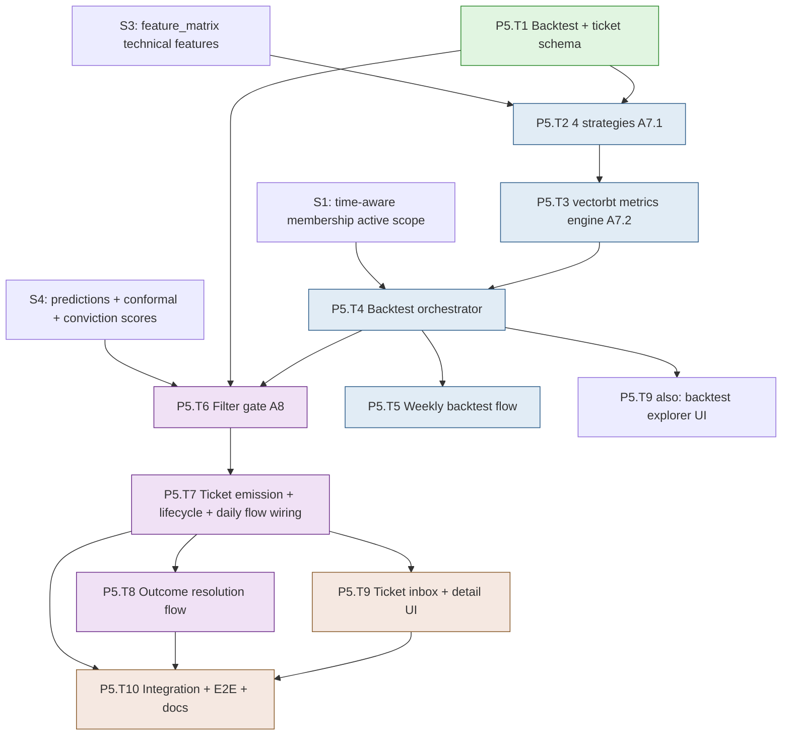

# Development Plan — Stage S5: Backtesting (A7) + Conviction Tickets (A8)

> **Project**: MBI Labs Oracle Engine — Pipeline A
> **Stage**: S5 — 4-Strategy Backtester + Filter Gate + Conviction Tickets (Blocks A7, A8)
> **Companion docs**: `mbi-pipeline-a-v1-design.md` (§7 Backtesting, §8 Conviction Tickets), `tech-stack-analysis.md`
> **Previous stage**: S4 — ML Models (Blocks A4 + A5 + A6)
> **Next stage**: S6 — Monitoring & Polish
> **Status**: Ready for execution. Generated via `dev-plan-generator`; gaps closed via `brainstorming`.

---

## Executive Summary

S5 produces Pipeline A's user-facing output. It implements Block A7 (the 4-strategy vectorbt backtester — the empirical "does this ticker have exploitable edge" proving ground) and Block A8 (the filter gate that turns predictions into Conviction Tickets). It wires the filter into the daily-inference flow, builds the conviction-ticket inbox + detail UI (the headline surface), the backtest explorer, ticket lifecycle management (TRADABLE → REVIEWED → ACTIONED → RESOLVED/EXPIRED), and the daily outcome-resolution flow that records actual returns for every ticket whose horizon has elapsed. By the end of S5, the system autonomously emits filtered, tradable conviction tickets each evening and tracks how they turn out.

- **Total tasks**: 10 (P5.T1 – P5.T10)
- **Total sub-tasks**: 32
- **Estimated effort**: 13–17 dev days (1 developer); 8–11 days with a backend+frontend pair
- **Builds on**: S4's `predictions` + conformal intervals + conviction scores; S3's `feature_matrix` (strategies read technical features); S2's `ohlcv_bars` (outcome resolution); S1's time-aware membership (active-member scope)

### Top 3 Risks & Mitigations

| Risk | Mitigation |
|---|---|
| **Backtest lookahead/signal-timing bugs** (entries/exits computed with same-bar data the strategy couldn't have seen live) | Signals use only completed-bar data; entries lag the signal bar by one where the spec implies it; reuse S3's pre-computed technical features (already lookahead-audited) rather than recomputing; per-strategy unit tests with known fixtures |
| **Filter emits noisy/empty ticket sets** (thresholds too loose → flood; too tight → nothing) | Every filter run snapshots its exact thresholds + counts into `filter_runs`; W_max computed per-universe from the calibration set (adaptive, not guessed); the filter is a discrete, independently re-runnable step so thresholds can be tuned without re-inferring |
| **Outcome resolution mis-attributes returns** (wrong base/resolution close, or resolving on a non-trading day) | Resolution uses the trading-calendar-aligned resolution date; base close = inference-date close, resolution close = resolution-date close, both from `ohlcv_bars`; idempotent (re-running doesn't double-resolve); ACTIONED outcomes preserved distinctly |

---

## Stage Dependency Map

**Critical path**: `S4 → T1 → T2 → T3 → T4 → T6 → T7 → T8 → T10`.
**Parallelizable**: The backtest track (T2→T3→T4→T5) and the filter/ticket track (T6→T7) converge at ticket emission; the UI (T9) can start once T4/T7 endpoints exist.

### Entry Criteria
- S4 complete: daily inference writes `predictions` with conformal intervals + conviction scores; W_max (90th-pct conformal width) computed per-universe at train time and stored on the model artifact/metadata.
- S3's `feature_matrix` has the technical features the strategies need (bb_lower, sma_50/200, atr_14, etc.); S2's `ohlcv_bars` has close prices + SPY for StatArb.

### Exit Criteria
- The 4 strategies produce correct entry/exit signals; the vectorbt engine extracts the 6 metrics per (ticker, strategy); `backtest_metrics.passed` reflects the locked criteria.
- Weekly backtest flow runs per universe over active members; on-demand single-ticker backtest works.
- The filter gate emits conviction tickets per the locked 4-criteria (conviction > 67 AND predicted_return > 0 AND ≥2/4 backtests pass AND conformal width < W_max), wired into the daily-inference flow.
- Ticket lifecycle works (user marks REVIEWED/ACTIONED; flow handles EXPIRED/RESOLVED); outcome resolution records actual returns idempotently.
- The conviction-ticket inbox (sortable/filterable), detail view, history, and CSV export work; the backtest explorer works.
- Integration + E2E green; CI green.

---

## Task P5.T1: Backtest + Ticket Schema

**Feature**: Features 6 + 7 — persistence
**Effort**: M / 1 day
**Dependencies**: S4
**Risk Level**: Low

#### Sub-task P5.T1.S1: Define ORM models for backtest_runs, backtest_metrics, conviction_tickets, filter_runs
**Description**: Create `features/backtesting/models.py` (backtest_runs, backtest_metrics with the GENERATED `passed` column) and `features/conviction_tickets/models.py` (conviction_tickets with the full status enum + lifecycle fields, filter_runs) per design §7–§8 exactly.
**Implementation Hints**: The `passed` column is `GENERATED ALWAYS AS (sharpe_ratio > 1.5 AND total_trades >= 10 AND max_drawdown > -0.40) STORED` — locked criteria in the DB. conviction_tickets carries the status enum (TRADABLE/REVIEWED/ACTIONED/RESOLVED/EXPIRED), `backtest_pass_strategies TEXT[]`, conformal bounds, and `outcome`. Register both in alembic env.
**Dependencies**: S4
**Effort**: M / 4 hrs
**Acceptance Criteria**:
- Models match design §7–§8 column-for-column
- `passed` generated column encodes the locked filter criteria
- Status + outcome enums present; models registered for autogen

#### Sub-task P5.T1.S2: Author the backtest + ticket migration
**Description**: Write the Alembic migration creating the four tables with the design indexes: `(ticker_id, strategy_name, computed_at DESC)` + `(backtest_run_id, passed)` on metrics; `(universe_id, status, conviction_score DESC)` (inbox) + `(resolution_date, status)` (resolution sweep) + `(ticker_id, inference_date DESC)` on tickets. conviction_tickets need not be a hypertable (lower volume than predictions) — confirm and document.
**Implementation Hints**: The `(backtest_run_id, passed)` index makes the filter-gate's "how many strategies passed for ticker T" query fast. The `(resolution_date, status)` index drives the daily resolution sweep. Standard tables (not hypertables) are fine here given ticket volume.
**Dependencies**: P5.T1.S1
**Effort**: S / 3 hrs
**Acceptance Criteria**:
- Migration creates all four tables with the specified indexes
- `passed` generated column works (insert metrics, verify computed value)
- `upgrade`/`downgrade` round-trip clean

---

## Task P5.T2: The 4 Strategies (Block A7.1)

**Feature**: Feature 6 (Backtesting) — strategies
**Effort**: L / 2 days
**Dependencies**: P5.T1, S3 (feature_matrix)
**Risk Level**: Medium

#### Sub-task P5.T2.S1: Define BaseStrategy ABC + write strategy tests (TDD — write first)
**Description**: Implement `features/backtesting/shared/base.py::BaseStrategy(ABC)` per spec a7.2 (`generate_signals(df) -> (entries: pd.Series[bool], exits: pd.Series[bool])`), then write tests for all four strategies against known fixtures: each produces the correct entry/exit booleans for hand-constructed price/feature sequences, and signals never use future data.
**Implementation Hints**: `features/backtesting/strategies/tests/`. Build small fixtures where the entry/exit conditions are obvious (e.g., a close dipping below bb_lower then crossing bb_middle for MeanReversion). Assert the boolean series match expected positions. The lookahead check: a signal at bar `t` uses only data ≤ `t`.
**Dependencies**: P5.T1.S1, S3, P0.T3.S3
**Effort**: M / 4 hrs
**Acceptance Criteria**:
- `BaseStrategy` ABC defined with the exact signal-tuple contract
- Tests FAIL initially (RED) for all 4 strategies
- Each strategy's entry/exit + lookahead-safety covered

#### Sub-task P5.T2.S2: Implement MeanReversion + MomentumCross
**Description**: Implement `strategies/mean_reversion.py` (entry `close < bb_lower`, exit `close > bb_middle`) and `strategies/momentum_cross.py` (entry `sma_50` crosses above `sma_200`, exit inverse crossover) per spec a7.3, reading the pre-computed technical features from S3's `feature_matrix` (not recomputing).
**Implementation Hints**: Pull `bb_lower`, `bb_middle`, `sma_50`, `sma_200` directly from `feature_matrix` (already lookahead-audited in S3). MomentumCross crossover: `(sma_50 > sma_200) & (sma_50.shift(1) <= sma_200.shift(1))`. Reusing S3 features avoids recompute drift and inherits the lookahead protections.
**Dependencies**: P5.T2.S1
**Effort**: M / 4 hrs
**Acceptance Criteria**:
- Both strategies pass their P5.T2.S1 tests (GREEN)
- Features sourced from `feature_matrix`, not recomputed
- Crossover logic uses the `.shift(1)` previous-bar comparison

#### Sub-task P5.T2.S3: Implement VolatilityBreakout + StatArb
**Description**: Implement `strategies/volatility_breakout.py` (entry: ATR spike >1.25× its 14-day mean AND close hits a new 20-day high; exit: close drops 5% below the 20-day high) and `strategies/stat_arb.py` (rolling 60-day OLS of the asset vs SPY via `scipy.stats.linregress`; entry residual < −2σ; exit residual > −0.5σ) per spec a7.3.
**Implementation Hints**: VolatilityBreakout uses `atr_14` from feature_matrix + `close.rolling(20).max().shift(1)`. StatArb needs SPY close (from `ohlcv_bars`) aligned to the asset's dates; run the rolling OLS to get the residual spread, then z-score it over the rolling window. Handle tickers where SPY history is shorter (skip gracefully).
**Dependencies**: P5.T2.S1
**Effort**: M / 4 hrs
**Risk Flags**: StatArb is the most complex — the rolling OLS + residual z-score must align asset and SPY dates exactly. Misalignment silently corrupts the spread. Test against a known cointegrated fixture.
**Acceptance Criteria**:
- Both strategies pass their P5.T2.S1 tests (GREEN)
- StatArb aligns asset/SPY dates correctly; rolling OLS residual computed
- Edge cases (short SPY history) handled gracefully

---

## Task P5.T3: VectorBT Metrics Engine (Block A7.2)

**Feature**: Feature 6 — backtest execution
**Effort**: M / 1 day
**Dependencies**: P5.T2
**Risk Level**: Medium

#### Sub-task P5.T3.S1: Implement the MetricsEngine
**Description**: Implement `features/backtesting/shared/metrics_engine.py::MetricsEngine` per spec a7.4: take `(entries, exits)` from a strategy, run `vbt.Portfolio.from_signals(close, entries, exits, init_cash=100000, fees=0.001, freq='1D')`, and extract exactly the 6 metrics (sharpe@rf=4.5%, max_drawdown, total_return, win_rate, profit_factor, total_trades).
**Implementation Hints**: Per spec a7.4 exact params. `portfolio.sharpe_ratio(risk_free=0.045)`, `.max_drawdown()`, `.total_return()`, `.trades.win_rate()`, profit_factor = gross_profits/gross_losses (compute from trades), `.trades.count()`. Handle the no-trades case (metrics → NaN/0, not crash). Returns a typed metrics dict.
**Dependencies**: P5.T2.S2, P5.T2.S3
**Effort**: M / 4 hrs
**Risk Flags**: A strategy that generates zero trades on a ticker must not crash the engine — return zero/NaN metrics and `passed=false`. profit_factor with zero losses → handle div-by-zero.
**Acceptance Criteria**:
- Extracts exactly the 6 metrics with the spec's global params
- No-trades and zero-loss edge cases handled (no crash)
- Sharpe uses risk-free 4.5%

#### Sub-task P5.T3.S2: MetricsEngine tests
**Description**: Test the engine against a fixture with a known-profitable signal (positive total return, computable Sharpe) and a known-flat signal (zero/few trades → not passed). Verify the 6 metrics are extracted and the `passed` criteria evaluate correctly.
**Implementation Hints**: Use a synthetic price series where a simple entry/exit clearly profits, assert positive metrics. Use a flat series → assert minimal trades and `passed=false`. Cross-check one Sharpe value against a manual computation within tolerance.
**Dependencies**: P5.T3.S1
**Effort**: S / 3 hrs
**Acceptance Criteria**:
- Profitable fixture yields positive metrics; flat fixture yields not-passed
- All 6 metrics asserted present and typed
- One metric cross-checked against manual computation

---

## Task P5.T4: Backtest Orchestrator

**Feature**: Feature 6 — orchestration
**Effort**: L / 2 days
**Dependencies**: P5.T3, S1 (active membership)
**Risk Level**: Medium

#### Sub-task P5.T4.S1: Implement the BacktestOrchestrator
**Description**: Implement `features/backtesting/service.py::BacktestOrchestrator` per spec a7.5: for a universe's **active members** (locked scope), run all 4 strategies through the MetricsEngine over the 5-year rolling window, and persist per-(ticker, strategy) metrics into `backtest_metrics` under a `backtest_run`. Per-ticker isolation (one failure doesn't abort the run).
**Implementation Hints**: Resolve active members via S1's membership query. For each ticker: load its feature_matrix + close history for the 5y window, run the 4 strategies → MetricsEngine → persist. Parallelize per-ticker across cores (reuse S3's joblib pattern). The `passed` column auto-computes via the generated column. Record the run lifecycle on `backtest_runs`.
**Dependencies**: P5.T3.S1, S1
**Effort**: L / 1 day
**Risk Flags**: 5-year window × all active members × 4 strategies is meaningful compute — parallelize and document runtime. StatArb needs SPY loaded once and shared (don't refetch per ticker).
**Acceptance Criteria**:
- Backtests all active members × 4 strategies over the 5y window
- Per-ticker isolation; run lifecycle persisted; metrics + `passed` stored
- Parallelized; SPY loaded once for StatArb

#### Sub-task P5.T4.S2: Backtest API endpoints
**Description**: Expose `POST /api/v1/backtests/trigger` (on-demand: full-universe or single-ticker via query params), `GET /api/v1/backtests/{universe_id}` (latest run's per-ticker pass badges), and `GET /api/v1/backtests/{universe_id}/{ticker_id}` (the 4 strategies' 6 metrics + equity-curve data for charts). Admin-only.
**Implementation Hints**: `features/backtesting/endpoints/`. The universe view aggregates `backtest_metrics` into per-ticker pass counts. The ticker detail returns the metrics + the equity-curve series (from the vectorbt portfolio value over time) for the frontend charts. Trigger fires the orchestrator (single ticker) or a Prefect run (full universe).
**Dependencies**: P5.T4.S1
**Effort**: M / 4 hrs
**Acceptance Criteria**:
- Trigger works for single-ticker (sync) and full-universe (Prefect run)
- Universe view returns per-ticker pass badges; ticker view returns 6 metrics + equity curves
- Admin-only

---

## Task P5.T5: Weekly Backtest Flow

**Feature**: Feature 9 (Orchestration) — backtest flow
**Effort**: S / half day
**Dependencies**: P5.T4, S2 (Prefect)
**Risk Level**: Low

#### Sub-task P5.T5.S1: Implement the weekly_backtest flow
**Description**: Build `orchestration/flows/weekly_backtest.py` per design §7: for each active universe, run the BacktestOrchestrator over active members. Scheduled Sundays ~4am ET (before the 6am retrain, so fresh backtest results exist for the week's filtering). Per-universe isolation; on-failure alert stub.
**Implementation Hints**: Independent of the inference flow (per the locked orchestration decision — the filter reads the freshest persisted backtest results, doesn't wait on a run). Schedule it before the weekly retrain so the week starts with current backtests. Composes the orchestrator via a task wrapper.
**Dependencies**: P5.T4.S1, P2.T3.S2
**Effort**: S / 3 hrs
**Acceptance Criteria**:
- Weekly backtest deployed + scheduled (Sundays ET, before retrain) + on-demand
- Per-universe isolation
- Results persisted for the week's daily filtering

---

## Task P5.T6: Filter Gate (Block A8)

**Feature**: Feature 7 (Conviction Tickets) — filter
**Effort**: L / 2 days
**Dependencies**: P5.T1, S4 (predictions)
**Risk Level**: Medium

#### Sub-task P5.T6.S1: Write filter-gate tests (TDD — write first)
**Description**: Write tests for the locked 4-criteria filter: a prediction passes only when conviction > 67 AND predicted_return > 0 AND ≥2/4 backtest strategies pass AND conformal width < W_max. Test each criterion's boundary independently (e.g., conviction exactly 67 fails; 67.01 passes) and the per-horizon independence (only T+5 passing emits one T+5 ticket).
**Implementation Hints**: `features/conviction_tickets/filter/tests/test_gate.py`. Construct predictions + backtest results that isolate each criterion. Assert the multi-horizon rule: a ticker passing only one horizon yields exactly one ticket. W_max comes from the universe/model metadata (locked: per-universe 90th-pct conformal width).
**Dependencies**: P5.T1.S1, S4, P0.T3.S3
**Effort**: M / 4 hrs
**Acceptance Criteria**:
- Tests FAIL initially (RED)
- Each of the 4 criteria tested at its boundary
- Per-horizon independence asserted

#### Sub-task P5.T6.S2: Implement the filter gate
**Description**: Implement `features/conviction_tickets/filter/gate.py::apply_filter(inference_run)` to pass P5.T6.S1: for each (ticker, horizon) in the inference run, evaluate the 4 criteria against the prediction + the freshest backtest results for that ticker + the per-universe W_max, and return the set of (ticker, horizon) that pass. Snapshot the exact thresholds used.
**Implementation Hints**: Read predictions from the inference run, join the latest `backtest_metrics` per ticker (the `(backtest_run_id, passed)` index helps), read W_max from the universe/model metadata. Long-only: predicted_return > 0. Per-horizon evaluation. The threshold snapshot goes into `filter_runs.filter_config`.
**Dependencies**: P5.T6.S1
**Effort**: M / 4 hrs
**Risk Flags**: W_max must come from the SAME universe/model that produced the prediction (don't cross universes). If a ticker has no recent backtest (e.g., newly added), treat backtest_passes as 0 (fails the ≥2 criterion) rather than crashing.
**Acceptance Criteria**:
- All P5.T6.S1 tests pass (GREEN)
- Reads per-universe W_max + freshest backtest results
- Missing-backtest ticker → 0 passes (not a crash); thresholds snapshotted

---

## Task P5.T7: Ticket Emission + Lifecycle + Daily Flow Wiring

**Feature**: Feature 7 — ticket emission
**Effort**: L / 2 days
**Dependencies**: P5.T6, S4 (daily inference flow)
**Risk Level**: Medium

#### Sub-task P5.T7.S1: Implement ticket emission from filter results
**Description**: Implement the service that turns passing (ticker, horizon) pairs into `conviction_tickets`: compute `resolution_date` (inference_date + horizon trading days via the trading calendar), set status TRADABLE, copy predicted_return/conviction/conformal bounds/backtest passes, and record a `filter_run` with emitted counts. Idempotent per `(inference_run, ticker, horizon)`.
**Implementation Hints**: resolution_date uses the trading calendar (T+5 = 5 trading days forward, not 5 calendar days). `expires_at` = resolution_date market close. The `UNIQUE(inference_run_id, ticker_id, horizon)` makes emission idempotent. backtest_pass_strategies lists which strategies passed (for the detail view).
**Dependencies**: P5.T6.S2, P2.T6 (calendar)
**Effort**: M / 4 hrs
**Acceptance Criteria**:
- Passing pairs become TRADABLE tickets with calendar-correct resolution dates
- Emission idempotent (re-running same inference run doesn't duplicate)
- `filter_run` records evaluated + emitted counts

#### Sub-task P5.T7.S2: Implement ticket lifecycle transitions
**Description**: Implement the user-driven lifecycle endpoints + service: `POST /tickets/{id}/review` (TRADABLE→REVIEWED), `POST /tickets/{id}/action` (→ACTIONED, optional notes), plus the rules that the daily flow uses for TRADABLE→EXPIRED (resolution day passed without action) and ACTIONED→RESOLVED. Guard invalid transitions.
**Implementation Hints**: `features/conviction_tickets/endpoints/lifecycle.py`. A state-machine validator rejects illegal transitions (e.g., can't review an EXPIRED ticket). ACTIONED tickets get resolved with outcome tracking (distinct from un-actioned TRADABLE that just expire). user_notes optional on action.
**Dependencies**: P5.T7.S1
**Effort**: M / 4 hrs
**Acceptance Criteria**:
- Review/action transitions work with validation
- Illegal transitions rejected with a clear error
- ACTIONED vs un-actioned tickets handled distinctly at resolution

#### Sub-task P5.T7.S3: Wire the filter + emission into the daily-inference flow
**Description**: Per the locked orchestration decision, extend S4's `daily_inference` flow so that after predictions are written, the same flow runs the filter gate and emits tickets (reading the freshest weekly backtest results already in the DB). One daily flow: data → features → inference → filter → tickets.
**Implementation Hints**: Add filter + emission tasks downstream of the inference task in `daily_inference.py`. No waiting on a backtest *run* — the filter reads persisted `backtest_metrics`. Per-universe. On-failure alert stub. This completes the autonomous daily pipeline.
**Dependencies**: P5.T7.S1, P4.T11.S2
**Effort**: S / 3 hrs
**Acceptance Criteria**:
- Daily flow emits tickets after inference, reading freshest backtests
- Per-universe; failure in filtering doesn't corrupt written predictions
- End-to-end daily run produces TRADABLE tickets

---

## Task P5.T8: Outcome Resolution Flow

**Feature**: Feature 7 + Feature 9 — outcome tracking
**Effort**: M / 1 day
**Dependencies**: P5.T7, S2 (ohlcv_bars, calendar)
**Risk Level**: Medium

#### Sub-task P5.T8.S1: Implement outcome resolution
**Description**: Implement the resolution service per design §8: for each ticket where `resolution_date == today`, compute `actual_return = close[resolution_date]/close[inference_date] - 1` from `ohlcv_bars`, set `outcome` (win/loss/flat with the |return|<0.001 flat band), and transition status (TRADABLE/REVIEWED → RESOLVED; ACTIONED → RESOLVED preserving the actioned distinction; un-resolved past-date TRADABLE → EXPIRED). Idempotent.
**Implementation Hints**: Base close = inference-date close, resolution close = resolution-date close, both from `ohlcv_bars`. Long-only: outcome win if actual_return > 0. Idempotency: only resolve tickets not already RESOLVED/EXPIRED. Use the trading calendar to confirm resolution_date is a real session (if the market was closed, roll to the next session — document this rule).
**Dependencies**: P5.T7.S1, S2
**Effort**: M / 4 hrs
**Risk Flags**: The base/resolution close attribution is the correctness crux — getting the dates swapped inverts every outcome. Idempotency prevents double-resolution. Handle the case where the resolution-date bar isn't ingested yet (defer, don't error).
**Acceptance Criteria**:
- actual_return computed from correct base/resolution closes
- outcome (win/loss/flat) + status transitions correct; ACTIONED preserved
- Idempotent; missing resolution-bar deferred not errored

#### Sub-task P5.T8.S2: Implement the outcome_resolution flow
**Description**: Build `orchestration/flows/outcome_resolution.py` per design §10: daily after close (weekdays ~5:00pm ET), resolve all due tickets and expire stale ones. Feeds S4's conformal coverage tracker (resolved outcomes are what coverage is measured against).
**Implementation Hints**: Query `(resolution_date <= today, status IN active)` via the `(resolution_date, status)` index. Resolve each. After resolution, the coverage tracker (S4 P4.T6.S3) can compute realized coverage — trigger it here or leave for S6's monitoring flow. Per-universe isolation.
**Dependencies**: P5.T8.S1, P2.T3.S2
**Effort**: S / 3 hrs
**Acceptance Criteria**:
- Resolution flow deployed + scheduled (weekdays after close) + on-demand
- Due tickets resolved; stale TRADABLE expired
- Resolved outcomes available for coverage measurement

---

## Task P5.T9: Conviction Ticket Inbox/Detail + Backtest Explorer UI

**Feature**: Features 6 + 7 — frontend
**Effort**: XL / 3 days
**Dependencies**: P5.T4, P5.T7
**Risk Level**: Low

#### Sub-task P5.T9.S1: Build the conviction-ticket inbox
**Description**: Implement `/tickets` (the headline view) per design §8: all TRADABLE tickets across universes in a TanStack Table, sortable (conviction desc default), filterable (universe, horizon, conviction range, backtest-pass-count, conformal-width range). Each row shows ticker, universe, horizon, conviction badge, predicted return, conformal interval, backtest passes, status.
**Implementation Hints**: `features/conviction_tickets/pages/InboxPage.tsx` + `api/useTickets.ts` (60s refetch). TanStack Table for sort/filter. A `ConvictionScoreBadge` component color-codes by score band. Filters map to query params (URL state). Regenerate API types first.
**Dependencies**: P5.T7.S1, P0.T8
**Effort**: L / 1 day
**Acceptance Criteria**:
- Inbox lists TRADABLE tickets, sortable + filterable per design
- Conviction badge color-codes by band; conformal interval rendered
- Filters reflected in URL state

#### Sub-task P5.T9.S2: Build the ticket detail view
**Description**: Implement `/tickets/{id}` per design §8: full breakdown — ensemble math (LSTM vs TFT components from the prediction's raw arrays), conformal interval visualization, backtest pass-by-strategy table, a link to `/features/inspect` for the feature snapshot, and action buttons (Mark Reviewed / Mark Actioned with notes).
**Implementation Hints**: `features/conviction_tickets/pages/DetailPage.tsx`. A `ConformalIntervalBar` component visualizes [low, predicted, high]. The backtest table shows which of the 4 strategies passed. Action buttons call the lifecycle endpoints (P5.T7.S2) with optimistic updates. Link to the S3 feature-inspect page for this ticker/date.
**Dependencies**: P5.T9.S1, P5.T7.S2
**Effort**: L / 1 day
**Acceptance Criteria**:
- Detail shows ensemble components, conformal viz, backtest-by-strategy table
- Action buttons transition state with optimistic UI
- Links to the feature-inspect snapshot

#### Sub-task P5.T9.S3: Build ticket history + CSV export + backtest explorer
**Description**: Implement `/tickets/history` (chronological, outcome filters: won/lost/flat/pending), `/tickets/export.csv` (filtered set, 10K cap), and the backtest explorer: `/backtests/{universe_id}` (per-ticker pass badges) + `/backtests/{universe_id}/{ticker_id}` (4 strategies' equity curves via TradingView Lightweight Charts + drawdown chart + the 6 metrics).
**Implementation Hints**: History reuses the inbox table with a status/outcome filter. CSV export streams from the backend endpoint. Backtest explorer: `features/backtesting/pages/` with equity-curve charts (Lightweight Charts for the financial series, Recharts for drawdown). Pass-badge grid links to per-ticker detail.
**Dependencies**: P5.T9.S2, P5.T4.S2
**Effort**: M / 4 hrs
**Acceptance Criteria**:
- History view with outcome filters; CSV export works (capped)
- Backtest explorer shows pass badges + per-ticker equity/drawdown charts + 6 metrics
- Equity curves render via Lightweight Charts

---

## Task P5.T10: Integration + E2E + Docs

**Feature**: Cross-feature verification
**Effort**: M / 1 day
**Dependencies**: P5.T7, P5.T8, P5.T9
**Risk Level**: Low

#### Sub-task P5.T10.S1: Cross-feature integration tests
**Description**: Write integration tests for the full output path on tiny synthetic data: predictions present → backtest run → filter gate → tickets emitted with correct criteria → lifecycle transitions → outcome resolution records returns. Assert the filter's 4 criteria gate correctly end-to-end and resolution attributes returns correctly.
**Implementation Hints**: Seed predictions (from a tiny S4 run or fixtures) + backtest_metrics, run the filter + emission, assert ticket counts match the criteria, transition a ticket through ACTIONED, run resolution, assert outcome. Mock the trading calendar where needed for deterministic resolution dates.
**Dependencies**: P5.T7, P5.T8
**Effort**: M / 4 hrs
**Acceptance Criteria**:
- Full path (predict → backtest → filter → emit → resolve) tested
- Filter criteria gate correctly; resolution attributes returns correctly
- Idempotency of emission + resolution asserted

#### Sub-task P5.T10.S2: Extend Playwright E2E (view inbox → open ticket → mark actioned)
**Description**: Add an E2E test: log in, navigate to the ticket inbox, confirm seeded TRADABLE tickets render, open a ticket detail, mark it ACTIONED, and confirm the status updates. Seed deterministic tickets in the test environment.
**Implementation Hints**: Extend the Playwright suite. Seed a couple of conviction tickets via a fixture/script in the test compose env. Reuse the `/ready` wait-gate. The test exercises the headline user journey (see tickets → act on one).
**Dependencies**: P5.T9.S2, P0.T9.S3
**Effort**: M / 4 hrs
**Acceptance Criteria**:
- E2E passes locally + CI: inbox renders → open detail → mark actioned → status updates
- Deterministic seeded tickets; `/ready` wait-gate used
- Fails if ticket rendering or lifecycle breaks

#### Sub-task P5.T10.S3: features.md for backtesting + conviction_tickets
**Description**: Author `features/backtesting/features.md` (the 4 strategies, vectorbt engine, pass criteria, active-member scope) and `features/conviction_tickets/features.md` (the filter gate's 4 criteria, W_max sourcing, ticket lifecycle, outcome resolution, the daily-flow wiring). Update frontend `feature.md` files.
**Implementation Hints**: Document the locked decisions clearly: active-member backtest scope, filter-in-daily-flow orchestration, per-universe W_max. The conviction_tickets doc is important — it's the system's output contract that Pipeline B will later consume.
**Dependencies**: P5.T9, P5.T8
**Effort**: S / 3 hrs
**Acceptance Criteria**:
- Both features.md document the implemented behavior + locked decisions
- W_max sourcing + lifecycle + daily-flow wiring clearly explained
- Output contract documented for future Pipeline B consumption

---

## Appendix

### Glossary

| Term | Meaning |
|---|---|
| **4 strategies** | MeanReversion, MomentumCross, VolatilityBreakout, StatArb — the paradigm backtests |
| **Pass criteria** | A ticker passes a strategy if Sharpe > 1.5 AND total_trades ≥ 10 AND max_drawdown > −0.40 |
| **Filter-eligible** | A ticker passing ≥ 2 of the 4 strategies |
| **Filter gate (A8)** | conviction > 67 AND predicted_return > 0 AND ≥2/4 backtests pass AND conformal width < W_max |
| **W_max** | Per-universe conformal-width threshold (90th pct of calibration-set widths), computed at train time |
| **Conviction Ticket** | Pipeline A's headline output: one tradable (ticker, horizon) signal with conviction + interval + backtest evidence |
| **Ticket lifecycle** | TRADABLE → REVIEWED → ACTIONED → RESOLVED, or TRADABLE → EXPIRED |
| **Outcome resolution** | Recording actual return when a ticket's horizon elapses (win/loss/flat) |

### Full Risk Register

| ID | Risk | Likelihood | Impact | Mitigation | Owner Task |
|---|---|---|---|---|---|
| R1 | Backtest signal-timing lookahead | Medium | High | Reuse S3 lookahead-audited features; previous-bar crossover; per-strategy fixtures | P5.T2.S2 |
| R2 | StatArb asset/SPY date misalignment | Medium | Medium | Explicit date alignment; cointegrated fixture test; load SPY once | P5.T2.S3 |
| R3 | Filter emits flood or nothing | Medium | Medium | Per-universe adaptive W_max; threshold snapshot in filter_runs; independently re-runnable | P5.T6.S2 |
| R4 | Outcome resolution mis-attributes returns | Medium | High | Calendar-aligned dates; correct base/resolution close; idempotent; defer missing bars | P5.T8.S1 |
| R5 | Zero-trade strategy crashes metrics | Low | Medium | No-trades + zero-loss handled → not-passed, no crash | P5.T3.S1 |
| R6 | Newly-added ticker has no backtest at filter time | Medium | Low | Treat as 0 passes (fails ≥2 criterion), not a crash | P5.T6.S2 |
| R7 | Duplicate tickets on flow re-run | Low | Medium | `UNIQUE(inference_run, ticker, horizon)` makes emission idempotent | P5.T7.S1 |

### Assumptions Log

Inherited from `tech-stack-analysis.md` §4, plus S5-specific:
- Backtest scope is **active members per universe, weekly** (locked); point-in-time historical backtests are a future upgrade the time-aware membership supports.
- Filter orchestration **reuses the daily-inference flow** (locked): predictions → filter (reads freshest backtests) → tickets; weekly backtest flow runs independently before retrain.
- **W_max is per-universe**, computed from the calibration set at train time (90th-pct conformal width), stored on the model, user-overridable later (locked).
- Strategies read **pre-computed technical features from S3** (lookahead-audited), not recomputed.
- Long-only filter for v1 (predicted_return > 0); SHORT reserved.
- Block A7 pass criteria add `total_trades ≥ 10` and `max_drawdown > −0.40` beyond the spec's Sharpe (deviation #11).

### Cross-references
- Design spec: `mbi-pipeline-a-v1-design.md` (§7 Backtesting, §8 Conviction Tickets, §14 deviation #11)
- Stack validation: `tech-stack-analysis.md` (§1 vectorbt/scipy, §5 compat #6 Python 3.11 for vectorbt)
- Previous stage: `development-plan-S4.md` (predictions + conformal + conviction scores this consumes)
- Next stage: `development-plan-S6.md` (Monitoring & Polish) — forthcoming

---

## End of Stage S5 Plan
