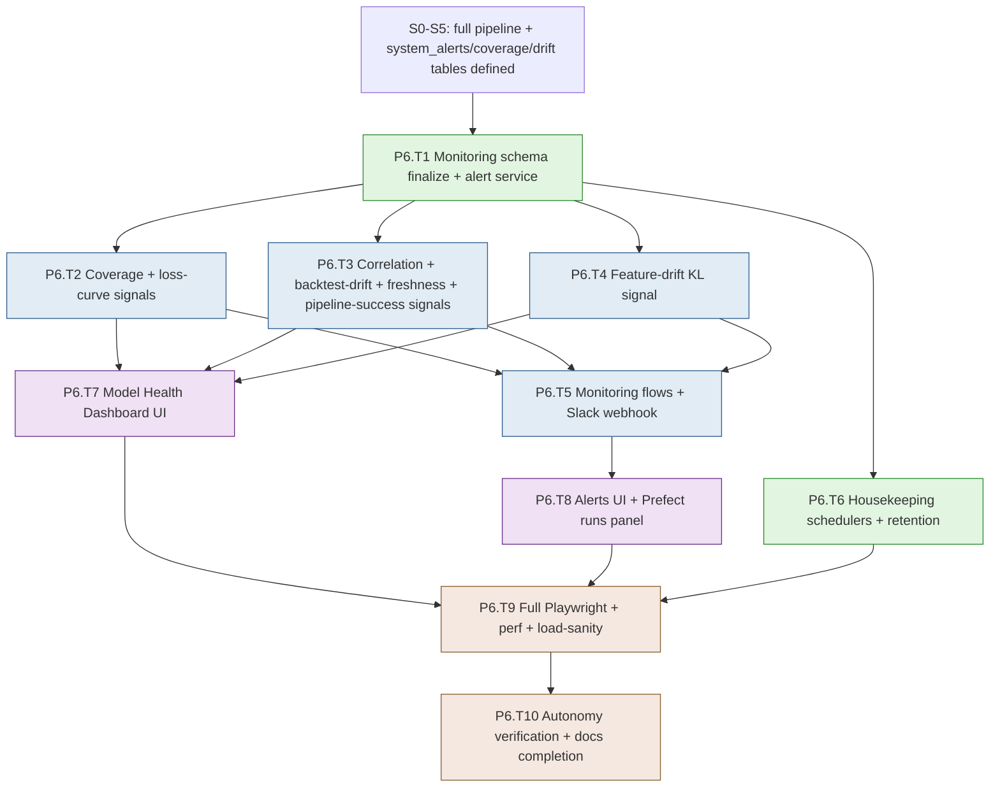

# Development Plan — Stage S6: Monitoring & Polish

> **Project**: MBI Labs Oracle Engine — Pipeline A
> **Stage**: S6 — Monitoring, Observability, Hardening & Autonomy (Feature 8 + cross-cutting polish)
> **Companion docs**: `mbi-pipeline-a-v1-design.md` (§9 Monitoring, §10 Orchestration, §11 Cross-cutting), `tech-stack-analysis.md`
> **Previous stage**: S5 — Backtesting + Conviction Tickets
> **Next stage**: — (v1 complete; Pipeline B is the next epic)
> **Status**: Ready for execution. Generated via `dev-plan-generator`; gaps closed via `brainstorming`.

---

## Executive Summary

S6 is the final stage — it turns a working pipeline into a **self-running, observable, hardened system**. It builds the full Model Health Dashboard with all 7 tracked signals (conformal coverage, train/val loss curves, conviction-vs-outcome correlation, backtest pass-rate drift, pipeline success rate, data freshness, feature drift), the `system_alerts` surface with a critical-severity Slack webhook, the monitoring computation flows, the remaining housekeeping schedulers (artifact retention reaper, session reaper, partition policy), full Playwright critical-path coverage, a performance pass, an API load-sanity check, and the documentation/runbook completion that lets the engine run autonomously for a week without intervention. By the end of S6, Pipeline A is feature-complete: data flows in, models retrain weekly, tickets emit daily, outcomes resolve, and the operator is notified when anything drifts or breaks.

- **Total tasks**: 10 (P6.T1 – P6.T10)
- **Total sub-tasks**: 31
- **Estimated effort**: 12–16 dev days (1 developer); 8–10 days with a backend+frontend pair
- **Builds on**: every prior stage — S6 instruments and hardens what S0–S5 built

### Top 3 Risks & Mitigations

| Risk | Mitigation |
|---|---|
| **Monitoring signals that look fine but are subtly wrong** (a coverage or drift metric computed incorrectly gives false confidence — worse than no metric) | Each of the 7 signals gets a unit test against a fixture with a known expected value; coverage cross-checked against the S4 conformal tracker; drift KL validated against a synthetic distribution shift |
| **Alert fatigue or alert silence** (too many alerts → ignored; too few/miscalibrated → silent failures) | Severity tiers (info/warning/critical); only critical hits Slack; thresholds from the design (coverage <80%, freshness >36h, correlation <0.2) are config-tunable; dedup so the same condition doesn't re-fire every run |
| **Autonomy gap** (the system "works" in dev but needs manual nursing weekly) | A dedicated end-to-end "one full week simulated" verification; every scheduled flow has an on-failure alert; runbooks cover every recurring operation; a documented "what to check Monday morning" digest |

---

## Stage Dependency Map

**Critical path**: `S5 → T1 → {T2,T3,T4} → T5 → T8 → T9 → T10`.
**Parallelizable**: The four signal-computation tasks (T2/T3/T4) run concurrently after T1; the dashboard UI (T7) builds alongside the flows (T5); housekeeping (T6) is independent.

### Entry Criteria
- S5 complete: tickets emit daily, outcomes resolve, backtests run weekly. The `coverage_metrics`, `feature_drift_metrics`, `system_alerts` tables were defined in earlier migrations (per design §9) — S6 finalizes/uses them.
- S4's conformal coverage tracker (P4.T6.S3) exists; S5's resolved tickets provide the outcome data the analytical signals need.

### Exit Criteria
- All 7 monitoring signals compute correctly (each fixture-tested) and surface on the Model Health Dashboard.
- `system_alerts` records structured alerts with severity; critical alerts fire a Slack webhook (config-gated, no-op if unset); alerts dedup.
- The monitoring computation flows run on schedule (coverage daily 11pm ET, drift daily, etc.).
- Housekeeping runs: artifact retention reaper (>6mo), session reaper (hourly), partition policy.
- Playwright covers all critical paths (login, universe CRUD, model-health, inbox→action, backtest explorer); a performance pass + API load-sanity check are documented and pass thresholds.
- A simulated "one full week" autonomy test passes: the system runs all flows end-to-end without manual intervention.
- All runbooks complete; the "Monday-morning check" digest documented. CI fully green.

---

## Task P6.T1: Monitoring Schema Finalize + Alert Service

**Feature**: Feature 8 (Monitoring) — foundation
**Effort**: M / 1 day
**Dependencies**: S5
**Risk Level**: Low

#### Sub-task P6.T1.S1: Finalize monitoring models + migration
**Description**: Ensure `features/monitoring/models.py` has the final `coverage_metrics`, `feature_drift_metrics`, and `system_alerts` models per design §9 (some defined as stubs in earlier stages). Add a `pipeline_run` read-model or confirm Prefect-API sourcing for pipeline success rate. Migrate any gaps. Add the `(resolved_at, severity) WHERE resolved_at IS NULL` partial index on system_alerts.
**Implementation Hints**: Reconcile with whatever was stubbed in S2/S4. `coverage_metrics` and `feature_drift_metrics` carry `measurement_date` + `window_size` + the computed value + an alert flag. The partial index makes "open critical alerts" queries fast. Confirm whether `pipeline_run` state comes from Prefect's API (P2.T3.S3) vs a local table — prefer the Prefect API read-model.
**Dependencies**: S5
**Effort**: M / 4 hrs
**Acceptance Criteria**:
- All three monitoring tables final per design §9 with indexes
- Open-alerts partial index present
- Pipeline-run sourcing decided + documented (Prefect API)

#### Sub-task P6.T1.S2: Implement the alert service with severity + dedup
**Description**: Build `features/monitoring/service.py` alert functions: `raise_alert(severity, code, message, universe_id, context)` that inserts a `system_alerts` row, dedups against an existing unresolved alert with the same `(code, universe_id)` (update rather than duplicate), and — for `critical` — invokes the Slack notifier. Plus `acknowledge_alert`, `resolve_alert`, `list_open_alerts`.
**Implementation Hints**: Dedup: before insert, check for an unresolved row with the same code+universe; if present, bump a count/timestamp in `context` instead of inserting a duplicate (prevents alert fatigue). Severity tiers: info/warning stay in-table; critical additionally notifies. This is the single funnel every flow's on-failure hook + every signal breach calls.
**Dependencies**: P6.T1.S1
**Effort**: M / 4 hrs
**Acceptance Criteria**:
- `raise_alert` inserts with severity; same condition dedups (no duplicate spam)
- Critical severity triggers the notifier path; info/warning don't
- Acknowledge/resolve/list-open functions work

#### Sub-task P6.T1.S3: Implement the Slack webhook notifier (config-gated)
**Description**: Build `core/services/notifier.py` that POSTs a formatted message to `SLACK_WEBHOOK_URL` for critical alerts. **No-op if the env var is unset** (so the system works with zero notification config). Never includes secrets in the payload. Wrapped in try/except so a Slack failure never breaks the calling flow.
**Implementation Hints**: Simple `httpx.post(webhook_url, json={"text": ...})`. Gate on `settings.SLACK_WEBHOOK_URL` being set. Format: severity, code, universe, message, timestamp. Swallow + log Slack errors (a down Slack must not fail a retrain). This is the locked alert-routing decision.
**Dependencies**: P6.T1.S2
**Effort**: S / 2 hrs
**Acceptance Criteria**:
- Critical alert POSTs to Slack when `SLACK_WEBHOOK_URL` set
- No-op (no error) when unset
- Slack failure is swallowed + logged, never propagates

---

## Task P6.T2: Coverage + Loss-Curve Signals

**Feature**: Feature 8 — signals (1–2)
**Effort**: M / 1 day
**Dependencies**: P6.T1, S4 (coverage tracker), S5 (resolved tickets)
**Risk Level**: Medium

#### Sub-task P6.T2.S1: Implement the conformal-coverage signal
**Description**: Wire S4's coverage tracker (P4.T6.S3) into a monitoring signal: compute realized coverage per universe per horizon over rolling 30/90-day windows from RESOLVED tickets, write `coverage_metrics`, and raise a `critical` alert (`COVERAGE_BREACH`) when realized coverage drops below 80% (for 90% nominal) on a sustained basis.
**Implementation Hints**: Realized coverage = fraction of resolved tickets whose `actual_return` fell within `[conformal_lower, conformal_upper]`. Per universe/horizon, two windows (30/90). "Sustained" = breached on multiple consecutive measurement days (avoid one-day noise). The threshold is config. Cross-check the computation against S4's tracker.
**Dependencies**: P6.T1.S2, S5 (resolved tickets)
**Effort**: M / 4 hrs
**Acceptance Criteria**:
- Coverage computed per universe/horizon over 30/90d windows; `coverage_metrics` written
- Sustained sub-80% raises a critical COVERAGE_BREACH alert
- Fixture test with known coverage validates the computation

#### Sub-task P6.T2.S2: Implement the train/val loss-curve signal
**Description**: Surface per-training-run loss curves (captured in S4's trainers) as a monitoring signal: expose the per-epoch train/val loss history from `training_runs.validation_metrics`, and flag overfitting (train decreasing while val plateaus/rises) with a `warning` alert.
**Implementation Hints**: The loss history was captured in P4.T4.S2 / P4.T5.S3 into `training_runs`. The signal reads it for the dashboard charts and runs a simple overfitting heuristic (val loss rose while train fell over the last N epochs). Warning-severity (not critical — overfitting is informative, not breaking).
**Dependencies**: P6.T1.S2, S4
**Effort**: S / 3 hrs
**Acceptance Criteria**:
- Per-run train/val loss history exposed for charts
- Overfitting heuristic raises a warning when detected
- Fixture test validates the overfitting detection

---

## Task P6.T3: Correlation + Backtest-Drift + Freshness + Pipeline-Success Signals

**Feature**: Feature 8 — signals (3–6)
**Effort**: L / 2 days
**Dependencies**: P6.T1, S5
**Risk Level**: Medium

#### Sub-task P6.T3.S1: Implement conviction-vs-outcome correlation
**Description**: Compute the Spearman rank correlation between `conviction_score` and `actual_return` across RESOLVED tickets in a rolling window per universe. Raise a `warning` (`CONVICTION_UNPREDICTIVE`) when correlation drops below 0.2 sustained — meaning high conviction is no longer predicting good outcomes.
**Implementation Hints**: `scipy.stats.spearmanr(conviction_scores, actual_returns)` over resolved tickets in the window. This is the single best "is the engine actually working" signal — if conviction doesn't correlate with outcomes, the models are noise. Per universe. Config threshold (0.2).
**Dependencies**: P6.T1.S2, S5
**Effort**: M / 4 hrs
**Acceptance Criteria**:
- Spearman correlation computed over resolved tickets per universe/window
- Sub-0.2 sustained raises a warning
- Fixture with known correlation validates the computation

#### Sub-task P6.T3.S2: Implement backtest pass-rate drift
**Description**: Compute the fraction of universe tickers passing ≥2 strategies per weekly backtest run, track it over time, and raise an `info`/`warning` when it trends down month-over-month (regime-shift indicator).
**Implementation Hints**: Query `backtest_metrics` per run: count tickers with ≥2 passes / total. Store the time series. A downward monthly trend is the signal (compare this month's average to last month's). Low-severity — it's a regime hint, not a failure.
**Dependencies**: P6.T1.S2, S5 (backtest_metrics)
**Effort**: S / 3 hrs
**Acceptance Criteria**:
- Pass-rate computed per backtest run; tracked over time
- Downward monthly trend raises an info/warning
- Fixture validates the trend detection

#### Sub-task P6.T3.S3: Implement data-freshness + pipeline-success signals
**Description**: Two operational signals: data freshness (time since last successful ingest per universe — raise `critical` `INGEST_STALE` if >36h) and pipeline success rate (fraction of recent daily flows succeeding via the Prefect API — raise `warning` if <95%).
**Implementation Hints**: Freshness: `MAX(ingest_runs.completed_at WHERE status succeeded)` per universe vs now. Pipeline success: query Prefect's API (P2.T3.S3) for recent flow-run states, compute success fraction. Both are operational must-haves for autonomy — they catch "the engine silently stopped."
**Dependencies**: P6.T1.S2, S2, P2.T3.S3
**Effort**: M / 4 hrs
**Acceptance Criteria**:
- Stale data (>36h) raises critical INGEST_STALE per universe
- Sub-95% pipeline success raises a warning
- Both fixture-tested

---

## Task P6.T4: Feature-Drift KL Signal

**Feature**: Feature 8 — signal (7)
**Effort**: M / 1 day
**Dependencies**: P6.T1, S3 (feature_matrix), S4 (training distribution)
**Risk Level**: Medium

#### Sub-task P6.T4.S1: Implement feature-drift KL divergence
**Description**: For each feature, compute the KL divergence between the current 252-day feature distribution and the distribution at training time, per universe. Write `feature_drift_metrics`; raise a `warning` (`FEATURE_DRIFT`) when divergence exceeds a per-feature threshold — signaling the live data has drifted from what the model trained on.
**Implementation Hints**: Bin both distributions (current trailing 252d vs the training window's distribution, snapshotted at train time) into histograms, compute `scipy.stats.entropy(p, q)` (KL). Per feature per universe. The training-time distribution needs to be captured during S4 training (a small addition — snapshot feature histograms into the training run metadata, or recompute from the training window). Threshold per feature (some features are naturally more variable).
**Dependencies**: P6.T1.S2, S3, S4
**Effort**: M / 4 hrs
**Risk Flags**: KL is asymmetric and sensitive to binning + zero bins — use a smoothed/regularized version (add epsilon to empty bins) to avoid infinities. Validate against a synthetic known shift.
**Acceptance Criteria**:
- Per-feature KL divergence computed (current vs training distribution) per universe
- `feature_drift_metrics` written; threshold breach raises a warning
- Smoothed binning avoids infinities; synthetic-shift test validates

---

## Task P6.T5: Monitoring Flows + Wiring

**Feature**: Feature 8 + Feature 9 — monitoring flows
**Effort**: M / 1 day
**Dependencies**: P6.T2, P6.T3, P6.T4
**Risk Level**: Low

#### Sub-task P6.T5.S1: Implement the conformal_coverage_check + monitoring flows
**Description**: Build the monitoring Prefect flows per design §10: `conformal_coverage_check.py` (daily 11pm ET — coverage signal), and a `daily_monitoring.py` that runs the freshness, pipeline-success, correlation, drift, and backtest-drift signals on appropriate cadences. Each writes metrics + raises alerts via the alert service.
**Implementation Hints**: Coverage check runs after outcome resolution (needs resolved tickets). The combined monitoring flow can run the cheaper signals daily and the heavier ones (drift KL) on a lighter cadence. Compose the signal services — no logic in the flow. On-failure hooks raise alerts.
**Dependencies**: P6.T2.S1, P6.T3, P6.T4.S1, P2.T3.S2
**Effort**: M / 4 hrs
**Acceptance Criteria**:
- Coverage-check + monitoring flows deployed + scheduled + on-demand
- Each signal writes its metrics + raises alerts on breach
- On-failure hooks raise alerts

#### Sub-task P6.T5.S2: Wire on-failure alert hooks into all existing flows
**Description**: Retrofit every existing Prefect flow (data refresh, inference, retrain, backtest, resolution) with an on-failure hook that raises a `critical` `FLOW_FAILED` alert via the alert service. This replaces the alert stubs left in S2/S4/S5 with the real implementation.
**Implementation Hints**: Prefect 3 supports flow-level `on_failure` hooks. Each writes a structured alert (flow name, universe, error). This is the autonomy backbone — a failed Sunday retrain now notifies you instead of silently leaving stale models. Replace the `system_alerts` stubs from earlier stages.
**Dependencies**: P6.T5.S1, P6.T1.S2
**Effort**: S / 3 hrs
**Acceptance Criteria**:
- Every scheduled flow raises a critical alert on failure
- Earlier alert-stubs replaced with the real alert service
- A deliberately failed flow produces an alert (+ Slack if configured)

---

## Task P6.T6: Housekeeping Schedulers + Retention

**Feature**: Cross-cutting (design §11) + Feature 9
**Effort**: M / 1 day
**Dependencies**: S4 (artifacts), S0 (scheduler)
**Risk Level**: Low

#### Sub-task P6.T6.S1: Implement the artifact retention reaper
**Description**: Build `orchestration/flows/artifact_retention.py` per design §10: weekly (Sundays 11pm ET), archive `model_artifacts` older than 6 months (never the active champion), deleting the underlying files via the artifact store but keeping the DB rows for history.
**Implementation Hints**: Query inactive artifacts with `created_at < now() - 6mo`. Never touch `is_active=true` rows. Delete the file via `artifact_store.delete`, stamp `archived_at`, keep the row. This prevents unbounded artifact-disk growth from weekly retrains (15 models/week × 52 weeks adds up).
**Dependencies**: S4, P0.T4.S2
**Effort**: S / 3 hrs
**Acceptance Criteria**:
- Reaper archives inactive artifacts >6mo; active champions untouched
- Files deleted via artifact store; DB rows preserved with `archived_at`
- Scheduled weekly + on-demand

#### Sub-task P6.T6.S2: Implement the session reaper + partition policy
**Description**: Per design §11: an hourly in-process scheduler task (S0's scheduler) that deletes expired `sessions` rows, plus confirm/configure TimescaleDB retention or chunk policies for the high-volume hypertables (a documented retention policy hook for `predictions` if it grows large; not active deletion in v1).
**Implementation Hints**: Session reaper: `DELETE FROM sessions WHERE expires_at < now()`. Register in the S0 `core/services/scheduler.py`. For Timescale, document the future `add_retention_policy('predictions', INTERVAL '2 years')` but leave inactive for v1 (we want full history). Confirm chunk intervals from S2/S4 are sensible.
**Dependencies**: P0.T2.S3 (scheduler), S4
**Effort**: S / 3 hrs
**Acceptance Criteria**:
- Hourly session reaper deletes expired sessions
- Timescale retention documented as a future hook (inactive v1)
- Chunk intervals confirmed sensible

---

## Task P6.T7: Model Health Dashboard UI

**Feature**: Feature 8 — frontend
**Effort**: L / 2 days
**Dependencies**: P6.T2, P6.T3, P6.T4
**Risk Level**: Low

#### Sub-task P6.T7.S1: Build the monitoring overview + per-universe model card
**Description**: Implement `/health` (cross-universe overview: each universe's freshness, last-retrain, open-alert count, conviction-correlation) and `/health/{universe_id}` (the model card per design §9: last training run, active artifacts, validation MAE/MSE/Pearson per horizon, coverage 30/90d, recent 10 tickets).
**Implementation Hints**: `features/monitoring/pages/`. The overview is a universe grid with health badges (green/amber/red from alert state). The model card aggregates training_runs + coverage_metrics + recent tickets. TanStack Query 60s refetch. Build on the S2 ingestion-status panel + S4 model-health endpoints.
**Dependencies**: P6.T2, P6.T3, P4.T12.S1
**Effort**: L / 1 day
**Acceptance Criteria**:
- Overview shows per-universe health badges + key signals
- Model card shows training, artifacts, validation metrics, coverage, recent tickets
- Health badges reflect open-alert severity

#### Sub-task P6.T7.S2: Build the coverage + drift signal pages
**Description**: Implement `/health/coverage` (conformal coverage history chart per universe per horizon, with the 80% breach line and 90% nominal line) and `/health/drift` (feature-drift indicators — per-feature KL over time, threshold-breach highlighting) + a conviction-vs-outcome correlation chart.
**Implementation Hints**: Recharts for the time-series. Coverage chart overlays realized vs nominal vs breach-threshold lines. Drift page is a per-feature small-multiples or heatmap of KL over time. The correlation chart shows the rolling Spearman value with the 0.2 threshold line.
**Dependencies**: P6.T7.S1
**Effort**: M / 4 hrs
**Acceptance Criteria**:
- Coverage page charts realized/nominal/breach per universe/horizon
- Drift page surfaces per-feature KL with breach highlighting
- Correlation chart with threshold line renders

---

## Task P6.T8: Alerts UI + Prefect Runs Panel

**Feature**: Feature 8 — alerts frontend
**Effort**: M / 1 day
**Dependencies**: P6.T1, P6.T5
**Risk Level**: Low

#### Sub-task P6.T8.S1: Build the alerts surface
**Description**: Implement an alerts panel (on `/health` and as a global banner for critical open alerts): list open `system_alerts` with severity, code, universe, message, age; acknowledge + resolve actions; filter by severity/universe. The global banner shows critical unresolved alerts on every page.
**Implementation Hints**: `features/monitoring/components/AlertsBanner.tsx` (global, critical-only) + an alerts list page/section. TanStack Query 60s. Acknowledge/resolve call the alert-service endpoints. The banner is the "something's broken" surface that makes silent failures visible even without Slack.
**Dependencies**: P6.T1.S2, P0.T8
**Effort**: M / 4 hrs
**Acceptance Criteria**:
- Open alerts listed with severity + acknowledge/resolve actions
- Critical unresolved alerts show a global banner on all pages
- Filters by severity/universe work

#### Sub-task P6.T8.S2: Build the pipeline-runs panel + Prefect link-out
**Description**: Implement `/health/runs` per design §9: recent flow-run summaries (name, status, timing, last-success) sourced from the Prefect API, with a link out to the Prefect UI at `/orchestration` for deep dives. Show the pipeline success rate prominently.
**Implementation Hints**: Reuse the Prefect API read-model (P2.T3.S3). A table of recent runs per flow with status badges. The external link opens the Prefect dashboard. Per design, we link out rather than rebuild Prefect's UI.
**Dependencies**: P6.T8.S1, P2.T3.S3
**Effort**: S / 3 hrs
**Acceptance Criteria**:
- Recent flow runs listed with status + timing from the Prefect API
- Pipeline success rate displayed; link-out to Prefect UI works
- In-progress runs surfaced

---

## Task P6.T9: Full Playwright + Performance + Load-Sanity

**Feature**: Cross-cutting — hardening
**Effort**: L / 2 days
**Dependencies**: P6.T7, P6.T8, all prior UI
**Risk Level**: Medium

#### Sub-task P6.T9.S1: Expand Playwright to all critical paths
**Description**: Complete the E2E suite covering every critical journey (locked full-hardening): login/logout, account password change, universe CRUD + CSV import, model-health navigation, ticket inbox→detail→action, backtest explorer, and an alert acknowledge. Each deterministic, waiting on `/ready`, with seeded fixtures.
**Implementation Hints**: Extend the Playwright suite incrementally — reuse the seeding + `/ready` wait-gate patterns from S0/S1/S5. Mock external APIs (Alpaca/yfinance) deterministically in the E2E compose env. Keep each test focused on one journey. These are the regression guardrails for the whole system.
**Dependencies**: P6.T7, P6.T8, all UI stages
**Effort**: L / 1 day
**Acceptance Criteria**:
- E2E covers login, account, universe CRUD/import, model-health, inbox→action, backtest explorer, alert ack
- All deterministic + `/ready`-gated; pass in CI
- External APIs mocked in the E2E environment

#### Sub-task P6.T9.S2: Performance pass + API load-sanity check
**Description**: Profile and tune the hot paths: the ticket inbox query (indexed), the feature-matrix reads during inference, the backtest aggregation, and the monitoring dashboard aggregations. Add an API load-sanity check (e.g., locust or a simple async script) hitting the inbox + model-health endpoints at moderate concurrency to confirm no pathological slowdowns or pool exhaustion.
**Implementation Hints**: Use `EXPLAIN ANALYZE` on the inbox + coverage queries; confirm the design's indexes are used. The load-sanity check isn't a full load test — it's "does the API stay responsive under, say, 50 concurrent dashboard requests without exhausting the 10+10 connection pool." Document findings + any added indexes. Set `statement_timeout` confirmed (compat #13).
**Dependencies**: P6.T9.S1
**Effort**: M / 4 hrs
**Risk Flags**: Connection-pool exhaustion (compat #11) is the likely finding — confirm the pool sizing holds under concurrent dashboard polling. The monitoring aggregations are the most likely slow queries.
**Acceptance Criteria**:
- Hot-path queries profiled; indexes confirmed used; any needed indexes added
- Load-sanity check passes at target concurrency without pool exhaustion
- Findings + tuning documented

---

## Task P6.T10: Autonomy Verification + Documentation Completion

**Feature**: Cross-cutting — release readiness
**Effort**: L / 2 days
**Dependencies**: all S6 tasks
**Risk Level**: Medium

#### Sub-task P6.T10.S1: Simulated full-week autonomy test
**Description**: Build an integration-level test (or a documented manual procedure with automation) that simulates a full week of operation on accelerated time: cold-start data → feature compute → weekly backtest → weekly retrain + promotion → daily inference + ticket emission (×5 days) → outcome resolution → monitoring signals + coverage check — asserting the system runs end-to-end with zero manual intervention and all flows succeed.
**Implementation Hints**: Use a small synthetic universe + time-warping (inject dates) so a "week" runs in minutes. Assert: artifacts promoted, tickets emitted each day, outcomes resolved, coverage computed, no unhandled exceptions, no critical alerts except deliberately injected ones. This is the capstone proving "autonomous for a week."
**Dependencies**: all S6 + prior flows
**Effort**: L / 1 day
**Risk Flags**: This test is the single best proof the system is actually autonomous. If it needs manual nursing to pass, that nursing is a v1 defect to fix here, not defer.
**Acceptance Criteria**:
- Simulated week runs all flows end-to-end without manual intervention
- Artifacts promote, tickets emit daily, outcomes resolve, signals compute
- Only deliberately-injected alerts fire; no unhandled exceptions

#### Sub-task P6.T10.S2: Complete all runbooks + the Monday-morning digest
**Description**: Finalize `docs/runbooks/`: cold-start, quarterly index refresh, manual password reset, Colab training, Prefect flow recovery, alert-response (what each alert code means + how to fix), and a "Monday-morning check" digest (what to look at each week to confirm the engine is healthy). Update the root README's operations section.
**Implementation Hints**: The alert-response runbook maps each `system_alerts.code` (COVERAGE_BREACH, INGEST_STALE, FLOW_FAILED, FEATURE_DRIFT, CONVICTION_UNPREDICTIVE) to a cause + remediation. The Monday digest is the operator's autonomy checklist: "check open alerts, confirm weekend retrain promoted, glance at coverage + correlation." Cross-link everything from the README.
**Dependencies**: P6.T10.S1
**Effort**: M / 4 hrs
**Acceptance Criteria**:
- Every runbook complete + tested-by-reading
- Alert-response runbook covers every alert code
- Monday-morning digest documented; README operations section complete

#### Sub-task P6.T10.S3: Final features.md + architecture doc + v1 completion review
**Description**: Write `features/monitoring/features.md`, update the top-level `docs/architecture.md` to reflect the complete built system, and produce a v1 completion review: a checklist confirming every design-doc feature shipped, every deviation is documented, and the deferred-to-v1.1 items are catalogued (Pipeline B handoff notes).
**Implementation Hints**: The architecture doc gets a final system-map diagram (all features + flows + data stores). The completion review maps design §2–§10 to shipped stages, confirms the §14 deviations are all implemented as documented, and writes the Pipeline B handoff (what the conviction-ticket output contract guarantees for the next epic).
**Dependencies**: P6.T10.S2
**Effort**: M / 4 hrs
**Acceptance Criteria**:
- monitoring features.md + updated architecture doc complete
- v1 completion checklist maps every design feature to a shipped stage
- Pipeline B handoff notes written (the output contract)

---

## Appendix

### Glossary

| Term | Meaning |
|---|---|
| **7 monitoring signals** | coverage, loss curves, conviction-vs-outcome correlation, backtest pass-rate drift, pipeline success, data freshness, feature drift |
| **Conformal coverage** | Fraction of resolved tickets whose actual return fell within the predicted interval; target 90% |
| **Conviction-vs-outcome correlation** | Spearman rank corr of conviction vs actual return — the core "is the engine working" signal |
| **Feature drift** | KL divergence between current and training-time feature distributions |
| **system_alerts** | The structured alert table; critical severity also fires Slack |
| **Alert dedup** | Same condition updates an existing open alert rather than spamming duplicates |
| **Autonomy test** | A simulated full week proving the system runs all flows without manual intervention |
| **Monday-morning digest** | The operator's weekly health-check checklist |

### Full Risk Register

| ID | Risk | Likelihood | Impact | Mitigation | Owner Task |
|---|---|---|---|---|---|
| R1 | A monitoring metric is subtly wrong (false confidence) | Medium | High | Each signal fixture-tested against known values; coverage cross-checked vs S4 tracker | P6.T2/T3/T4 |
| R2 | Alert fatigue or silence | Medium | Medium | Severity tiers; critical-only Slack; dedup; config-tunable thresholds | P6.T1.S2 |
| R3 | Autonomy gap (needs weekly nursing) | Medium | High | Simulated full-week test; on-failure alerts on every flow; complete runbooks | P6.T10.S1 |
| R4 | KL divergence infinities from zero bins | Medium | Medium | Smoothed/regularized binning; synthetic-shift validation | P6.T4.S1 |
| R5 | Connection-pool exhaustion under dashboard polling | Medium | Medium | Load-sanity check; confirmed pool sizing + statement_timeout | P6.T9.S2 |
| R6 | Slack outage breaks a flow | Low | Medium | Notifier wrapped in try/except; failure swallowed + logged | P6.T1.S3 |
| R7 | Retention reaper deletes an active champion | Low | High | Reaper explicitly excludes `is_active=true`; tested | P6.T6.S1 |

### Assumptions Log

Inherited from `tech-stack-analysis.md` §4, plus S6-specific:
- **All 7 monitoring signals** ship in S6 (locked) — full design §9.
- Alert routing is **loguru + system_alerts + critical-severity Slack webhook** (locked, config-gated; no-op if unset); email digest deferred.
- Hardening is **full** (locked): Playwright across all critical paths + performance pass + API load-sanity check.
- Pipeline success + flow state sourced from the **Prefect API** (not a local mirror table).
- Feature-drift training distribution snapshotted at train time (small S4 addition) or recomputed from the training window.
- Timescale retention policies documented but **inactive** in v1 (full history retained).
- v1 scope ends here; Pipeline B (LLM swarm, fusion engine, paper-trading sandbox) is the next epic, consuming the conviction-ticket output contract.

### Cross-references
- Design spec: `mbi-pipeline-a-v1-design.md` (§9 Monitoring, §10 Orchestration, §11 Cross-cutting, §15 Future Hooks)
- Stack validation: `tech-stack-analysis.md` (§5 compat #11/#13 pool/timeout, §6 deferred items)
- Previous stage: `development-plan-S5.md` (tickets + outcomes the signals measure)
- v1 complete: design §2–§10 fully shipped across S0–S6; §14 deviations all implemented; §15 hooks catalogued for v1.1 / Pipeline B

---

## End of Stage S6 Plan — Pipeline A v1 Development Plan Complete
